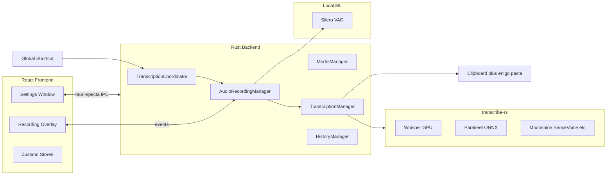

# Codebase overview

**Last reviewed:** 2026-05-16  
**Upstream:** [cjpais/Handy](https://github.com/cjpais/Handy) @ ~0.8.3  
**Fork remote:** [felixbaileymurray/goldfish](https://github.com/felixbaileymurray/goldfish)

## What this repository is

**Handy** is a free, MIT-licensed desktop app that transcribes speech locally and pastes text into whatever app is focused. Press a shortcut, speak, release — text appears in the active field. No cloud audio upload by default.

**Goldfish** (this repo) is a fork intended to become a **separate product** that reuses Handy’s engine rather than reimplementing offline STT. At the time of this overview, the codebase still uses Handy branding internally (`productName`, bundle ID `com.pais.handy`, i18n strings, etc.); only the Git remote and local folder name reflect “goldfish.”

## High-level architecture



### Technology stack

| Layer | Technologies |
|-------|----------------|
| **Frontend** | React 18, TypeScript, Vite 6, Tailwind 4, Zustand (+ Immer), i18next (20 locales) |
| **Shell** | Tauri 2.10 |
| **IPC** | tauri-specta → auto-generated `src/bindings.ts` (~80 commands) |
| **Inference** | `transcribe-rs` (Whisper via Metal/Vulkan; Parakeet/Moonshine/etc. via ONNX) |
| **Audio** | `cpal` → `rubato` resample to 16 kHz → `vad-rs` Silero VAD |

## Runtime flow (core product loop)

1. User presses a **global keyboard shortcut** (toggle or push-to-talk) or sends CLI flags (`--toggle-transcription`, etc.) to a running instance via the **single-instance** plugin.
2. `src-tauri/src/transcription_coordinator.rs` serializes state: `Idle` → `Recording` → `Processing`.
3. `AudioRecordingManager` (`src-tauri/src/managers/audio.rs`) starts cpal mic stream; VAD filters silence; overlay shows mic levels.
4. On stop: audio → `TranscriptionManager::transcribe()` → optional post-processing (custom dictionary, Chinese OpenCC, LLM API or Apple Intelligence on macOS ARM).
5. Text is **pasted** into the focused app via clipboard + `enigo` (`src-tauri/src/utils.rs`).
6. Optional: WAV + transcript saved to SQLite history (`src-tauri/src/managers/history.rs`).

## Repository layout

| Path | Purpose |
|------|---------|
| `src/` | React settings UI, onboarding, model selector, i18n |
| `src/overlay/` | Second Vite entry — minimal recording overlay window |
| `src-tauri/src/` | Rust application logic |
| `src-tauri/src/managers/` | Audio, Model, Transcription, History |
| `src-tauri/src/audio_toolkit/` | Low-level recorder, VAD, resampling |
| `src-tauri/src/commands/` | Tauri command handlers |
| `src-tauri/src/shortcut/` | Global shortcuts, bindings, post-process LLM settings |
| `src/i18n/locales/` | 20 translation JSON files |
| `.github/workflows/` | CI: build, test, Playwright, Nix, release |
| `flake.nix` / `nix/` | Nix packaging |
| `AGENTS.md` / `BUILD.md` | Upstream dev docs (root) |

## Frontend

**Two Vite entry points** (`vite.config.ts`):

- Main: `src/main.tsx` → `src/App.tsx`
- Overlay: `src/overlay/main.tsx` → `src/overlay/RecordingOverlay.tsx`

**State:**

- `src/stores/settingsStore.ts` — persisted settings, devices, post-process config
- `src/stores/modelStore.ts` — models, downloads, progress
- `src/hooks/useSettings.ts` — React facade for settings store

**Settings UI sections** (`src/components/Sidebar.tsx`): General, Models, Advanced, History, Post-processing, Debug, About.

**Onboarding:** Accessibility permissions → model download → done.

**Debug mode:** `Cmd+Shift+D` (macOS) / `Ctrl+Shift+D` (Windows/Linux).

## Backend

**Boot** (`src-tauri/src/lib.rs`): Tauri plugins (store, clipboard, global-shortcut, updater, single-instance, macOS permissions, …) → four `Arc` managers in state → tray → deferred shortcut init until permissions/onboarding.

| Manager | File | Role |
|---------|------|------|
| Audio | `managers/audio.rs` | cpal, VAD pipeline, devices, always-on mic, mute-while-recording |
| Model | `managers/model.rs` | Catalog, download, verify, engine selection |
| Transcription | `managers/transcription.rs` | Load/unload engines, GPU accelerators |
| History | `managers/history.rs` | SQLite + WAV under app data dir |

**App data directory (Handy today):**

- macOS: `~/Library/Application Support/com.pais.handy/`
- Windows: `%APPDATA%\com.pais.handy\`
- Linux: `~/.config/com.pais.handy/`

**Other notable modules:**

- `cli.rs` — remote control flags for running instance
- `llm_client.rs` — optional LLM post-processing
- `apple_intelligence.rs` + Swift bridge — macOS ARM post-process
- `portable.rs` — portable mode (`portable` marker + `Data/` next to exe)
- `signal_handle.rs` — shared transcription trigger logic for CLI/signals

**Required dev asset:** `src-tauri/resources/models/silero_vad_v4.onnx` (see `AGENTS.md` for download URL).

## Models and engines

Users choose local ASR backends via `transcribe-rs`:

- **Whisper** variants (Small/Medium/Turbo/Large) with GPU when available
- **Parakeet V3** and others (Moonshine, SenseVoice, GigaAM, …)

Models are downloaded on demand from `blob.handy.computer` (defined in `managers/model.rs`). They are not shipped in the repo except VAD.

## Development commands

```bash
bun install

mkdir -p src-tauri/resources/models
curl -o src-tauri/resources/models/silero_vad_v4.onnx \
  https://blob.handy.computer/silero_vad_v4.onnx

bun run tauri dev    # full app
bun run lint
bun run format
```

**Prerequisites:** Rust (stable), [Bun](https://bun.sh/), platform deps in `BUILD.md`.

## Upstream governance (if contributing back to Handy)

- Feature freeze on upstream — new features need community discussion
- Bug fixes prioritized
- Strict PR/issue templates in `.github/`
- MIT license; copyright CJ Pais

## Observations relevant to Goldfish

1. **Production-shaped** — tray, single-instance, updater, autostart, 20 languages, Playwright, multi-platform CI, Nix.
2. **Clean IPC** — do not hand-edit `src/bindings.ts`; it is generated from Rust via tauri-specta.
3. **No Goldfish strings in tree yet** — product split not started in code.
4. **Heavy native deps** — first `tauri dev` may need platform setup (Metal, ONNX, accessibility permissions on macOS).
5. **Privacy-first** — local inference unless user configures LLM post-processing with their own API.

See [fork-strategy.md](./fork-strategy.md) for how Goldfish should evolve on top of this codebase.
