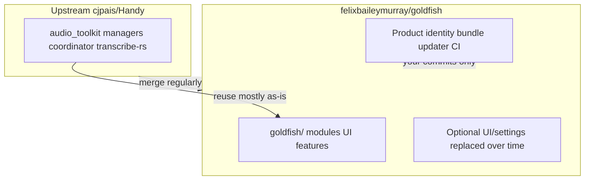

# Fork strategy: Handy as engine, Goldfish as product

**Last updated:** 2026-05-19

## Intent

Goldfish is a **product fork**, not a cosmetic rebrand. It is a new application that **reuses Handy’s technical foundation** (Tauri, cpal + VAD + `transcribe-rs`, transcription coordinator, paste pipeline, model downloads) instead of reimplementing offline speech-to-text.

Handy’s [CONTRIBUTING.md](../CONTRIBUTING.md) describes the project as aiming to be “the most forkable speech-to-text app” — this fork follows that model.

### What you need (not a global string replace)

1. **Clear product boundary** — separate app ID, data directory, releases, updater.
2. **Thin integration surface** — small, documented hooks into the engine.
3. **Upstream discipline** — regular merges from `cjpais/Handy` for bugfixes and core pipeline improvements.

## Mental model



| Layer | Treatment | Examples |
|-------|-----------|----------|
| **Engine** | Sync from upstream; minimize edits | `audio_toolkit/`, `managers/`, `transcription_coordinator.rs`, `transcribe-rs`, `blob.handy.computer` model URLs |
| **Product** | Yours; edit freely | Features, navigation, onboarding, release pipeline, icons |
| **Gray zone** | Touch lightly; few hook lines | `lib.rs`, `App.tsx`, sidebar composition, i18n overlays |

## Git remotes and branches

```bash
git remote add upstream https://github.com/cjpais/Handy.git
git fetch upstream
```

### Current: single `main`, merge from `upstream/main`

This is what the fork uses today. Workflow lives in [UPSTREAM.md](../UPSTREAM.md). It works because:

- Goldfish-only code is identified by **path** (`src-tauri/src/goldfish/`, `src/goldfish/`), not by branch.
- There are no users yet, no Goldfish releases, no plan to contribute fixes upstream.

### Switch to two-branch when either trigger fires

| Branch | Purpose |
|--------|---------|
| `upstream-sync` | Stays close to `upstream/main`; engine fixes only |
| `goldfish` | Default dev: product identity + Goldfish features |

Switch when:

1. **An upstream merge breaks something** and we need to ship a Goldfish-only hotfix without pulling in the rest of that merge, **or**
2. **We start contributing engine fixes back upstream** and need a clean branch to cherry-pick from.

Two-branch merge flow (for when we get there):

1. `git checkout upstream-sync && git merge upstream/main`
2. `git checkout goldfish && git merge upstream-sync`
3. `bun run lint`, `cargo test` / `bun run tauri build`

**Avoid:** Goldfish-specific logic spread across dozens of upstream files. The branch model does not solve this — directory layout does.

### UPSTREAM.md (repo root)

Created 2026-05-19. Documents remotes, merge workflow, conflict hot-spots, and the merge-log table tracking last-merged upstream SHA + date. Update it on every upstream merge.

## Product identity (minimum for “a new app”)

| Item | Handy today | Goldfish direction |
|------|-------------|-------------------|
| Bundle ID | `com.pais.handy` in `src-tauri/tauri.conf.json` | e.g. `com.felixbaileymurray.goldfish` — new data dir; can run beside Handy |
| `productName` | `Handy` | `Goldfish` |
| Updater | cjpais releases + their signing key | Disable until own releases, or own `latest.json` + keys |
| Windows signing | cjpais Azure config in tauri.conf | Remove/replace for local dev; own keys for release |
| About / links | Handy URLs in `AboutSettings.tsx` | Goldfish repo + your links |
| Icons | `src-tauri/icons/` | New set |
| `package.json` name | `handy-app` | `goldfish` (tooling) |

**Keep unchanged (shared infrastructure):**

- Model URLs in `src-tauri/src/managers/model.rs`
- Silero VAD download URL
- Internal Rust crate names (`handy`, `handy_app_lib`) until rename pain is worth it

**Attribution (MIT):** Keep `LICENSE`; About can note speech engine derived from [Handy](https://github.com/cjpais/Handy).

## Extending without merge pain

### 1. Goldfish-only directories

```
src-tauri/src/goldfish/     # Rust: commands, services, hooks
src/goldfish/               # React: screens, stores, flows
```

These are the source of truth for "what is ours." Concrete file layout and exact `lib.rs` edits live in [scaffold.md](./scaffold.md).

### 2. The `lib.rs` touchpoint reality

Registering Goldfish into [src-tauri/src/lib.rs](../src-tauri/src/lib.rs) is **not** a one-liner. There are four upstream-owned regions you have to touch, all of which upstream also edits — so the goal is to **minimize conflict shape**, not eliminate it:

| Touchpoint | Where | Strategy |
|------------|-------|----------|
| `mod goldfish;` declaration | top of `lib.rs` | One line, low conflict risk |
| `collect_commands![...]` macro | inside `pub fn run()` | Always append Goldfish commands at the **end** of the list, in a contiguous block preceded by a `// === Goldfish ===` marker. Conflicts become one-line trailing additions, trivial to resolve. |
| `collect_events![...]` macro | same area | Same pattern as commands. |
| State / setup registration | end of `initialize_core_logic()` | One call: `goldfish::register_state(app_handle);` |

The plugin registration block (`tauri_plugin_*`) is currently untouched by Goldfish; if it ever needs a Goldfish plugin, append at the end.

### 3. `src/bindings.ts` is a regenerated artifact

[src/bindings.ts](../src/bindings.ts) is auto-generated by tauri-specta from `collect_commands![]` (see [lib.rs](../src-tauri/src/lib.rs) where `specta_builder.export(...)` runs in debug builds). It WILL conflict on every upstream merge that touches commands.

**Resolution recipe:**

1. On merge conflict in `src/bindings.ts`, accept either side at random.
2. Run `bun run tauri build` (or `bun run tauri dev`) once — it regenerates the file from the merged Rust source.
3. `git add src/bindings.ts` and finish the merge.

Do not hand-edit `bindings.ts` ever. Do not try to merge it carefully — regeneration is the source of truth.

### 4. Post-transcription / engine hooks

We have not yet picked a concrete hook location for post-transcription work. Real hook candidates in the codebase:

- [src-tauri/src/transcription_coordinator.rs](../src-tauri/src/transcription_coordinator.rs) — `stop()` (line 177), end of the recording→transcribe→paste pipeline.
- [src-tauri/src/managers/transcription.rs](../src-tauri/src/managers/transcription.rs) — `TranscriptionManager` transcribe entry points.

**Decide when the first feature needs a hook**, not before — picking blind invites guessing wrong about the threading model.

Until then:

| Need | Prefer | Avoid |
|------|--------|-------|
| New shortcut action | Goldfish-only command invoked from a binding | Copy-paste of `shortcut::handy_keys` |
| New settings | Goldfish section behind its own route | Edit every Handy settings file |
| New UI screen | New route in `src/goldfish/`, mounted from `App.tsx` via the [composition pattern](#5-frontend-composition-pattern) | Rewrite `App.tsx` wholesale |

### 5. Frontend composition pattern

**Deferred** until the first Goldfish UI lands. The two viable patterns:

- **Route registry** — `src/goldfish/routes.ts` exports an array of `{ path, element }`; `App.tsx` spreads it into its router. One `App.tsx` touchpoint.
- **Slot in App.tsx** — A single `<GoldfishMount />` component imported and rendered conditionally. One `App.tsx` touchpoint.

Pick the one that fits the first feature; do not generalize ahead of time.

### 6. i18n

- Add `src/i18n/locales/en/goldfish.json` (namespace) and load it from `src/i18n/index.ts` (one touchpoint, low conflict risk).
- Use `{{appName}}` in Goldfish strings; do **not** mass-edit all 20 upstream locale files.

### 7. Settings store + history DB

- **Settings** live in `tauri-plugin-store` (additive, JSON). Namespace Goldfish keys with a `goldfish_` prefix to avoid colliding with upstream keys.
- **History** is SQLite ([src-tauri/src/managers/history.rs](../src-tauri/src/managers/history.rs)). If Goldfish ever adds columns, prefix them `goldfish_` and use a separate migration so upstream schema changes don't fight Goldfish ones.

## Staying current with Handy

**Merges cleanly:** `audio_toolkit/`, VAD, cpal, `model.rs`, `transcribe-rs`, Tauri plugin security fixes.

**Conflicts likely:** `tauri.conf.json`, `lib.rs`, `App.tsx`, `Sidebar.tsx`, product-identity commits, bulk i18n edits.

**Cadence:** When you need a fix, or ~monthly — then smoke-test record → transcribe → paste.

**Upstream features:** Do not expect Goldfish features to be accepted during Handy’s feature freeze; upstream **bugfixes** only unless you follow their discussion process.

## What not to do

- Maintain a duplicate “goldfish-core” crate unless merges fail repeatedly.
- Rename every `handy` symbol in Rust upfront.
- Use Handy’s updater endpoint for Goldfish builds.
- PR Goldfish features to Handy without community discussion.

## Dev environment prerequisite

```bash
curl -fsSL https://bun.sh/install | bash
# restart shell
cd /path/to/goldfish
bun install
mkdir -p src-tauri/resources/models
curl -o src-tauri/resources/models/silero_vad_v4.onnx \
  https://blob.handy.computer/silero_vad_v4.onnx
bun run tauri dev
```

Plus Rust stable and platform deps in `BUILD.md`.

## Phased implementation

| Phase | Scope |
|-------|--------|
| **1 — Product split** | Bundle ID, productName, icons, disable updater, Goldfish About/README, `UPSTREAM.md`, upstream remote |
| **2 — Extension scaffold** | `goldfish/mod.rs`, `src/goldfish/`, trivial command + empty settings section |
| **3 — First feature** | Real differentiator via coordinator / post-transcription hooks |
| **4 — UI divergence** | Onboarding, sidebar, remove unused Handy UI |
| **Ongoing** | Upstream merges; log SHA in `UPSTREAM.md` and [decisions.md](./decisions.md) |

## Summary

| Goal | Approach |
|------|----------|
| New app, not rewrite | Engine + product layer |
| Avoid merge hell | New dirs + few hook lines |
| Stay updated | `upstream` remote + documented merges |
| Separate product | New bundle ID, own releases/updater |
| Not a string replace | Identity + hooks first; internal `handy` names later if needed |
