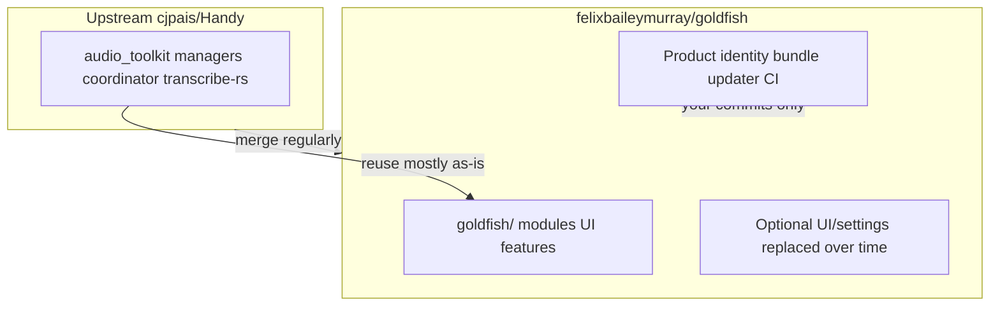

# Fork strategy: Handy as engine, Goldfish as product

**Last updated:** 2026-05-16

## Intent

Goldfish is a **product fork**, not a cosmetic rebrand. It is a new application that **reuses Handy’s technical foundation** (Tauri, cpal + VAD + `transcribe-rs`, transcription coordinator, paste pipeline, model downloads) instead of reimplementing offline speech-to-text.

Handy’s [CONTRIBUTING.md](../CONTRIBUTING.md) describes the project as aiming to be “the most forkable speech-to-text app” — this fork follows that model.

### What you need (not a global string replace)

1. **Clear product boundary** — separate app ID, data directory, releases, updater.
2. **Thin integration surface** — small, documented hooks into the engine.
3. **Upstream discipline** — regular merges from `cjpais/Handy` for bugfixes and core pipeline improvements.

## Mental model



| Layer | Treatment | Examples |
|-------|-----------|----------|
| **Engine** | Sync from upstream; minimize edits | `audio_toolkit/`, `managers/`, `transcription_coordinator.rs`, `transcribe-rs`, `blob.handy.computer` model URLs |
| **Product** | Yours; edit freely | Features, navigation, onboarding, release pipeline, icons |
| **Gray zone** | Touch lightly; few hook lines | `lib.rs`, `App.tsx`, sidebar composition, i18n overlays |

## Git remotes and branches

```bash
git remote add upstream https://github.com/cjpais/Handy.git
git fetch upstream
```

### Recommended: two-branch model

| Branch | Purpose |
|--------|---------|
| `upstream-sync` | Stays close to `upstream/main`; Handy merges + engine fixes only |
| `goldfish` | Default dev: product identity + all Goldfish features |

**When Handy releases:**

1. `git checkout upstream-sync && git merge upstream/main`
2. `git checkout goldfish && git merge upstream-sync`
3. `bun run lint`, `cargo test` / `bun run tauri build`

**Simpler alternative:** single `main` with direct `merge upstream/main` — fine early, more conflicts as Goldfish diverges.

**Avoid:** Goldfish-specific logic spread across dozens of upstream files.

### UPSTREAM.md (repo root, to create)

Document:

- Remotes and merge commands
- Files never customized (or only 1-line hooks)
- Product commit(s) on `goldfish` branch
- Last merged upstream SHA + date

## Product identity (minimum for “a new app”)

| Item | Handy today | Goldfish direction |
|------|-------------|-------------------|
| Bundle ID | `com.pais.handy` in `src-tauri/tauri.conf.json` | e.g. `com.felixbaileymurray.goldfish` — new data dir; can run beside Handy |
| `productName` | `Handy` | `Goldfish` |
| Updater | cjpais releases + their signing key | Disable until own releases, or own `latest.json` + keys |
| Windows signing | cjpais Azure config in tauri.conf | Remove/replace for local dev; own keys for release |
| About / links | Handy URLs in `AboutSettings.tsx` | Goldfish repo + your links |
| Icons | `src-tauri/icons/` | New set |
| `package.json` name | `handy-app` | `goldfish` (tooling) |

**Keep unchanged (shared infrastructure):**

- Model URLs in `src-tauri/src/managers/model.rs`
- Silero VAD download URL
- Internal Rust crate names (`handy`, `handy_app_lib`) until rename pain is worth it

**Attribution (MIT):** Keep `LICENSE`; About can note speech engine derived from [Handy](https://github.com/cjpais/Handy).

## Extending without merge pain

### 1. Goldfish-only directories

```
src-tauri/src/goldfish/     # Rust: commands, services, hooks
src/goldfish/               # React: screens, stores, flows
```

Register once from `src-tauri/src/lib.rs`:

```rust
mod goldfish;
goldfish::register(app_handle)?;
```

### 2. Prefer hooks over forks

| Need | Prefer | Avoid |
|------|--------|-------|
| New shortcut action | New action variant or Goldfish-only command | Copy-paste `TranscribeAction` |
| Post-transcription | One-line call into `goldfish` after `process_transcription_output` | Duplicate transcription manager |
| New settings | Goldfish section + route | Edit every Handy settings file |
| New UI | Sidebar section / new window | Rewrite `App.tsx` wholesale |

### 3. UI divergence over time

- **Early:** Keep Handy settings (models, mic, shortcuts).
- **Later:** `GoldfishApp` composes “dictation” (engine) + new features; remove unused Handy sections on your branch only.

### 4. i18n

- Add `src/i18n/locales/en/goldfish.json` (namespace) merged in `src/i18n/index.ts`.
- Use `{{appName}}` in Goldfish strings; do not mass-edit all 20 upstream locale files.

## Staying current with Handy

**Merges cleanly:** `audio_toolkit/`, VAD, cpal, `model.rs`, `transcribe-rs`, Tauri plugin security fixes.

**Conflicts likely:** `tauri.conf.json`, `lib.rs`, `App.tsx`, `Sidebar.tsx`, product-identity commits, bulk i18n edits.

**Cadence:** When you need a fix, or ~monthly — then smoke-test record → transcribe → paste.

**Upstream features:** Do not expect Goldfish features to be accepted during Handy’s feature freeze; upstream **bugfixes** only unless you follow their discussion process.

## What not to do

- Maintain a duplicate “goldfish-core” crate unless merges fail repeatedly.
- Rename every `handy` symbol in Rust upfront.
- Use Handy’s updater endpoint for Goldfish builds.
- PR Goldfish features to Handy without community discussion.

## Dev environment prerequisite

```bash
curl -fsSL https://bun.sh/install | bash
# restart shell
cd /path/to/goldfish
bun install
mkdir -p src-tauri/resources/models
curl -o src-tauri/resources/models/silero_vad_v4.onnx \
  https://blob.handy.computer/silero_vad_v4.onnx
bun run tauri dev
```

Plus Rust stable and platform deps in `BUILD.md`.

## Phased implementation

| Phase | Scope |
|-------|--------|
| **1 — Product split** | Bundle ID, productName, icons, disable updater, Goldfish About/README, `UPSTREAM.md`, upstream remote |
| **2 — Extension scaffold** | `goldfish/mod.rs`, `src/goldfish/`, trivial command + empty settings section |
| **3 — First feature** | Real differentiator via coordinator / post-transcription hooks |
| **4 — UI divergence** | Onboarding, sidebar, remove unused Handy UI |
| **Ongoing** | Upstream merges; log SHA in `UPSTREAM.md` and [decisions.md](./decisions.md) |

## Summary

| Goal | Approach |
|------|----------|
| New app, not rewrite | Engine + product layer |
| Avoid merge hell | New dirs + few hook lines |
| Stay updated | `upstream` remote + documented merges |
| Separate product | New bundle ID, own releases/updater |
| Not a string replace | Identity + hooks first; internal `handy` names later if needed |
