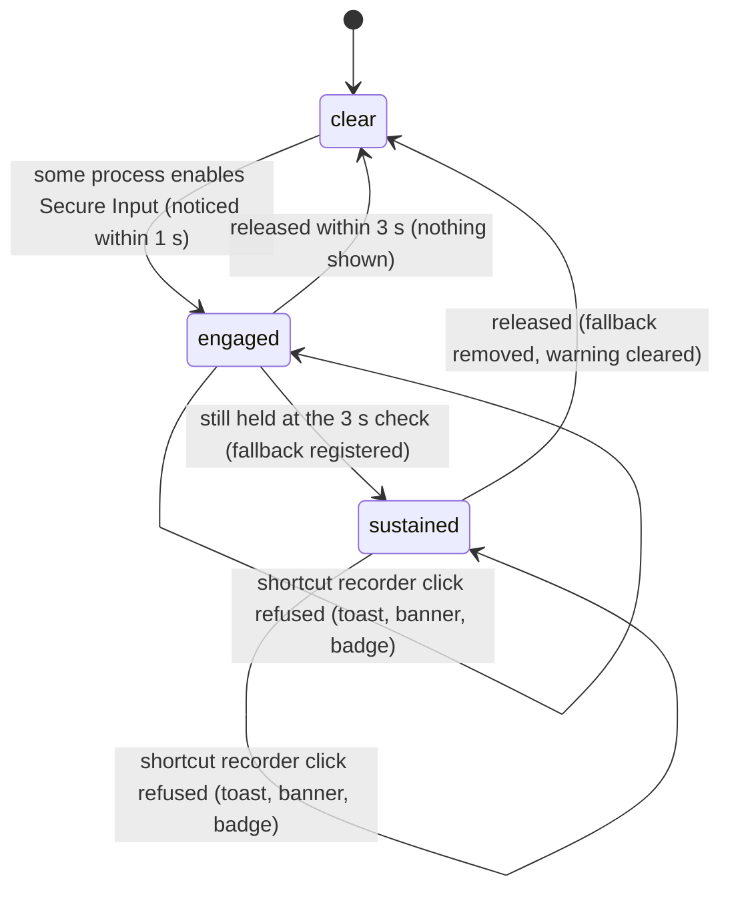

# Secure Input

## Summary

Secure Input is a macOS state in which one process asks the system to hide key presses from every other process. Password fields turn it on for as long as they have focus; Terminal's "Secure Keyboard Entry" holds it whenever Terminal is frontmost; a misbehaving `loginwindow` can hold it indefinitely. While it is held, Handy's default keyboard listener stops seeing ordinary keys, so a keyed shortcut such as Option+Space dies silently while modifier-only and mouse-button shortcuts keep working. Handy watches for this once a second, waits 3 s to rule out a password field, then re-registers every vulnerable keyed shortcut through a second, immune path so dictation keeps working. It shows a warning — a badge on the tray icon, a line in the tray menu, and a banner in the settings window — only when that second path cannot fully cover a shortcut, or when the user tried to open the [shortcut recorder](../settings/shortcut-recorder.md) and was refused. This document describes one *episode*: Secure Input engaging, being sustained, and clearing. It is macOS-only; the Windows and Linux builds have none of it.

## The simple case

The user opens Terminal, turns on Secure Keyboard Entry from its menu, and carries on working in Terminal. Handy notices within a second. For the next 3 s, holding Option+Space does nothing. Then Handy re-registers Option+Space (and Option+Shift+Space, if post-processing is on) through the immune path, and from then on holding Option+Space records exactly as before — the overlay appears, speech is captured, the release stops. Because the stock shortcuts are fully covered, nothing changes in the tray or the settings window; the user sees a few seconds of dead shortcut and then normal service.

When the user turns Secure Keyboard Entry off, Handy notices within a second, removes the extra registrations, and the original listener takes over again.

## The interaction, event by event

### Start

An episode starts when some process enables Secure Input. Handy polls once a second, so it notices up to 1 s later; at that moment it records the time, looks up which process holds Secure Input (best effort; see [Edge cases](#edge-cases)), and writes a line to the log. Nothing is shown to the user. From the instant Secure Input engaged, keyed shortcuts on the default handy_keys implementation stop firing: a press of Option+Space is invisible to Handy, and a release of a key already held is invisible too. Shortcuts made only of modifiers (for example Right Option) and shortcuts bound to mouse buttons are unaffected throughout.

> Technical note: Secure Input blocks key-down and key-up events from reaching the system-wide event tap handy_keys uses, but modifier-change events still flow. That is why modifier-only shortcuts survive and why the shortcut recorder, if it were allowed to open, would capture only the modifier half of a combination.

### Ends at once

The episode ends with nothing visible if Secure Input is released before the 3 s mark — the normal case for a password field that had focus for a moment. Handy notices on its next poll, clears what it recorded, and logs the release. The one thing the user can have seen in this window is the shortcut recorder refusal: the refusal check is live, not tied to the 3 s threshold, so clicking a shortcut chip while a password field is focused elsewhere is refused (see [While active](#while-active)), and the banner and badge that accompany the refusal stay until the next poll that finds Secure Input off — at most about a second after it clears.

### Becomes active

The episode becomes *sustained* when Secure Input is still held at the first poll 3 s or more after Handy noticed it — so between 3 and 4 s after it engaged. Handy now rebuilds its fallback registrations from the current bindings. For each registered binding:

- **Modifier-only or mouse-button shortcuts** are immune and left alone.
- **Keyed shortcuts without side-specific modifiers** (the defaults: Option+Space, Option+Shift+Space) are *covered*: registered a second time through the immune path with identical meaning. The user notices nothing but the 3–4 s gap.
- **Keyed shortcuts with a side-specific modifier** (for example Left Option+Space) are *degraded*: the immune path cannot tell left from right, so the shadow fires on either Option. The shortcut works, but more widely than configured.
- **Keyed shortcuts that include fn**, or any shortcut the immune path refuses to register, are *uncovered*: they cannot fire at all until Secure Input clears.

Only bindings that are currently registered are considered: Transcribe with Post-Processing only while post-processing is enabled, Cancel only while a dictation is recording (see below). Settings are not changed.

If at least one binding is degraded or uncovered, the warning appears everywhere at once: the tray icon gains a warning badge (idle state only), the tray menu gains the line "⚠ Shortcuts blocked by Secure Input" directly under the version line, the tray tooltip becomes "Handy v{version} — ⚠ Shortcuts blocked by Secure Input", and the settings window shows a banner at the top of the content area, above whichever section is open. If every keyed binding is covered, nothing is shown; the fallback is silent.

> Technical note: the immune path is the Carbon-backed Tauri global-shortcut plugin, the same engine the "tauri" keyboard implementation uses. The fallback is only built when the keyboard implementation is handy_keys; under the tauri implementation every shortcut is already on the immune path and no warning can arise. It is also deferred until Handy's shortcuts have been initialized (after onboarding's permissions step), so an episode that begins during onboarding is picked up when shortcuts come up.

### While active

While the episode is sustained:

- **Dictation works through the fallback.** Press and release both arrive, so push to talk and toggle mode behave as in [Triggers and shortcuts](../foundations/triggers-and-shortcuts.md). A degraded shortcut answers to either side of its modifier. An uncovered shortcut does nothing.
- **Cancel is shadowed only while recording.** The Cancel binding is registered at each recording start and removed at each stop (see Triggers and shortcuts). Under sustained Secure Input, Handy also adds and removes a fallback for it at the same moments, a beat later because the rebuild runs in the background. Escape therefore still cancels a recording. If the Cancel binding itself is side-specific or includes fn, it is reported degraded or uncovered and the warning appears for the duration of the recording.
- **The banner** shows a warning triangle and one of: "{name} may be blocking 1 shortcut" / "{name} may be blocking N shortcuts" when Handy has a name for the holding process, or "macOS is temporarily blocking 1 shortcut" / "macOS is temporarily blocking N shortcuts" when it does not. N counts the distinct bindings that are degraded or uncovered. Beside the text is a "How to fix" link with an external-link icon, which opens the troubleshooting page on handy.computer, and a ✕ whose accessible name is "Dismiss". Dismiss hides the banner for the rest of this episode only; the next episode shows it again. The tray badge and menu line are not dismissible.
- **The shortcut recorder is refused.** Clicking any shortcut chip while Secure Input is enabled (sustained or not) does not open the recorder. A toast reads "Can't record shortcuts right now — macOS Secure Input is blocking key events. Resolve the Secure Input warning first." with a "How to fix" action. The refusal also counts as user impact: the badge, menu line, and banner appear even when every binding is covered. In that case, with no blocked bindings to count, the banner reads "{name} may be blocking shortcut changes" or "macOS is temporarily blocking shortcut changes".
- **Any change to the bindings rebuilds the fallback**: committing a new shortcut, resetting one, turning post-processing on or off, switching the keyboard implementation. The rebuild removes every shadow and re-adds the ones still needed, and the warning updates to match.
- **The tray menu line is clickable** and simply opens the settings window, where the banner explains the situation.

### Finish

The episode ends when Secure Input is released. On the next poll (within 1 s) Handy removes every fallback registration, forgets the holding process, clears the recorder-refusal flag, and refreshes the tray and the banner. The badge, the menu line, the tooltip suffix, and the banner all disappear together, and the banner's dismissal is reset. Nothing is written to settings or history, and nothing about the episode survives a relaunch.

## Modifiers

| Modifier | Set before the start | Changed while active |
| --- | --- | --- |
| Push to talk | On: a release delivered through the fallback stops the recording normally. If Secure Input engages while the key is held and before the 3 s mark, the release is lost and the recording continues until the shortcut is pressed (and released) again once a path is live. Off: the second press that stops is subject to the same 3 s gap. | Read per key event as usual; the fallback delivers the same presses and releases. |
| Binding | Transcribe is always shadowed. Transcribe with Post-Processing is shadowed only while post-processing is enabled. Cancel is shadowed only while recording. | Toggling post-processing or re-recording a binding rebuilds the fallback immediately. |
| Overlay style | No effect. | No effect. |
| Streaming model | No effect. | No effect. |
| Voice activity detection | No effect. | No effect. |
| Always-on microphone | No effect. | No effect. |

## Cancel and interrupt

The columns describe Secure Input's effect when the episode overlaps with no dictation and with a dictation in progress.

| Event | Before a dictation (Handy idle) | During a dictation (recording or processing) |
| --- | --- | --- |
| Cancel | No dictation to cancel; Escape is not registered while idle and reaches the front app as usual. | Recording, sustained: Escape works through the Cancel fallback. Recording, first 3 s of an episode: Escape does nothing; the overlay ✕, the tray's Cancel item, and `handy --cancel` still cancel. Processing: Escape never cancels (see [Cancelling](../dictation/cancelling.md)); the other three are unaffected by Secure Input. |
| Another trigger | Keyed transcribe shortcuts are dead for the first 3–4 s and then work via the fallback (uncovered ones never do). `handy --toggle-transcription`, `--toggle-post-process`, and the signals do not use the keyboard and work throughout. | The stop (release or second press) goes through whichever path is live; during the first 3–4 s it is lost, and the recording continues. Remote toggles stop as usual. |
| A setting changed mid-way | Re-recording a shortcut is refused with the toast. Resetting a shortcut with the arrow is allowed and rebuilds the fallback. Switching the keyboard implementation to tauri removes the fallback and the warning (every shortcut is then on the immune path); switching back to handy_keys rebuilds it. | Same. A rebuild mid-recording briefly unregisters and re-registers the shadows; a release that lands in that instant can be missed. |
| Microphone lost | No effect. | No effect. |
| Model or processing failure | No effect. | No effect. |
| The active application changes | Focusing a password field starts an episode that usually ends at once. Bringing Terminal forward with Secure Keyboard Entry on starts one that lasts as long as Terminal is frontmost. The holding process is looked up once, when the episode starts, and is not re-checked if a different process takes over. | Same; the dictation itself is unaffected. |
| Handy quits or the system sleeps | Nothing is persisted; at the next launch the monitor starts from "clear" and rebuilds the fallback once shortcuts are initialized if Secure Input is already sustained. Across sleep the poll thread pauses; on wake the elapsed time includes the sleep, so an episode that began just before sleep can become sustained on the first poll after wake. | Same. |
| Keyboard channel changes | This document is that channel. Key auto-repeat arriving through the fallback is absorbed by the coordinator's 30 ms debounce and 50 ms release grace as usual. | Same. |

## Interactions with other systems

**Permissions.** The handy_keys listener, the fallback registrations, and the Keyboard Diagnostic all need Accessibility access, which onboarding already required. Secure Input is not a permission and cannot be granted around; it is released only by the process holding it.

**History and recordings.** None.

**Clipboard.** None.

**Model state.** None.

**Tray and overlay.** The warning badge is drawn only on the idle icon; while recording or transcribing the normal recording and transcribing icons are shown so in-flight activity stays recognizable, and the badge returns at idle if the episode is still sustained. The menu line "⚠ Shortcuts blocked by Secure Input" sits between the version line and "Copy Last Transcript", with a separator under it, and opens the settings window when clicked. The overlay is unaffected. See [The tray menu](../tray/the-tray-menu.md).

**Sounds and system audio.** None.

**Settings persistence.** Nothing about Secure Input is saved. The fallback is rebuilt from settings whenever a binding is committed or reset, post-processing is enabled or disabled, the keyboard implementation changes, or shortcuts are first initialized. The keyboard implementation setting decides whether a fallback exists at all (handy_keys only).

**Platform differences.** macOS only. On Windows and Linux the status always reports disabled, no monitor runs, no badge, menu line, or banner can appear, the recorder is never refused on these grounds, and the Keyboard Diagnostic is not rendered on the Debug page. Shortcuts that include fn can never be covered, and fn shortcuts only work on Apple keyboards to begin with.

## The Keyboard Diagnostic

In [debug mode](../settings/debug.md) the Debug section has a "Keyboard Diagnostic" panel described as "Checks whether keyboard events reach Handy. Only event counts are recorded — never which keys you press." Its button "Run 10s diagnostic" opens a second system-wide listener for ten seconds; while it runs the panel pulses "Listening… press your shortcut a few times (e.g. Option+Space)". Handy's shortcuts keep working during the test, so pressing Option+Space as suggested also starts a dictation.

The result is three monospace lines:

- "Secure Input: enabled — held by {name} (pid {pid})", "Secure Input: enabled — no visible holder", or "Secure Input: disabled". "Enabled" means Secure Input was on at the start of the test or at its end.
- "Key down: N · Key up: N · Modifiers: N · Mouse: N" — counts of event kinds only.
- A verdict: "Secure Input is blocking key events — keyed shortcuts cannot work until it is resolved." (enabled and no key-down events); "Modifier events arrived but no key events — something is suppressing keys even though Secure Input reports disabled. Please report this on GitHub." (disabled, no key-downs, some modifier events); "No events captured — did you press any keys during the test?" (nothing at all); otherwise "Key events are reaching Handy normally."

If the listener cannot be created the panel shows "Diagnostic failed: {error}" in red. The button is disabled while a test runs.

## Edge cases

- A stock install never sees the warning: both default shortcuts and Escape have no side-specific modifier and no fn, so they are covered, and the only visible symptom of Secure Input is the 3–4 s during which Option+Space does nothing.
- The holding process is looked up once per episode from a system registry entry that Apple does not document as reliable. It may be absent (then the banner and diagnostic fall back to the "macOS is temporarily blocking…" and "no visible holder" wording), point at a parent process or `loginwindow` rather than the real holder, or name a process that has since quit, in which case the name shown is "(process no longer running)".
- The banner counts distinct bindings, so a side-specific Transcribe and an fn-based Transcribe with Post-Processing together read "… blocking 2 shortcuts".
- The recorder refusal latches its warning until the next poll that finds Secure Input off. A refusal during a momentary password-field episode therefore shows the badge and banner for up to about a second after the field loses focus.
- The banner lives in the settings window; a user with the window hidden sees only the badge and the menu line. Opening the window from the menu line shows the banner immediately (it fetches the current status on open).
- The banner's dismissal is per episode and per window load: the "Dismiss" ✕ hides it, and a new episode — or the same episode continuing after the warning state changes — can bring it back.
- A degraded shortcut is reported as degraded even though it works; the warning is there to explain why Right Option+Space now also fires on Left Option+Space.
- The Keyboard Diagnostic's "Secure Input" line reports "enabled" if Secure Input was on at either end of the test, so a password field focused during the ten seconds can make a healthy keyboard read as "enabled" with a normal verdict.
- Secure Input engaging after the shortcut recorder has already opened is not caught by the refusal check (which runs only at the click); what happens then is in [The shortcut recorder](../settings/shortcut-recorder.md).

## Open questions and verification

- Whether the immune path can register a bare Escape (no modifiers) as the Cancel fallback was not confirmed; if the plugin refuses it, Cancel would be reported uncovered and the warning would appear during every recording under sustained Secure Input, which would contradict the "stock install sees nothing" claim above.
- Whether key auto-repeat is delivered as repeated presses through the fallback path, and therefore whether holding Option+Space under sustained Secure Input behaves identically to the default path, was read from the coordinator's grace logic but not observed.
- Suspected bug: if Secure Input engages while the user is already holding Option+Space (push to talk), the release is lost and the recording runs on until the shortcut is pressed and released again. Sustained mode does not help here because the fallback only sees presses made after it was registered.
- Suspected bug: under sustained Secure Input the fallback shadows stay registered while the shortcut recorder is open (the recorder suspends only the handy_keys registrations). If an episode becomes sustained after the recorder opened, pressing Option+Space both starts a dictation through the fallback and is captured by the recorder as a modifier-only combination.
- The 3 s threshold is measured from Handy noticing the episode, not from Secure Input engaging, so the real gap before the fallback is 3–4 s; not measured by hand.
- The timing of the Cancel fallback relative to the recording start (it is added in the background after the recording begins) was not measured; a very early Escape could be missed.
- Whether the fallback registrations are counted as "already in use" if the user later switches the keyboard implementation to tauri before the rebuild runs was read from the ordering in the code (shadows are removed first) but not reproduced.
- The visual appearance of the warning badge on the tray icon was not checked by hand.

Verified against Handy commit `af48dd6`.
