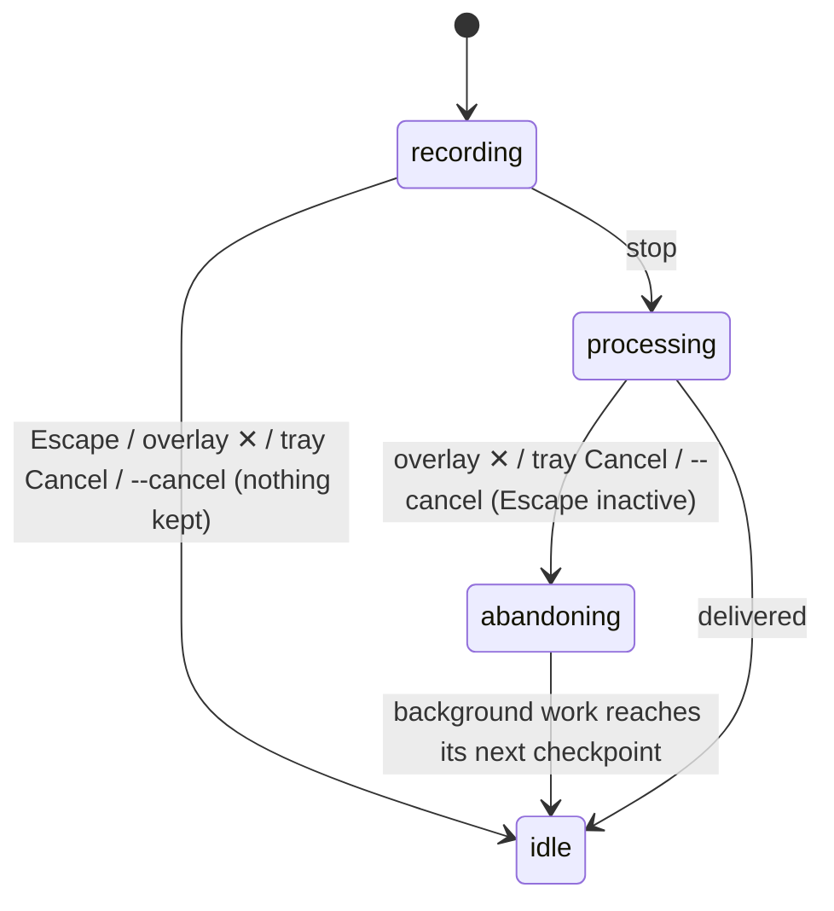

# Cancelling

## Summary

Cancelling abandons a dictation without delivering text. There are four ways: the Escape key (the Cancel shortcut, live only while recording), the ✕ button on the overlay, the "Cancel" item in the tray menu, and `handy --cancel` from a shell. What a cancel leaves behind depends on how far the dictation had got: nothing at all during recording; a recording file during transcription; a file and a history entry once the entry has been saved. The overlay and tray always return to idle at once, but Handy itself is not ready for the next dictation until the abandoned work finishes in the background.

## The simple case

The user holds Option+Space, starts a sentence, and realizes it is wrong. Still holding the shortcut, they press Escape. The pill fades out, the menu-bar icon returns to idle, and nothing is pasted. The recording is gone: no file, no history entry, no stop chime. They let go of Option+Space — that release does nothing now — and start again.

## The interaction, event by event

### Start

A cancel starts when one of the four cancel sources fires while a dictation is in progress. They are not equivalent:

- **Escape** works only while recording, because the Cancel shortcut is registered at the start of recording and removed at the stop. Pressing Escape while Handy is idle or processing sends Escape to the front app as usual.
- **The overlay ✕** works whenever the overlay is visible: recording, transcribing, and processing.
- **The tray's Cancel item** appears in the menu from the trigger until the dictation ends.
- **`handy --cancel`** works at any time; when nothing is in progress it does nothing visible.

When none of these is available (overlay None, tray hidden, Escape already unregistered) a dictation in processing cannot be cancelled from the keyboard or screen.

### Ends at once

A cancel that arrives while arming or recording ends the dictation completely and at once: the microphone stops and (in on-demand mode) closes, the capture is thrown away, readiness is invalidated so a late chime or mute cannot fire, the live-transcription session (if any) is reset, the overlay fades, the tray returns to idle, system audio is unmuted if it was muted, and the stop chime does not play. No recording file and no history entry exist. If the unload timeout is "Immediately" the model is unloaded. Handy is idle and the next trigger starts a new dictation.

### Becomes active

A cancel during processing is different: it *marks* the dictation cancelled and updates the screen immediately — overlay fades, tray idles — but the work already started cannot be interrupted. The transcription runs to completion. A post-processing request keeps going on the network. The recording file keeps writing. Handy checks the cancel mark at checkpoints between steps and stops at the first one it reaches:

1. after the capture is collected (before the file is written and the model runs);
2. after the model returns and the file is written;
3. during post-processing, checked every 25 ms;
4. after post-processing, before the history entry is saved;
5. on the main thread, immediately before the paste keystroke.

### While active

From the user's point of view nothing is happening: the overlay is gone and the tray is idle. But the dictation's stage is still "processing", so the transcribe shortcut is ignored until the abandoned work reaches a checkpoint. With a long recording and a slow model this can be several seconds during which Option+Space silently does nothing. A second cancel in this window has no effect.

### Finish

The abandoned work stops at its checkpoint and Handy becomes idle. What remains:

| Cancel arrived… | Recording file | History entry | Text pasted |
| --- | --- | --- | --- |
| while recording | no | no | no |
| during transcription (checkpoints 1–2) | yes, orphaned | no | no |
| during post-processing (3–4) | yes, orphaned | no | no |
| after the entry was saved, before the paste (5) | yes | yes | no |

An orphaned file sits in the recordings folder with no history entry; the History page never shows it and the retention rules never delete it.

## Modifiers

| Modifier | Set before the start | Changed while active |
| --- | --- | --- |
| Push to talk | On: the General page hides the Cancel Shortcut row (the release is the way out), but Escape still cancels while recording. Off: the Cancel Shortcut row is shown and Escape is the only keyboard way to abandon a recording. | Read per key event; no effect on a cancel already delivered. |
| Binding | No effect on cancelling itself; the post-processing binding adds checkpoints 3–4. | Fixed. |
| Overlay style | None: no ✕ button; the tray and `--cancel` remain. | An overlay already shown keeps its ✕. |
| Streaming model | The live session is reset on cancel; partial live text is discarded. | Fixed. |
| Voice activity detection | No effect. | No effect. |
| Always-on microphone | On: the microphone stays open after a cancel. Off: it closes. | No effect. |

## Cancel and interrupt

| Event | Before active (cancel during recording) | While active (cancel during processing, work finishing in the background) |
| --- | --- | --- |
| Cancel | Idempotent; a second cancel does nothing. | A second cancel does nothing. |
| Another trigger | The next trigger after the cancel starts a new dictation immediately. | Ignored until the background work finishes; then the next press works. |
| A setting changed mid-way | No effect. | Changing the model now lets the abandoned transcription finish with the old model. |
| Microphone lost | No effect. | No effect. |
| Model or processing failure | No effect. | The failure is swallowed: no toast, no entry. |
| The active application changes | No effect. | No effect. |
| Handy quits or the system sleeps | Nothing to lose. | The orphaned file may be incomplete. |
| Keyboard channel changes | Under Secure Input, Escape is shadowed through the fallback while recording, so it keeps working. On Linux Escape never works. | No effect. |

## Interactions with other systems

**Permissions.** None beyond the Accessibility access that makes Escape visible to Handy.

**History and recordings.** See the table above. Orphaned recordings are the one case where the recordings folder and the History page disagree.

**Clipboard.** A cancel before checkpoint 5 leaves the clipboard untouched. A cancel cannot interrupt a paste already started.

**Model state.** The model stays loaded unless the unload timeout is "Immediately", in which case every cancel unloads it.

**Tray and overlay.** Both go idle the instant the cancel is accepted, ahead of the background work.

**Sounds and system audio.** No stop chime on cancel. Mute While Recording is restored immediately.

**Settings persistence.** None.

**Platform differences.** Linux: the Cancel shortcut is never registered and its row is hidden; only the overlay ✕ (overlay off by default there), the tray, and `--cancel` cancel. Windows: same as macOS.

## Edge cases

- Escape pressed after the stop but before the Cancel shortcut has finished unregistering (a few milliseconds) can still cancel the dictation during transcription, behaving like the overlay ✕.
- Holding Option+Space and pressing Escape, then keeping Option+Space held: the release is ignored; the next press starts a new dictation.
- Clicking the overlay ✕ requires the pointer to reach the overlay; it never takes focus, so the app the user was in stays in front.
- `handy --cancel` from a shell also raises nothing and shows no output.
- Cancelling while the model is loading for the first time does not cancel the load; the model finishes loading and stays loaded.
- Cancelling during the debug "Extra Recording Buffer" aborts the buffer early.

## Open questions and verification

- After a cancel during transcription, the shortcut is dead until the abandoned transcription finishes, with no indication on screen. Suspected bug: the user sees idle but cannot dictate.
- Orphaned recording files from cancels during processing are never cleaned up. Suspected bug.
- Whether the overlay's ✕ is clickable during the 300 ms fade after a cancel, and whether a second click does anything, was not observed.
- The claim that Escape can still cancel in the few milliseconds after the stop was read from the asynchronous unregistration and not reproduced.

Verified against Handy commit `af48dd6`.
