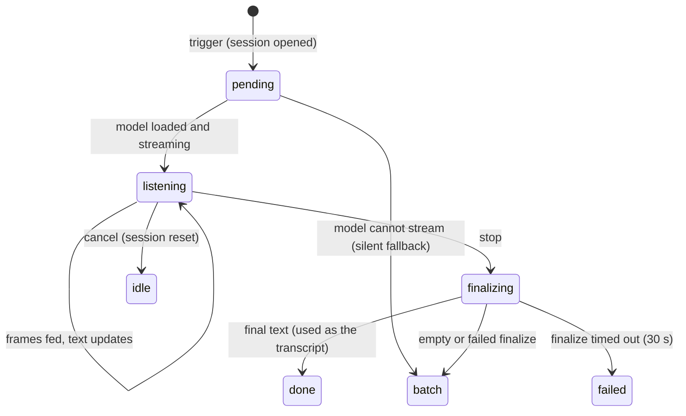

# Live transcription

## Summary

Live transcription shows the user's words on screen while they are still speaking. It runs when two things are true: the Overlay setting is Live (the macOS default) and the active model is a streaming model (Parakeet Unified EN, Nemotron Streaming, and others tagged "Streaming"). The overlay then takes its panel form and fills with text as the model recognizes it. At the stop the live text becomes the transcript directly, so the "Transcribing..." wait is short. With any other model, or with the Minimal overlay, nothing in this document applies and the dictation follows [Transcribing](transcribing.md) alone.

## The simple case

The user holds Option+Space. A wider pill appears, turns ready, and as soon as they have said a few words it grows into a panel: the words appear above the waveform in italics, with a blinking pink caret at the end and a timer (0:03, 0:04…) on the right. Committed words stay put; the last few words may rewrite themselves as the model hears more. They let go. The waveform row becomes a spinner with "Transcribing..." while the panel keeps the text in view; a moment later the panel fades and the text is pasted.

## The interaction, event by event

### Start

At the trigger, alongside everything in [Starting and recording](starting-and-recording.md), Handy opens a live session and shows the overlay in its panel-capable form (the "streaming" state of [The overlay](the-overlay.md): a wider pill that can open). The session waits for the model to finish loading if it is loading, then takes the model for itself and begins a stream using the same language and translation choices as a batch run. Sound captured before the stream is ready is queued, not lost.

If the loaded model turns out not to stream — the capability flag was wrong, the model was switched, or it was unloaded before the session started — the session quietly does nothing and the dictation falls back to batch transcription at the stop; the overlay stays a pill.

### Ends at once

Live transcription ends at once when the stop or a cancel arrives before the stream produced anything. On a stop the finalize returns nothing and the capture is batch-transcribed instead (or, if empty, the dictation ends silently). On a cancel the session is reset and discarded.

### Becomes active

The session becomes active when the stream begins: frames that pass voice activity detection are fed to the model as they arrive. The first text event opens the panel: the card widens to about 392 points, the text region unfolds above the control row, the timer fades in on the right, and the ✕ stays in place. The timer counts seconds since the microphone became ready, not since the trigger.

### While active

Text arrives as two parts: **committed** text, which the model will not change, shown first; and **tentative** text, the model's current guess at the most recent words, shown after it with the caret. The display updates whenever either part changes. Up to about four lines are visible; older lines scroll up under a fade. The view follows the newest line unless the user scrolls up inside the panel to read earlier text, in which case it stays put until they scroll back to the bottom. The waveform and dot behave as in the pill.

Custom Words are not given to streaming models as a hint; they are applied by fuzzy correction to the final text instead, so live text shows the model's raw spelling and the pasted text may differ.

### Finish

At the stop the panel's control row switches to the spinner and "Transcribing..." but the text region stays open so the words do not jump. The stream is told to finalize; the final text is the committed text plus whatever the model settles the tentative tail to. That text goes through the same [cleanup](transcribing.md) as a batch transcript (custom words, filler words, stutters, whitespace, Chinese script) and continues as the transcript: history entry, post-processing if requested ("Processing..." replaces "Transcribing..." in the same row), paste.

Three failure paths:

- **Empty final text** (the model committed nothing): Handy batch-transcribes the whole capture as if there had been no live session. The user sees a longer "Transcribing..." and then ordinary delivery.
- **Finalize error**: same batch fallback.
- **Finalize timeout** (30 s without a reply): the dictation fails with "Transcription Failed: Timed out waiting 30s for live transcription to finalize", an empty history entry, and no paste. No batch fallback is attempted because the model may still be busy.

## Modifiers

| Modifier | Set before the start | Changed while active |
| --- | --- | --- |
| Push to talk | No effect on live text. | No effect. |
| Binding | With Transcribe with Post-Processing the panel shows "Processing..." after "Transcribing..." and the pasted text is the LLM's reply, not the live text. | Fixed. |
| Overlay style | Live: the panel. Minimal or None: no live session is started at all, even with a streaming model, so the dictation is batch-only. | No effect on the current dictation. |
| Streaming model | Required. A non-streaming model under Live gets the pill and batch transcription. | Switching to a non-streaming model mid-dictation: the session ends up with no stream and falls back to batch. |
| Voice activity detection | On: the longer 1.65 s tail keeps phrase ends flowing to the stream; silence between phrases is not fed. Off: every frame is fed, including silence. | Fixed. |
| Always-on microphone | No effect on live text. | No effect. |

## Cancel and interrupt

| Event | Before active (session pending) | While active (listening, text on screen) |
| --- | --- | --- |
| Cancel | The session is reset; the overlay fades; nothing kept. | Same; the live text disappears with the panel and is not saved anywhere. |
| Another trigger | Ignored. | Same-binding stop: finalize. Others ignored. |
| A setting changed mid-way | Switching models: the session waits for the new load and streams if it can. | Switching models: the old model finishes this stream, then is dropped. Changing Overlay to Minimal: the panel already shown stays. |
| Microphone lost | No effect on the session; no frames arrive. | Text stops updating; the stop finalizes whatever was fed. |
| Model or processing failure | Load failure: no stream, batch fallback at the stop, which then fails with a toast. | A stream error mid-way is logged; finalize returns what it has or falls back to batch. |
| The active application changes | No effect. | No effect; the panel is on the pointer's monitor, not the focused app's. |
| Handy quits or the system sleeps | Lost. | Lost. |
| Keyboard channel changes | No effect. | No effect. |

## Interactions with other systems

**Permissions.** None beyond the microphone.

**History and recordings.** The history entry holds the cleaned final text, not the live text as displayed; the recording file is the same VAD-filtered capture as for batch.

**Clipboard.** None.

**Model state.** The model is held by the session from stream start to finalize; the footer still shows it as loaded. "Immediately" unloads it after finalize.

**Tray and overlay.** The tray is unaffected. The overlay's panel states are described in [The overlay](the-overlay.md).

**Sounds and system audio.** The stop chime plays at the stop, before finalize completes.

**Settings persistence.** None.

**Platform differences.** None beyond the Linux default of no overlay, which disables live transcription there until the user picks Live.

## Edge cases

- Pauses longer than the 1.65 s tail stop feeding the stream; the panel's text freezes until speech resumes, and the committed/tentative split may shift when it does.
- A recording that starts with a long silence keeps the pill closed; the panel opens only with the first text.
- With the overlay placed at the top of the screen the panel grows downward and older lines fade off the top edge instead of the bottom.
- The timer keeps counting during "Transcribing..." until the panel fades.
- Live text and the final pasted text can differ: custom-word correction, filler removal, and the model's own final pass all happen after the last thing shown.
- Translate to English with a streaming model that supports translation streams the translation live.

## Open questions and verification

- Whether the first text event reliably opens the panel before the user has finished a short phrase, or the panel opens only for multi-sentence dictations, depends on the model's commit policy and was not observed.
- The 30 s finalize timeout is read from the code; whether it can be hit in practice (a very long recording on a slow machine) was not tested.
- Whether the tentative tail is visibly rewritten often enough to be noticeable, and whether users perceive the final pasted text as matching the panel, is a question for the verification pass.

Verified against Handy commit `af48dd6`.
