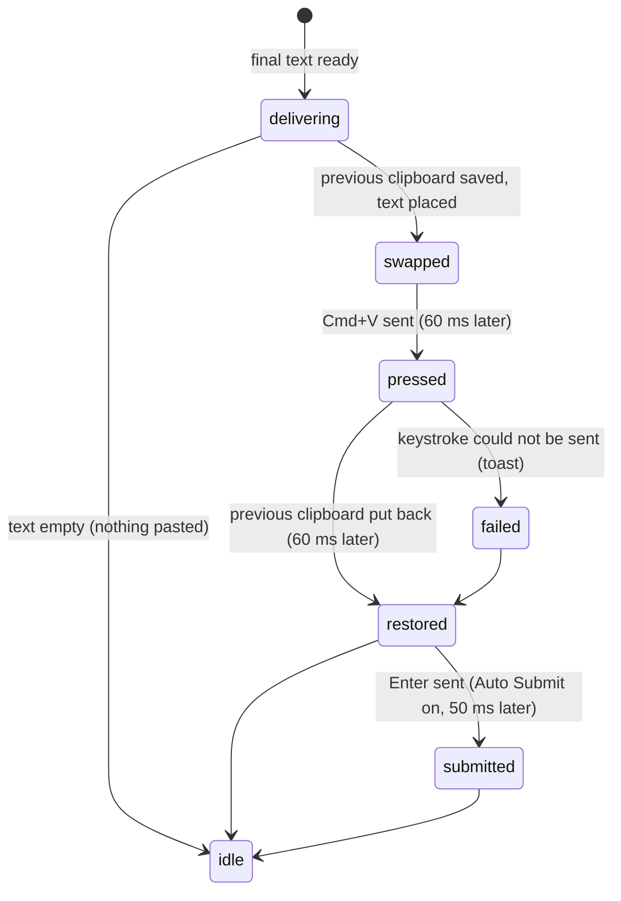

# Pasting

## Summary

Pasting is the last stretch of a dictation: getting the final text into whatever application is in front. By default Handy puts the text on the clipboard, presses Cmd+V on the user's behalf, and then puts the previous clipboard contents back, so the user's clipboard looks untouched afterwards. The Paste Method, Clipboard Handling, Auto Submit, and Append Trailing Space settings (Advanced › Output and Transcription) change what is inserted and what is left behind. Pasting happens only with non-empty text and is over in a fraction of a second.

## The simple case

The overlay's spinner disappears. In the same instant the recognized text appears at the text cursor in the app the user was using, exactly as if they had pressed Cmd+V. Anything they had copied earlier is still on the clipboard when they next paste by hand. The menu-bar icon returns to idle and the overlay fades out.

## The interaction, event by event

### Start

Pasting starts when the dictation's final text is ready — after transcription, or after post-processing for that binding — and the dictation has not been cancelled. If Append Trailing Space is on, a space is added to the text first. Then the paste method decides what happens:

- **Clipboard (Cmd+V)** — the default on macOS and Windows. Continues below.
- **None.** Nothing is inserted. The text is still in history and, with Clipboard Handling set to Copy to Clipboard, on the clipboard. The dictation ends.
- **Direct**, **Clipboard (Ctrl+Shift+V)**, **Clipboard (Shift+Insert)**, **External Script** — Windows and Linux only; see Platform differences.

Empty text never reaches this step: the overlay fades and nothing is pasted.

### Ends at once

Pasting ends at once with the None method (nothing is sent to the front app) and whenever the final text is empty. In both cases the history entry already exists and the clipboard is untouched unless Copy to Clipboard is set.

### Becomes active

With the clipboard method, Handy reads what is on the clipboard now — text if there is any, otherwise an image — and remembers it, then writes the dictation text to the clipboard. It waits the Paste Delay (Before) of 60 ms so the clipboard change settles, then presses Cmd+V: the Command key down, the V key, and the Command key released 100 ms later. The V key is resolved for the current keyboard layout so that Dvorak, AZERTY, and non-Latin layouts still paste.

> Technical note: the paste runs on Handy's main thread and the front application receives an ordinary key event, so it can do whatever it normally does with Cmd+V: insert, replace a selection, or, in an app with no focused text field, nothing at all. Handy cannot tell whether the paste "took".

### While active

For about 220 ms the clipboard holds the dictation text. If the user presses Cmd+V by hand in that window they paste the transcript; if they copy something in that window, their copy is overwritten by the restore below (but see Reliable Paste). The overlay is still showing its working spinner during this; it fades immediately after.

### Finish

After Paste Delay (After) — another 60 ms — the previous clipboard contents are put back: the remembered text, or the remembered image, or, if the clipboard was empty before, it is cleared so the transcript is not left behind. The restore happens even when the keystroke failed.

If Auto Submit is on, Handy waits 50 ms and presses the chosen key: Enter, Ctrl+Enter, or Cmd+Enter. If Clipboard Handling is Copy to Clipboard, the dictation text is written to the clipboard again now, after the restore, so it ends up on the clipboard after all. Then the overlay fades, the tray returns to idle, and the dictation is complete.

If the keystroke could not be sent at all, a toast "Failed to Paste Text — Text could not be pasted into the active application." appears in the settings window; the text is in history and the clipboard is restored as usual.

**Reliable Paste (Beta)**, a debug-section toggle on macOS and Windows, replaces the fixed 60 ms restore with a wait for the front app to actually read the clipboard: the restore happens 200 ms after the last read, or 8 s after publishing if no read was seen (500 ms if the keystroke failed), and is skipped entirely if the user copied something else meanwhile. Auto Submit and Copy to Clipboard follow the same rules on that path. If reliable paste cannot start, the ordinary path runs.

## Modifiers

| Modifier | Set before the start | Changed while active |
| --- | --- | --- |
| Push to talk | No effect. | No effect. |
| Binding | Decides whether the pasted text is the post-processed one. | Fixed. |
| Overlay style | No effect on pasting. | No effect. |
| Streaming model | No effect on pasting. | No effect. |
| Voice activity detection | No effect. | No effect. |
| Always-on microphone | No effect. | No effect. |

The settings that do change pasting — Paste Method, Clipboard Handling, Auto Submit, Append Trailing Space, the two Paste Delays, Reliable Paste — are read when pasting starts, so a change made during the recording applies to that dictation.

## Cancel and interrupt

| Event | Before active (text ready, about to paste) | While active (clipboard swapped, keystroke sent) |
| --- | --- | --- |
| Cancel | A cancel that lands before the paste begins discards the text: nothing is pasted, the history entry (already saved) stays. | Cannot interrupt the 220 ms sequence; the paste completes and the clipboard is restored. |
| Another trigger | Ignored until idle. | Ignored. |
| A setting changed mid-way | Read at the start of pasting. | No effect. |
| Microphone lost | No effect. | No effect. |
| Model or processing failure | Does not reach pasting. | — |
| The active application changes | The text goes to whatever app is frontmost at this instant — including Handy's own settings window if the user clicked into it, where Cmd+V lands in any focused field (a custom word, an API key) or nowhere. | Switching apps mid-sequence can send Cmd+V to the new app. |
| Handy quits or the system sleeps | Text lost (history kept). | The clipboard may be left holding the transcript if Handy dies between swap and restore. |
| Keyboard channel changes | Secure Input does not block Handy from *sending* keys; a password field as the target receives the paste. | Same. |

## Interactions with other systems

**Permissions.** On macOS sending Cmd+V requires Accessibility access; without it the keystroke fails and the toast appears every time.

**History and recordings.** The history entry is written before pasting and does not record whether the paste succeeded.

**Clipboard.** The whole mechanism. After a dictation the clipboard holds: what it held before (default), the transcript (Copy to Clipboard), or nothing (it was empty before). Only text and images are restored; files, rich text, and other types are lost and replaced by nothing.

**Model state.** None.

**Tray and overlay.** Both return to idle after the paste completes, not before.

**Sounds and system audio.** None.

**Settings persistence.** None.

**Platform differences.** Windows uses Ctrl+V and offers Direct typing, Ctrl+Shift+V, and Shift+Insert. Linux additionally offers External Script (the text is passed as one argument to a script path typed into a field below the dropdown; a non-zero exit is a paste failure) and a Typing Tool dropdown for the Direct method; on Wayland the clipboard is written through `wl-copy` and keystrokes through wtype, dotool, or ydotool, on X11 through xdotool or ydotool, falling back to Handy's own key injection. Direct typing is not offered on macOS (an existing Direct selection is shown disabled).

## Edge cases

- The front app has no text field: Cmd+V does nothing visible, Handy reports success, the text is only in history.
- The front app is a terminal that treats Cmd+V differently, or a remote desktop: the paste may not arrive; Windows/Linux users can pick Ctrl+Shift+V or Shift+Insert, macOS users cannot.
- Clipboard managers that react to clipboard changes may record the transcript during the 220 ms swap.
- Copy to Clipboard plus an image previously on the clipboard: the image is restored and then overwritten by the transcript.
- Auto Submit with Cmd+Enter on Windows/Linux is labeled "Super+Enter" and sends the Super (Windows) key.
- A trailing space is appended to the pasted text but not to the history entry.
- Reliable Paste falls back silently to the timed path if the transaction cannot start; there is no indication which path ran.

## Open questions and verification

- Whether pasting into Handy's own settings window (when it is frontmost) inserts into a focused field or is swallowed was not tested. Suspected sharp edge.
- The 100 ms modifier hold and the two 60 ms delays were read from the code; the total time the transcript occupies the clipboard was not measured.
- Whether restoring an image works for every image type macOS can hold (only bitmap images are read back) was not tested.
- Whether the "Failed to Paste Text" toast ever appears on macOS with Accessibility granted — the keystroke call rarely reports failure even when the target ignored it — was not confirmed.

Verified against Handy commit `af48dd6`.
