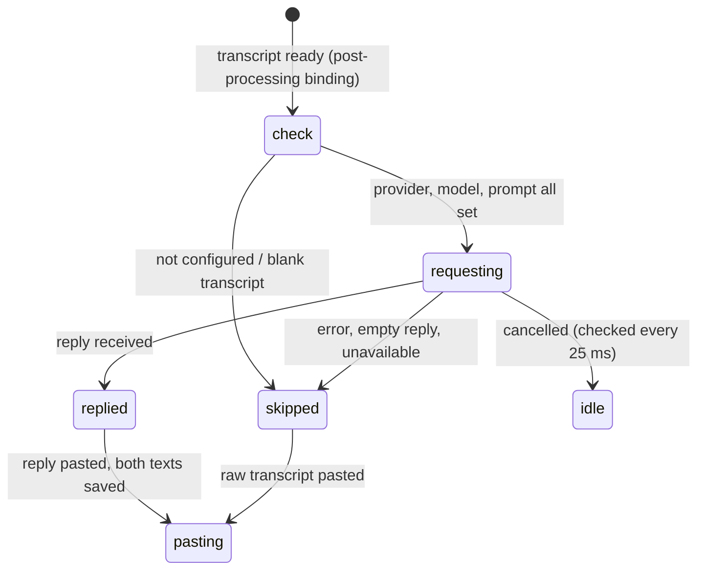

# Post-processing

## Summary

Post-processing sends a finished transcript to a large language model with a prompt — by default, "Improve Transcriptions": fix spelling and punctuation, turn number words into digits, drop fillers — and pastes the model's reply instead of the raw transcript. It is off by default and lives behind Advanced › Experimental › Post Processing. Once on, a Post Process section appears in the sidebar for choosing a provider, key, model, and prompt, and a second shortcut, Transcribe with Post-Processing (Option+Shift+Space), becomes the way to request it: the plain Transcribe shortcut never post-processes. Every failure falls back, silently, to the ordinary transcript.

## The simple case

With OpenAI configured and the "Improve Transcriptions" prompt selected, the user holds Option+Shift+Space and says "so um the meeting is at three thirty on tuesday". They let go. The pill reads "Transcribing..." and then "Processing..." while the transcript travels to the provider and back; a second or two later the overlay fades and "So the meeting is at 3:30 on Tuesday." is pasted. The History page shows the entry with the raw transcript; the post-processed text is stored alongside it and is what "Copy Last Transcript" in the tray copies.

## The interaction, event by event

### Start

Post-processing starts when a dictation begun with the Transcribe with Post-Processing shortcut (or `--toggle-post-process`, or SIGUSR1 on macOS) has its cleaned transcript. The overlay switches from "Transcribing..." to "Processing..." — in the pill, or in the panel's control row for a live session. Before anything is sent Handy checks, in order, that: the transcript is not blank; a provider is selected; that provider has a model name set; a prompt is selected; the prompt text is not empty. Any of these failing skips post-processing without a message and the raw transcript is pasted.

> Technical note: a fresh install has no selected prompt. The "Improve Transcriptions" prompt exists, but `post_process_selected_prompt_id` is empty until the user picks it on the Post Process page. Enabling Post Processing and configuring a provider is therefore not enough: until a prompt is chosen, the post-processing shortcut behaves exactly like the plain one.

### Ends at once

Post-processing ends at once — raw transcript pasted, nothing sent — in every skipped case above, and when the selected provider is Apple Intelligence on a machine where it is not available.

### Becomes active

The request is sent. For providers marked as supporting structured output (OpenAI, Z.AI, OpenRouter, Cerebras, AWS Bedrock, Apple Intelligence) the prompt becomes the system message with the `${output}` placeholder removed, the transcript is the user message, and the reply is requested as a small JSON object with one `transcription` field. For the others (Anthropic, Groq, Custom) `${output}` in the prompt is replaced by the transcript and the whole prompt is sent as one message. OpenRouter and Custom endpoints are additionally asked to skip "reasoning"; if the endpoint rejects that, the request is retried once without it and the endpoint is remembered for the rest of the session.

### While active

The overlay shows "Processing..." with its spinner. There is no timeout on the request: a provider that never answers keeps the dictation in this state indefinitely. The user can cancel from the overlay ✕, the tray, or `--cancel`; the cancel is noticed within 25 ms and the raw transcript is *not* pasted either — a cancel abandons the whole dictation. The request itself is not aborted and finishes in the background.

### Finish

On a reply: any leading `<think>…</think>` block and invisible characters are stripped; for structured replies the `transcription` field is extracted (if the reply is not the expected JSON, the raw reply text is used). The reply becomes the final text. The history entry stores the raw transcript, the post-processed text, and the prompt that was used, and marks the entry as post-processing requested. The reply is pasted per [Pasting](pasting.md).

On any failure — network error, HTTP error, an empty reply, a structured-output request that fails and whose plain retry also fails — the raw transcript is pasted and saved, with no visible indication. The only record is in Handy's log.

## Modifiers

| Modifier | Set before the start | Changed while active |
| --- | --- | --- |
| Push to talk | No effect. | No effect. |
| Binding | Transcribe with Post-Processing: this document applies. Transcribe: never post-processes, whatever the settings. | Fixed at the trigger. |
| Overlay style | The "Processing..." label is shown in the pill or panel; with None there is no indication. | The overlay in use stays. |
| Streaming model | The panel keeps the live text under the "Processing..." row; the reply replaces it only at paste time, never on screen. | Fixed. |
| Voice activity detection | No effect. | No effect. |
| Always-on microphone | No effect. | No effect. |

The provider, key, model, and prompt are read when post-processing starts, so a change made during the recording applies to that dictation.

## Cancel and interrupt

| Event | Before active (checks) | While active (request in flight) |
| --- | --- | --- |
| Cancel | Overlay ✕, tray Cancel, `--cancel`: the dictation is abandoned, nothing pasted, no history entry. | Same; the network request is not aborted but its reply is discarded. |
| Another trigger | Ignored. | Ignored until the reply or the cancel checkpoint. |
| A setting changed mid-way | Read at the start of post-processing. | No effect on the request in flight. |
| Microphone lost | No effect. | No effect. |
| Model or processing failure | A missing provider/model/prompt: silently skipped. | Any request failure: raw transcript pasted silently. Apple Intelligence unavailable: skipped. |
| The active application changes | No effect. | Affects where the paste lands. |
| Handy quits or the system sleeps | Lost. | Sleep pauses networking; the request may time out at the OS level and fall back on wake. |
| Keyboard channel changes | No effect. | No effect. |

## Interactions with other systems

**Permissions.** Apple Intelligence requires an Apple-silicon Mac on macOS 26 or later with Apple Intelligence enabled; availability is checked when the provider is chosen and again at each use.

**History and recordings.** Entries record both texts and the prompt; re-transcribing an entry from History re-runs post-processing if the original requested it, using the current provider and prompt.

**Clipboard.** The reply, not the raw transcript, is what reaches the clipboard and the paste.

**Model state.** None; the speech model has already finished.

**Tray and overlay.** "Processing..." in the overlay; the tray stays on its transcribing glyph.

**Sounds and system audio.** None.

**Settings persistence.** Provider selection, per-provider API keys, per-provider model names, the prompt list, and the selected prompt are all saved as they are edited on the Post Process page; see [The Post Process page](../settings/post-processing-page.md).

**Platform differences.** Apple Intelligence appears as a provider only on Apple-silicon Macs. Everything else is identical across platforms.

## Edge cases

- The default prompt tells the model not to answer questions in the transcript, but only to clean them; a provider that ignores this pastes an answer instead of the dictated question.
- A reply that is empty after stripping is treated as a failure (raw transcript pasted).
- A structured reply whose JSON lacks the field pastes the entire JSON-ish reply text.
- `${output}` in a prompt is removed for structured-output providers and substituted for the others, so the same prompt can behave differently across providers.
- Chinese script conversion runs before the LLM call; the provider sees the converted text.
- The API key field is saved on blur; a key typed and then the window closed without clicking away is not saved.
- Post-processing is skipped for blank transcripts specifically so the LLM does not reply "you need to provide a transcription".

## Open questions and verification

- No request timeout exists: a hung provider leaves the dictation at "Processing..." until cancelled. Suspected bug.
- A fresh install has no selected prompt, so enabling post-processing does nothing until the user visits the Post Process page and picks one — with no hint anywhere. Suspected bug.
- Failures are invisible (no toast), so a wrong API key looks like post-processing "not working". Likely a product call.
- Whether `--toggle-post-process` works when post-processing is disabled (the binding is unregistered but the coordinator accepts the input by id) was read from the code as "yes, it records and then post-processing is skipped for lack of configuration"; not reproduced.

Verified against Handy commit `af48dd6`.
