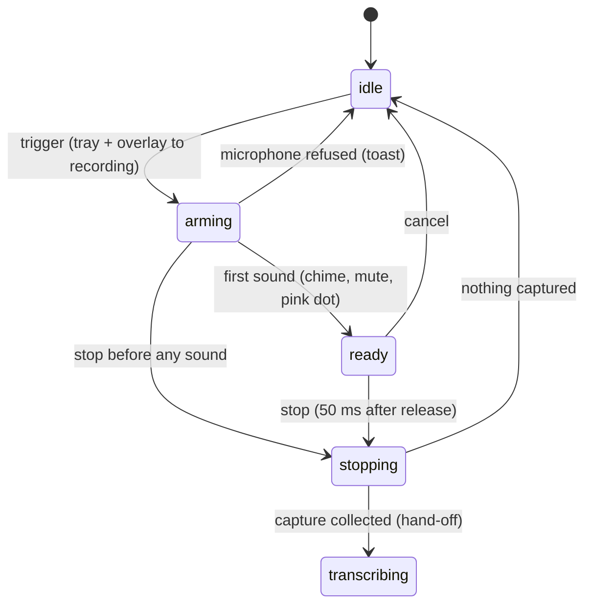

# Starting and recording

## Summary

Starting and recording is the first half of a dictation: from the trigger to the stop. It covers what changes on screen the instant the shortcut is pressed, what happens while the microphone is opening, the moment the overlay turns ready and the chime plays, what the user sees and can do while recording, and the stop itself — the last thing this document owns before handing the captured sound to [Transcribing](transcribing.md). It is reached from anywhere on the Mac by the transcribe shortcut (see [Triggers and shortcuts](../foundations/triggers-and-shortcuts.md)) and is unavailable while another dictation is in progress.

## The simple case

In a text field in any app, the user presses and holds Option+Space. Immediately the menu-bar icon switches to its recording glyph and a small pill fades in at the bottom center of the screen with a grey dot and a faintly pulsing row of bars. A fraction of a second later the dot turns pink and starts pulsing and the bars begin to move with the user's voice; with audio feedback on, the start chime sounds at that same moment.

The user speaks. The bars follow their voice and go flat in pauses. They let go of Option+Space. About 50 ms later the pill's bars are replaced by a small spinner and the word "Transcribing..." and the menu-bar icon switches to its transcribing glyph; the stop chime sounds. The microphone closes. What happens next is in [Transcribing](transcribing.md).

With the default Live overlay and a streaming model, the pill is wider and grows into a panel as soon as the first words are recognized, showing the text as it is spoken with a timer on the right; see [Live transcription](live-transcription.md).

## The interaction, event by event

### Start

The interaction starts when a trigger is accepted while idle. In the same instant, and in this order, Handy: begins loading the active model in the background if it is not loaded (and the voice detector if it is not ready); switches the tray icon to recording and its menu to the busy layout (Cancel instead of the model submenu); decides the VAD policy from the setting and whether the active model streams; starts a live-transcription session if the model streams; shows the overlay — the panel form if the style is Live and the model streams, the pill for Live with a non-streaming model or for Minimal, nothing for None — in its arming look; and asks the microphone to open. The binding that fired (Transcribe or Transcribe with Post-Processing) is fixed now.

If the microphone refuses, everything above is undone: the overlay hides, the tray returns to idle, any streaming session is abandoned, and a toast in the settings window says why (see [Audio capture](../foundations/audio-capture.md)). The dictation is over and the next trigger can start a new one.

Once the microphone is accepted the Cancel shortcut is registered, so from here Escape is intercepted.

### Ends at once

The dictation ends at once when the stop arrives before any sound was delivered, or when a cancel arrives before or during arming. In push to talk, a tap on Option+Space shorter than the microphone's start-up time (roughly 50–250 ms on a built-in microphone) is exactly this case: the pill flashes arming, the start chime never plays, and the stop runs against an empty capture. The overlay switches to "Transcribing..." for an instant, then fades out; the stop chime does play (it is tied to the stop, not to readiness). No recording file and no history entry are created. Nothing is pasted.

### Becomes active

Recording becomes active when the microphone delivers its first chunk of sound. The overlay's dot turns pink and begins a slow pulse, the bars switch from the faint travelling pulse to live levels, and the panel's timer (Live, streaming model) starts counting from 0:00. If audio feedback is on the start chime plays now, through the chosen output device at the chosen volume, and Handy waits for it to finish before muting system audio if Mute While Recording is on. Readiness is a one-shot: a stop or cancel that lands first cancels the chime and the mute.

> Technical note: readiness is announced by the audio thread, not by a timer, so on a Bluetooth headset the arming look can last a second or more. The chime is deliberately late for the same reason: it tells the user the microphone is actually hearing them.

### While active

The user speaks. Every 33 ms the overlay receives the current spectrum and the nine bars rise and fall with it (smoothed so they never jump). Voice activity detection silently decides which frames are kept; the bars show the raw signal regardless. With a streaming model, recognized text appears in the panel as it is spoken. The tray icon stays on recording.

What the user can do: keep holding (push to talk) or do anything else (toggle mode); press Escape, click the overlay's ✕, or choose Cancel from the tray to abandon it; switch applications — the recording continues and the eventual paste goes wherever focus is then. What is ignored: the other transcribe shortcut; in push to talk, a second press of the same shortcut; in toggle mode, releases. The settings window can be used meanwhile, but changing the microphone or input channel is refused or restarts the stream (see [Audio capture](../foundations/audio-capture.md)).

There is no maximum recording length. A long recording costs memory (about 2 MB per minute of kept sound) and a proportionally long transcription afterwards.

### Finish

The stop is the release of the shortcut in push to talk (honored 50 ms later unless the key repeats), the same shortcut pressed again in toggle mode, or a remote toggle for the same binding. At the stop, in order: any pending readiness cue is cancelled; the Cancel shortcut is unregistered (Escape no longer reaches Handy); the tray switches to transcribing; the overlay switches to its working look — the pill shows a spinner and "Transcribing...", the panel keeps its text and replaces the waveform row with the spinner; system audio is unmuted; the stop chime plays. Then, off the main thread, the extra recording buffer (debug, default 0 ms) runs, the microphone is drained and, in on-demand mode, closed, and the capture is collected and padded if short.

If the capture is empty the dictation ends here: the overlay fades, the tray returns to idle, no file is written. Otherwise the recording file starts writing and the capture is handed to [Transcribing](transcribing.md). From the stop onward the dictation is in the processing stage: no shortcut affects it, and only the overlay ✕, the tray's Cancel, or `handy --cancel` can abandon it.

## Modifiers

| Modifier | Set before the start | Changed while active |
| --- | --- | --- |
| Push to talk | On: the stop is the release (plus 50 ms). Off: the stop is the next press of the same shortcut. | Read at each key event; see [Triggers and shortcuts](../foundations/triggers-and-shortcuts.md). |
| Binding | Transcribe with Post-Processing marks the dictation for [post-processing](post-processing.md) at the end; nothing differs during recording. | Fixed at the start. |
| Overlay style | Live: panel with a streaming model, pill otherwise. Minimal: pill. None: no overlay; the tray icon is the only indicator. | The overlay already shown stays; level updates stop if changed to None. |
| Streaming model | Yes: the panel form, live text, the longer VAD tail, and the streaming session. No: pill, batch transcription at the stop. | Fixed at the start. |
| Voice activity detection | On: silence is dropped from the capture. Off: everything is kept. | Fixed at the start. |
| Always-on microphone | On: no arming phase to speak of; ready almost immediately after the trigger, and the system microphone indicator is on even between dictations. Off: the microphone opens at the trigger. | No effect on the current dictation. |

## Cancel and interrupt

| Event | Before active (arming) | While active (ready, recording) |
| --- | --- | --- |
| Cancel | Escape (once the microphone is accepted), the overlay ✕, the tray Cancel item, or `--cancel`: the overlay fades, the tray returns to idle, the chime and mute are suppressed, nothing is kept. | Same; the capture is discarded, no file, no history entry, no stop chime. See [Cancelling](cancelling.md). |
| Another trigger | Dropped within 30 ms; otherwise treated against the recording stage (a same-binding stop in toggle mode, else ignored). | Same binding: stop (toggle mode) or ignored (push to talk). Other binding or other-binding remote toggle: ignored. |
| A setting changed mid-way | Changing the microphone restarts the stream; arming restarts. | Model switch: the new model loads and is used at the stop if ready. Overlay style: applies next time. Push to talk: applies to the next key event. Microphone: the stream is rebuilt; the capture so far may be lost. |
| Microphone lost | Refused at open: dictation ends with a toast. | The bars go flat; the stop still collects what was captured; the next dictation rebuilds the stream. |
| Model or processing failure | A load failure shows "Failed to load model: {name}" but recording continues. | Same; the failure surfaces at the stop as "Transcription Failed". |
| The active application changes | No effect. | No effect on recording; the paste later goes to the app focused at that moment. |
| Handy quits or the system sleeps | Lost. | Lost; on wake the recording is nominally still active with a dead stream until stopped or cancelled. |
| Keyboard channel changes | Secure Input: the fallback registration keeps the shortcut working; the Cancel shortcut is also shadowed while recording. | Auto-repeat absorbed by the 50 ms grace. Switching the keyboard implementation re-registers bindings; a held push-to-talk key's release may be missed, leaving the recording running. |

After a cancel the user is idle with nothing saved. After the stop the user is in [Transcribing](transcribing.md).

## Interactions with other systems

**Permissions.** Microphone access is required and, on macOS, Accessibility access for the shortcut to be heard at all. A denial shows the "Microphone Access Denied" toast in the settings window only.

**History and recordings.** Nothing is written until the stop; the recording file begins writing at the hand-off to transcribing.

**Clipboard.** Untouched during recording.

**Model state.** The trigger starts a background load if needed; the footer dot goes yellow ("Loading {name}...") while it loads, then green. Recording counts as activity for the unload timer.

**Tray and overlay.** Tray: recording glyph at the trigger, transcribing glyph at the stop, Cancel item in the menu throughout. Overlay: arming → ready → working, per [The overlay](the-overlay.md).

**Sounds and system audio.** Start chime at readiness (blocking the mute until done), stop chime at the stop (after unmuting). Both only with Audio Feedback on; volume and output device from settings. Mute While Recording covers readiness to stop.

**Settings persistence.** None written by a dictation, except the microphone setting being rewritten to Default after a device fallback.

**Platform differences.** On Linux the Cancel shortcut is never registered, so Escape never cancels; the overlay defaults to None, so the tray icon is the only indicator unless the user enables it; the tray recording glyph is a pink icon rather than a template image. Windows forces the overlay topmost after each show. Mute uses a different mechanism per platform.

## Edge cases

- Two dictations back to back: the second trigger is ignored until the first has finished processing, which with a long recording can be several seconds after its overlay disappeared; see [Cancelling](cancelling.md) for the same gap after a cancel.
- Starting a dictation with no model selected: recording works normally; the stop fails with "Transcription Failed: Model is not loaded for transcription." and an empty history entry.
- Starting while the model is still loading from a previous selection: recording proceeds; the stop waits for the load.
- With audio feedback on and Bluetooth output, the start chime can arrive noticeably after the pink dot because the chime plays through the slower device.
- With the overlay set to None and the settings window hidden, a refused microphone gives no visible feedback beyond the tray icon flashing.
- A remote toggle (`--toggle-transcription`) while recording in push to talk stops the recording even though the key is still held; the later release is then ignored.
- Holding the shortcut across a system sleep: on wake, a release stops the recording with whatever the dead stream left.

## Open questions and verification

- The 50–250 ms arming estimate for a built-in microphone is inferred from code comments, not measured.
- Whether the overlay's "Transcribing..." state is visible at all for an empty capture, or the fade begins too quickly to see, was not observed.
- The claim that the bars show the raw signal while VAD silently drops frames is read from the code (levels are computed before VAD); not confirmed visually.
- Whether a microphone change mid-recording preserves the capture so far was not determined (see [Audio capture](../foundations/audio-capture.md)).

Verified against Handy commit `af48dd6`.
