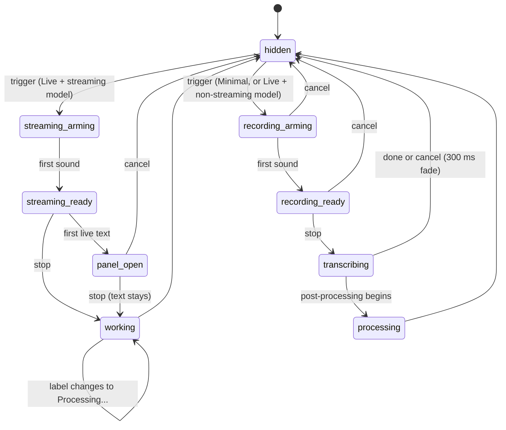

# The overlay

## Summary

The overlay is the small floating card Handy shows during a dictation: a pill while recording and transcribing, a panel that grows to show live text with a streaming model, and nothing when the Overlay setting is None. It sits at the bottom center of the screen the mouse pointer is on (or the top), above every window and Space, never takes focus, and has one control — a ✕ that cancels. Its look follows the app theme (System by default). This document owns what each state looks like; the dictation documents say when each state is entered.

## The simple case

The user presses the shortcut. A rounded pill about 172×40 points fades in at the bottom of the screen: a small grey dot on the left, nine short grey bars pulsing gently in a wave in the middle, a round ✕ on the right. Within a fraction of a second the dot turns pink and pulses, and the bars turn pink and dance with the user's voice. When they let go, the pill widens to about 216 points and the bars are replaced by a small spinning ring and the text "Transcribing..."; the ✕ stays. A moment later the whole pill fades out.

## The states

**Recording, arming.** The pill as described, dot grey at half opacity, bars grey and faint, animating a travelling pulse that acknowledges the shortcut without pretending to hear anything.

**Recording, ready.** Dot pink with a slow ripple; bars pink, each 3–18 points tall following the spectrum of the voice (smoothed so they decay rather than snap). The ✕ is on the right.

**Streaming (Live with a streaming model).** The same control row in a slightly wider pill (184 points) that can open. Arming and ready look the same as above.

**Panel open.** Once live text exists the card widens to about 392 points with smaller corner radius and a text region unfolds above the control row: italic 15-point text, committed words followed by tentative ones and a blinking pink caret, up to about 64 points tall, scrolling with a fade at the edge. A timer (m:ss) appears on the right of the control row next to the ✕. With the overlay placed at the top of the screen the control row sits on top and the text flows downward beneath it.

**Transcribing / Processing (pill).** The pill widens to 216 points; the left shows a spinning ring (pink arc on a faint track), the middle the label "Transcribing..." or "Processing...", the right the ✕.

**Working (panel).** The control row becomes spinner + label + ✕ while the text region stays open if it has text; if it has none, the card shrinks to the working pill.

**Hidden.** After the dictation ends or is cancelled, the card fades out (about 240–300 ms) and the window is hidden.

## Placement and behavior

The card is horizontally centered on the monitor under the mouse pointer at the moment it is shown, 15 points above the bottom of that monitor's work area (so it sits above the Dock when the Dock is shown) or 46 points from the top with Overlay Position set to Top. It is repositioned at every state change and when the position setting changes. It appears over full-screen apps and on every Space. It cannot be moved, resized, or focused; clicking anywhere on it other than the ✕ does nothing and does not bring Handy forward. The ✕ cancels the dictation (see [Cancelling](cancelling.md)); hovering it tints it, clicking scales it briefly.

The pill's text ("Transcribing...", "Processing...") follows the interface language. Colors follow the app theme: a near-opaque light or dark surface with a hairline border, pink accents (the logo color), and grey neutrals; no shadow or blur.

## Modifiers

| Modifier | Set before the start | Changed while active |
| --- | --- | --- |
| Push to talk | No effect on the overlay. | No effect. |
| Binding | The post-processing binding adds the "Processing..." label after "Transcribing...". | Fixed. |
| Overlay style | Live (default): streaming form with a streaming model, pill otherwise. Minimal: pill always. None: never shown. | A change applies the next time the overlay is shown; level updates stop at once if changed to None. |
| Streaming model | Decides pill vs streaming form under Live. | Fixed at the trigger. |
| Voice activity detection | No effect on what is drawn; the bars show the raw signal. | No effect. |
| Always-on microphone | Arming is over almost immediately. | No effect. |

## Cancel and interrupt

| Event | Before active (arming) | While active (ready, panel, working) |
| --- | --- | --- |
| Cancel | The ✕ or any other cancel fades the card out. | Same. |
| Another trigger | No effect on the overlay. | No effect. |
| A setting changed mid-way | Overlay Position: the card moves to the other edge immediately. Theme: colors change live. Overlay style: next show. | Same. |
| Microphone lost | The card stays arming until stop or cancel. | Bars go flat; the card stays until the dictation ends. |
| Model or processing failure | The card shows "Transcribing..." and then fades when the dictation fails. | Same. |
| The active application changes | No effect; the card never follows focus. | No effect. |
| Handy quits or the system sleeps | The window goes with the process. | On wake the card is where it was, frozen, until stop or cancel. |
| Keyboard channel changes | No effect. | No effect. |

## Interactions with other systems

**Permissions.** None.

**History and recordings.** None.

**Clipboard.** None.

**Model state.** The streaming form is chosen from the model's advertised capability at the trigger; if the loaded model then turns out not to stream, the wider pill is shown but never opens.

**Tray and overlay.** The tray icon changes in step with the overlay states (recording, transcribing, idle). With Overlay None the tray is the only indicator.

**Sounds and system audio.** The start chime coincides with the dot turning pink; the stop chime with the switch to "Transcribing...".

**Settings persistence.** `overlay_style`, `overlay_position`, `theme`.

**Platform differences.** Linux defaults to None; with a layer-shell compositor the card is anchored to the screen edge by the compositor, otherwise it is an ordinary always-on-top window and monitor detection may fail under Wayland. Windows places the card 40 points above the bottom (clearing the taskbar) or 4 points from the top and re-asserts topmost after each show. macOS uses a non-activating panel that joins all Spaces.

## Edge cases

- Multiple monitors: the card appears on the monitor under the pointer, which may not be where the user is typing; it does not move if the pointer moves during the dictation.
- A dictation started with the pointer over a monitor that is then disconnected: the card is repositioned at the next state change onto the primary monitor.
- The pill with Minimal style never shows a timer, even with a streaming model.
- The "Transcribing..." state for an empty capture may be too brief to see.
- The card's text region hides its scrollbar; scroll-back is only discoverable by scrolling over the panel.
- The overlay window exists even when the style is None, hidden; level events are suppressed to keep it idle.

## Open questions and verification

- The exact bar heights, colors, and the ripple/pulse timings are read from the stylesheet and not checked visually.
- Whether the bottom placement clears the Dock with auto-hide on, and what happens when the Dock is on the side, was not tested.
- Whether clicking the card (not the ✕) passes the click through to the window beneath, or swallows it, was not tested.
- Whether the fade-out can be cut short by a new dictation starting within 300 ms was not tested.

Verified against Handy commit `af48dd6`.
