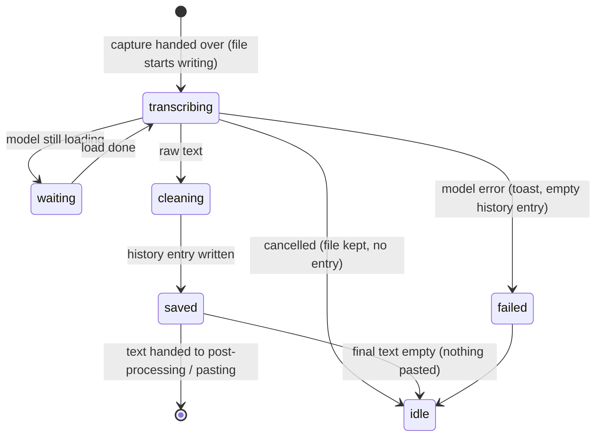

# Transcribing

## Summary

Transcribing is the stretch of a dictation between the stop and the final text: the capture is written to a recording file and run through the active model, the language is resolved, the raw transcript is cleaned up, and a history entry is saved. It ends by handing the text to [Post-processing](post-processing.md) (only for the post-processing binding) and then to [Pasting](pasting.md). The user sees it as the overlay's "Transcribing..." spinner and the tray's transcribing glyph. It cannot be stopped, only cancelled from the overlay ✕, the tray, or `--cancel`.

## The simple case

The user lets go of the shortcut. The pill reads "Transcribing..." with a spinner. Half a second to a few seconds later — depending on the model, the length of the recording, and whether the model was already loaded — the spinner disappears along with the pill, and the recognized sentence appears in the text field they were in. On the History page a new entry has appeared with that sentence and a play button for the recording.

## The interaction, event by event

### Start

Transcribing starts with a non-empty capture. Two things begin at once: the recording file `handy-<unix seconds>.wav` is written to the recordings folder and checked for completeness, and the model is asked for text. If a live-transcription session was running (streaming model, Live style), it is finalized instead and its text is used; if it produced nothing, the capture is batch-transcribed as below. If the model is still loading — because this is the first dictation after selection or after an idle unload — transcription waits for the load to finish; the overlay keeps showing "Transcribing..." and the footer says "Loading {name}...". If no model is selected or the load failed, transcription fails immediately (see Finish).

### Ends at once

Transcribing ends at once only by cancellation. There is no short path: every non-empty capture is transcribed in full. A cancel arriving now lets the file finish writing and the model finish its work (neither can be interrupted), then discards the text; see [Cancelling](cancelling.md).

### Becomes active

The model produces text. Before it runs, Handy resolves the [effective language](../cross-cutting/language-and-translation.md) from the Language setting and the model's capabilities, decides whether to translate to English (only if the toggle is on, the model supports translation, and the source is not English), and — for Whisper-family models only — hands the Custom Words list to the model as a hint. The model's work is the bulk of the time: on Apple silicon with a recommended model it is faster than real time, so a ten-second recording takes well under ten seconds; a first run after a load, or a large model on CPU, takes longer.

### While active

Nothing updates on screen while the model works; the spinner turns. The user can do other things, including switching apps — the paste will go to whatever is focused when it arrives. Pressing the shortcut does nothing. Escape does nothing (the Cancel shortcut was unregistered at the stop); the overlay ✕, the tray's Cancel, and `--cancel` still cancel.

When the model returns, the raw text is cleaned in a fixed order:

1. **Custom words.** For models that did not receive the hint, each word or run of up to three words in the transcript is compared with the Custom Words list; a close enough match (edit distance and phonetic similarity, threshold 0.18 by default) is replaced by the custom spelling, keeping the original capitalization pattern and surrounding punctuation. Only words of A–Z and digits are matched.
2. **Filler words.** With Remove Filler Words on (the default), tokens that are fillers in every language ("uh", "uhm", "umm", "hmm", "mmm", …) are removed. "um", "ah", "eh", "ha" are removed only when Handy knows the text is English; "äh"/"ähm" for German and "euh" for French likewise. Knowing the language means: the user chose it, the model only does one language, the model detected it, or the text itself is confidently detectable. A trailing comma or period after a removed filler goes with it.
3. **Stutters.** Three or more consecutive repeats of the same word collapse to one ("I I I think" → "I think"; "no no" stays).
4. **Whitespace.** Runs of spaces collapse to one; leading and trailing space is trimmed.
5. **Chinese script.** If the effective language is Simplified or Traditional Chinese, the text is converted to that script.

A cleanup error never loses text: if any step fails the raw transcript is used.

### Finish

The history entry is written: the timestamp title, the cleaned transcript, whether post-processing was requested, and — once post-processing is done — the post-processed text and the prompt used. The entry appears on the History page immediately and the oldest unsaved entries beyond the limit are deleted along with their files. If the unload timeout is "Immediately", the model is unloaded now.

Then one of:

- **Text.** For the plain Transcribe binding the text goes straight to [Pasting](pasting.md). For the post-processing binding it goes to [Post-processing](post-processing.md) first (the overlay switches to "Processing...").
- **Empty text.** The model heard nothing it could transcribe. The overlay fades, the tray returns to idle, nothing is pasted. The history entry still exists, with empty text, and shows "Transcription failed. You can re-transcribe using the retry icon."
- **Failure.** The model could not run: not loaded ("Model is not loaded for transcription."), failed to load, or crashed. A toast "Transcription Failed" with the error appears in the settings window; an entry with empty text is saved so the recording can be retried from History; the overlay fades and the tray returns to idle. A crash also unloads the model so the next dictation reloads it.

## Modifiers

| Modifier | Set before the start | Changed while active |
| --- | --- | --- |
| Push to talk | No effect. | No effect. |
| Binding | Transcribe with Post-Processing sends the cleaned text to [Post-processing](post-processing.md) before pasting and records that in the history entry. | Fixed at the trigger. |
| Overlay style | Live with a streaming model: the panel keeps the live text visible under the spinner. Otherwise the pill reads "Transcribing...". None: only the tray glyph. | The overlay in use stays. |
| Streaming model | Yes: the live session is finalized and its text used (batch only as a fallback). No: batch transcription of the capture. | Fixed at the trigger. |
| Voice activity detection | Decides what the capture contained; off means silence is transcribed too, which can produce spurious text. | Fixed at the trigger. |
| Always-on microphone | No effect. | No effect. |

## Cancel and interrupt

| Event | Before active (waiting for the model) | While active (model running, cleaning, saving) |
| --- | --- | --- |
| Cancel | Overlay ✕, tray Cancel, `--cancel`: the overlay fades and tray idles at once; the load completes in the background; the result is dropped at the next checkpoint. Escape does nothing. | Same. The recording file is already written and stays; the history entry is written only if the cancel arrives after saving. See [Cancelling](cancelling.md). |
| Another trigger | Ignored until the dictation is idle again. | Ignored. |
| A setting changed mid-way | Switching models now: the dictation uses whichever finishes loading; a model switch during transcription lets the old model finish and then drops it. Changing Custom Words, filler removal, or language mid-way is read when cleanup runs. | Same. |
| Microphone lost | No effect. | No effect. |
| Model or processing failure | Load fails: "Transcription Failed" toast, empty entry. | Engine error or crash: toast, empty entry, model unloaded on crash. |
| The active application changes | No effect on transcription. | No effect; affects where the paste lands. |
| Handy quits or the system sleeps | The capture is lost; a partially written file may remain. | Sleep pauses the work; it resumes on wake. |
| Keyboard channel changes | No effect. | No effect. |

## Interactions with other systems

**Permissions.** None.

**History and recordings.** The file is written in parallel with transcription and verified; if writing fails, no history entry is saved for this dictation even though text may be pasted. Entries beyond History Limit (5) are removed after each save unless starred.

**Clipboard.** Untouched.

**Model state.** Waits for a load in progress; unloads immediately if so configured; a crash unloads. The footer dot reflects each of these.

**Tray and overlay.** Transcribing glyph; pill spinner "Transcribing..." or the panel's working row. Both revert when the dictation ends, whatever the outcome.

**Sounds and system audio.** None during transcription; the stop chime already played.

**Settings persistence.** None.

**Platform differences.** Model speed differs by accelerator (Metal on macOS, Vulkan elsewhere, CPU fallback). Filler and custom-word rules are the same everywhere.

## Edge cases

- A recording of pure room noise that VAD let through transcribes to empty text and leaves a "Transcription failed" entry in History even though nothing failed. Likely worth treating as a bug (see Open questions).
- Custom words containing spaces ("MacBook Pro") match runs of words; custom words with "&" also match the spoken "and".
- A custom word with non-ASCII letters is still given to Whisper-family models as a hint but is never fuzzy-matched.
- With Language set to a language the active model does not support, the model is run in auto-detect (or its fallback language) and the unsupported choice stays in the setting for the next model.
- Translate to English with English speech does nothing (the translation task is skipped for an English source).
- Very short captures are padded to 1.25 s before the model sees them; one-word dictations work because of this.
- Pasting and the history entry use the same text, except that the Append Trailing Space setting applies only to the paste.

## Open questions and verification

- Empty transcripts create history entries that read "Transcription failed" with a retry icon, indistinguishable from real failures. Suspected bug or at least a copy problem.
- The model-detected language (Whisper's own detection) is used as evidence for filler removal; whether this makes "um" removal reliable for English speakers using Auto was not tested.
- Whether a failed recording-file write really results in pasted text with no history entry (the code pastes regardless of the file) was not reproduced.
- Transcription timings quoted as "faster than real time" come from log statements and catalog speed scores, not measurement.

Verified against Handy commit `af48dd6`.
