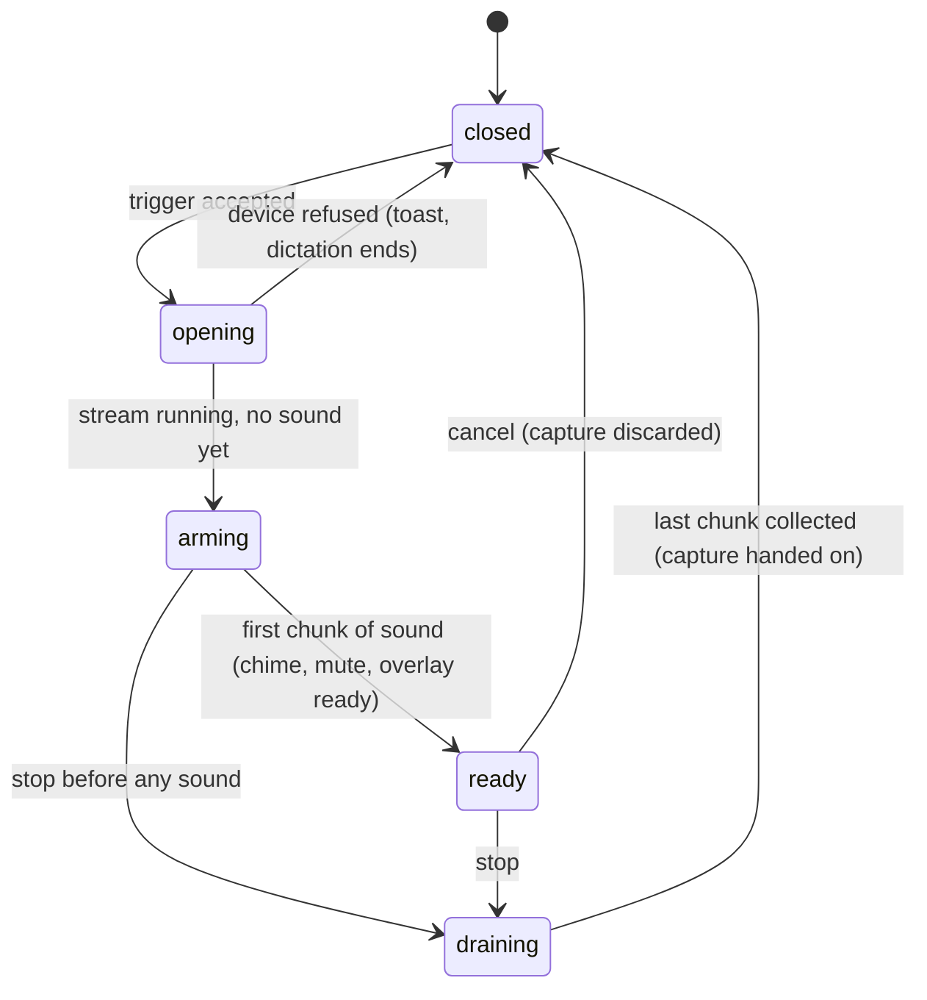

# Audio capture

## Summary

This document is the microphone model: which device Handy records from, when the microphone is opened and closed, what "ready" means, how voice activity detection decides what is kept, what the level meter shows, and how system audio is muted and restored. It owns every number a dictation document needs about sound. Capture happens only inside a dictation; there is no way to record without a [trigger](triggers-and-shortcuts.md).

## The simple case

The user holds Option+Space. Handy opens the system-default microphone, and a fraction of a second later the first chunk of sound arrives. At that instant the overlay's dot turns pink and the waveform starts moving; if audio feedback is on, the start chime plays. The user speaks. Voice activity detection keeps the speech and a little silence around it and drops the rest. The user lets go; Handy collects everything it kept, closes the microphone, and hands the sound to transcription as a 16 kHz mono recording.

## The interaction, event by event

This document's phases are the microphone's, inside the recording stage defined in [Triggers and shortcuts](triggers-and-shortcuts.md).

### Start

Capture starts with an accepted trigger. Handy resolves which device to use: the microphone chosen in Settings › General › Sound › Microphone if it is present; otherwise the system default. If a clamshell microphone is configured (Debug section) and the MacBook's lid is closed, that device is used instead. The stream is opened at the device's own sample rate and channel count and converted to 16 kHz mono as it arrives; if an input channel is selected it is used alone, otherwise all channels are averaged.

Opening can fail. If the device cannot be opened Handy tries once more after re-enumerating devices, and if that fails too the dictation ends before recording: the overlay and tray revert, and the settings window shows a toast — "Microphone Access Denied" with "Grant microphone access in System Settings → Privacy & Security → Microphone." when permission is the cause, "No Microphone Found" with "No audio input device was detected. Please connect a microphone or headset and try again." when there is no device, or "Failed to start recording: {error}" otherwise. If the chosen microphone is missing but the default works, Handy records from the default and silently changes the Microphone setting to Default.

> Technical note: with always-on microphone enabled the stream is already open and this phase is skipped; the trigger only checks that the stream is still alive and rebuilds it if the device went away.

### Ends at once

Capture ends at once when the stop arrives before the first chunk of sound. The readiness cue never fires: no chime, no mute, the overlay never turns ready, and the stop collects whatever the resampler holds (usually nothing). The dictation then proceeds through the stop with an empty or near-empty capture; an empty capture ends the dictation silently with no recording file and no history entry.

### Becomes active

Capture becomes active — *ready* — on the first chunk of sound the device delivers after the start, whatever it contains. Readiness means sound is flowing, not that speech was heard. At that instant, in order: the overlay is told it is ready (pink dot, live waveform); the start chime plays if audio feedback is on, and the chime is played to completion before the next step; system output is muted if "Mute While Recording" is on. A stop or cancel that arrives during the chime suppresses the mute.

Typical time from trigger to ready is the stream start (tens of milliseconds for a built-in microphone) plus one buffer period (about 10–200 ms; longer for Bluetooth and USB devices). With always-on microphone it is close to zero.

### While active

Sound arrives in chunks and is processed in 30 ms frames at 16 kHz. Two things happen per chunk:

- **The level meter.** A spectrum of 16 buckets between 400 Hz and 4 kHz is computed and sent to the overlay at most every 33 ms; the overlay shows the first nine as bars, smoothed so they decay rather than jump. Levels are only computed while recording and only when an overlay is shown.
- **Voice activity detection.** With VAD on (the default), each frame is classified as speech or not. Speech starts after 2 consecutive speech frames (60 ms) and, when it does, the 15 frames before it (450 ms) are kept too. Once in speech, every frame is kept until 15 consecutive non-speech frames (450 ms) have passed; with a streaming model the tail is 55 frames (1.65 s) so live transcription is not cut off mid-phrase. Frames outside speech are dropped and never reach transcription or the recording file. With VAD off, every frame is kept.

Kept frames are appended to the capture and, with a streaming model, also fed to [live transcription](../dictation/live-transcription.md) as they arrive. The VAD policy (off, normal, streaming) is fixed at the trigger from the settings and the active model's capabilities; changing the setting mid-dictation has no effect until the next one.

### Finish

The stop first invalidates readiness (a late "ready" from a slow device is ignored), then, if the debug "Extra Recording Buffer" is greater than zero, keeps capturing for that many milliseconds. Then the stream is told to stop and Handy drains every chunk the device already produced, so nothing said before the release is lost, up to a 2 s wait. The remaining frames go through VAD like the rest. The result is the capture: a 16 kHz mono sample buffer.

If the capture is shorter than one second but not empty it is padded with silence to 1.25 s before transcription, because very short inputs transcribe badly. An empty capture (nothing kept) is handed on as empty and the dictation ends without a recording file or history entry.

In on-demand mode (the default) the microphone is closed at this point, so the macOS microphone indicator goes away. With "Keep Mic Open Between Transcriptions" on it is closed 30 s after the last stop unless another dictation starts; with always-on microphone it is never closed. "Mute While Recording" is undone here, before the stop chime, so the chime is audible.

## Modifiers

| Modifier | Set before the start | Changed while active |
| --- | --- | --- |
| Push to talk | No effect on capture. | No effect. |
| Binding | No effect on capture. | No effect. |
| Overlay style | None: no level meter is computed or sent. Minimal or Live: levels are sent to the overlay. | Changing to None mid-dictation stops level updates at the next chunk; the overlay that is already showing stays until the dictation ends. |
| Streaming model | Streaming: VAD uses the long 1.65 s tail and kept frames are also fed to the live transcriber. Batch: 450 ms tail, frames only accumulate. | Fixed at the trigger. |
| Voice activity detection | On: only speech (plus run-in and tail) is kept. Off: everything is kept, including silence. | Fixed at the trigger; the toggle takes effect next dictation. |
| Always-on microphone | On: the stream is open before the trigger, so ready arrives almost immediately and the system microphone indicator is on permanently. Off: opened per dictation. | Turning it on while recording opens nothing new; turning it off closes the stream only once the dictation is idle. |

## Cancel and interrupt

| Event | Before active (opening or arming) | While active (ready) |
| --- | --- | --- |
| Cancel | The stream is stopped and closed (on-demand), readiness is invalidated so no chime or mute fires late, nothing is kept. | The stream is stopped and closed, the capture is discarded, mute is undone. No recording file. |
| Another trigger | Ignored by the trigger model; capture is unaffected. | A same-binding stop drains and hands on the capture. |
| A setting changed mid-way | Changing the microphone or channel while a dictation is starting restarts the stream; the input channel change is refused while recording ("Cannot change the input channel while recording"). | Microphone change: the stream is rebuilt and the capture so far is kept only if the recorder survives the restart (not determined). Channel change: refused with an error until idle. |
| Microphone lost | If the device fails during opening, the dictation ends with a toast as in Start. | The stream reports an error and stops delivering; the waveform flattens. The stop still works and hands on whatever was captured. The next trigger rebuilds the stream. |
| Model or processing failure | No effect on capture; the model loads in parallel. | No effect on capture. |
| The active application changes | No effect. | No effect. |
| Handy quits or the system sleeps | The stream is closed with the process; nothing is kept. | On sleep the device stops delivering; on wake the dictation is still "recording" with a dead stream until stopped or cancelled. |
| Keyboard channel changes | No effect on capture. | No effect on capture. |

## Interactions with other systems

**Permissions.** macOS asks for microphone access the first time a stream is opened; onboarding requests it up front. Denied access surfaces as the "Microphone Access Denied" toast at the trigger and nothing is captured.

**History and recordings.** The capture is what becomes the recording file (`handy-<unix seconds>.wav`, 16 kHz mono, VAD-filtered, padded if short). Dropped frames are not in the file.

**Clipboard.** None.

**Model state.** The VAD policy and the level of the streaming tail depend on whether the active model advertises streaming; see [Models](models.md).

**Tray and overlay.** The overlay's arming/ready look and waveform are driven entirely by this document's readiness and level events; the tray icon is driven by the trigger model, not by capture.

**Sounds and system audio.** The start chime is played on readiness, blocking the mute until it finishes; the stop chime is played at the stop after unmuting. "Mute While Recording" uses the system's output mute and restores the prior state; if the prior state cannot be read it unmutes. On macOS muting goes through an AppleScript command and may be refused silently on unusual setups.

**Settings persistence.** `selected_microphone`, `selected_channel`, `clamshell_microphone`, `always_on_microphone`, `lazy_stream_close`, `vad_enabled`, `mute_while_recording`, `extra_recording_buffer_ms`. The microphone setting can be rewritten to Default by Handy itself after a fallback.

**Platform differences.** Mute uses CoreAudio via AppleScript on macOS, the endpoint volume API on Windows, and wpctl/pactl/amixer in turn on Linux (any may be missing). The clamshell microphone and laptop detection exist only on macOS. Bluetooth headset microphones on macOS degrade playback quality while recording because the headset switches profiles; the README recommends a wired or built-in microphone.

## Edge cases

- Speaking only during the first 60 ms: VAD needs two speech frames in a row, so a single syllable shorter than that can be dropped entirely, leaving an empty capture and a silent dictation.
- A pause longer than 450 ms mid-sentence splits the capture into two speech stretches; the silence between them is removed, so the recording file and the transcript run the phrases together.
- With VAD off, a 30 s recording of a quiet room is 30 s of near-silence and transcribes to nothing or to hallucinated text; this is the user's choice.
- A stereo interface with the selected channel out of range falls back to averaging all channels, and the Input Channel dropdown shows "Average all channels".
- The Input Channel dropdown only appears when the selected microphone has more than one channel.
- Very slow devices can deliver their first chunk after the user has already released a short push-to-talk; the chime then never plays and the capture is empty or a few frames long.
- Unplugging the selected microphone between dictations: the next trigger falls back to the default and rewrites the setting; the Microphone dropdown updates to Default without a toast.

## Open questions and verification

- Whether the capture survives a microphone change mid-recording or is reset by the stream restart was not determined from the code.
- The real trigger-to-ready latency on a MacBook's built-in microphone and on a Bluetooth headset was not measured.
- Whether macOS mute via AppleScript works on the current macOS version, and how long it takes, was not checked.
- The behavior after system sleep during a recording (dead stream, recording still "active") is read from the code and may be worth treating as a bug.
- Whether the "Microphone Access Denied" toast appears when the settings window is hidden (it does not — toasts only render inside the window), which means a user who started hidden gets no visible explanation beyond the overlay flashing. Suspected usability gap.

Verified against Handy commit `af48dd6`.
