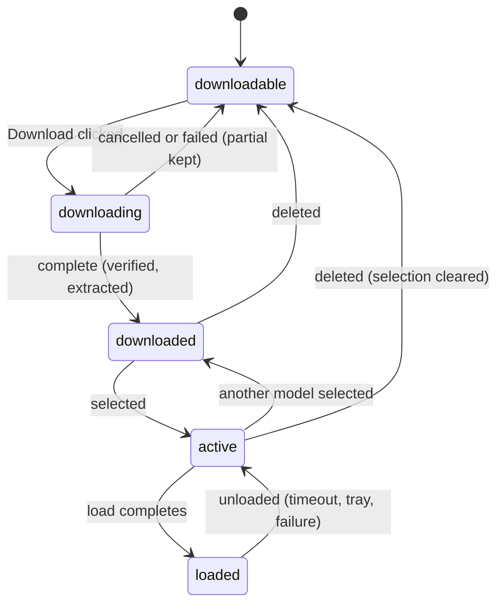

# Models

## Summary

This document is the model: what a speech-to-text model is to Handy, the states one can be in (downloadable, downloading, downloaded, active, loaded), the capabilities that change what the rest of the product offers (streaming, translation, language detection, supported languages), where models come from, and when the loaded model is released. It owns the words and rules the Models page, the footer selector, the tray submenu, onboarding, and every dictation document use. Downloading, switching, and deleting are described as interactions under `models/`.

## The simple case

After onboarding the user has one model downloaded and active — say Parakeet Unified EN 0.6B. The footer shows its name with a green dot: it is loaded and ready. The user dictates; the model is used. Five minutes after the last dictation the model is released from memory and the dot turns grey; the next dictation loads it again in the background while the user is speaking, and the text arrives a little later than usual. Nothing else changes.

## The model's states

**Downloadable.** A catalog model not on disk. Shown under "Available to Download" on the Models page and in onboarding with its size. Legacy models (the older direct downloads: Whisper Small/Medium/Turbo/Large, Parakeet V2/V3, Moonshine, SenseVoice, GigaAM, Canary, Cohere, Breeze) are hidden unless already on disk.

**Downloading.** A transfer is in progress, verifying, or extracting; see [Downloading a model](../models/downloading-a-model.md). A partial file is kept on cancel so a later attempt resumes.

**Downloaded.** The complete file (or directory) is on disk in the models folder or the shared Hugging Face cache. Downloaded models appear under "Downloaded Models", in the footer's dropdown, and in the tray's model submenu. Custom models (a `.bin` or `.gguf` dropped into the models folder, badged "Custom", described "Not officially supported") and cache models (compatible files found in the Hugging Face cache) are always downloaded.

**Active.** The one downloaded model named in settings as the model to use. Badged "Active" and sorted first on the Models page, named in the footer, ticked in the tray. A fresh install has none until onboarding picks one; after onboarding, if the active model disappears (deleted, file removed), the selection is cleared and, at the next launch or rescan, the first downloaded model in catalog order is selected automatically. Selecting a model writes the setting first and then loads it; if the load fails the selection reverts to the previous model and a toast reads "Failed to load model: {name}".

**Loaded.** The active model resident in memory. Footer dot colors: green loaded, grey active but unloaded, yellow pulsing while loading, red on error or when no model is selected ("No Model - Download Required"). A load happens on selection (unless the unload timeout is "Immediately"), at every trigger if the model is not loaded, and on re-transcribe from History. The first dictation after a load waits for it at the stop, so the "Transcribing..." state lasts longer.

**Unloaded.** The active model released from memory: after the unload timeout, from the tray's "Unload Model" item (enabled only while loaded), when deleted, when a later load fails, or when the transcription engine crashes mid-dictation (the model is dropped so the next attempt reloads it; that dictation fails with a toast).

## Capabilities

Each model advertises four things. They come from the catalog before download, from the file's own metadata for models found on disk, and are corrected from the real model once it is loaded — so a badge can change after the first load.

- **Supported languages.** Shown on every model card as "<Language> only" (one language) or "N languages". Feeds the General page's language picker: only languages the active model supports are listed, and the picker is hidden for single-language models. See [Language and translation](../cross-cutting/language-and-translation.md).
- **Language detection.** Whether "Auto" is offered in the language picker. Models that cannot detect (Canary, for example) force a concrete language; the stored "auto" intent is then resolved to English if supported, else the model's first language.
- **Translation.** Whether the "Translate to English" toggle appears on the General page and whether it does anything. The Models page has a filter for it.
- **Streaming.** Whether the model can transcribe live. Shown as a "Streaming" tag on cards and in the footer dropdown. Gates the Live overlay's panel and [live transcription](../dictation/live-transcription.md) and lengthens the VAD tail. The Models page has a filter for it.

Cards also show accuracy and speed bars (from the catalog; custom and cache models show none) and a size. In debug mode the quantization label (for example "Q8_0") is shown next to the size.

## The unload timeout

Settings › Advanced › Unload Model: Never, Immediately, After 2 minutes, After 5 minutes (default), After 10 minutes, After 15 minutes, After 1 hour, and in debug mode After 15 seconds (Debug). The idle check runs every 10 seconds; a recording in progress counts as activity so a model is never unloaded mid-dictation. "Immediately" is different in kind: the model is unloaded right after each dictation (and after a cancel), and selecting a model does not load it — the footer shows the name with a grey dot until the first dictation.

## Where models live

Catalog models download into the shared Hugging Face cache (`~/.cache/huggingface/hub`), so other tools can reuse them; if Hugging Face fails after four attempts, a mirror is tried and the file lands in Handy's own models folder instead. Legacy and custom models live in the models folder under the app data directory. The "Rescan" button on the Models page re-reads both places so a file dropped in by hand appears without a restart. See [Data on disk](../cross-cutting/data-on-disk.md).

## Modifiers

| Modifier | Set before the start | Changed while active |
| --- | --- | --- |
| Push to talk | No effect on models. | No effect. |
| Binding | No effect on which model is used. | No effect. |
| Overlay style | No effect on models. | No effect. |
| Streaming model | This *is* a model capability: it decides the overlay form, the VAD tail, and the transcription path. | Fixed at the trigger. |
| Voice activity detection | No effect on models. | No effect. |
| Always-on microphone | No effect on models. | No effect. |

## Cancel and interrupt

The model's own interactions (download, switch, delete) have their tables in `models/`. For a dictation:

| Event | Before active (loading at the trigger) | While active (loaded, transcribing) |
| --- | --- | --- |
| Cancel | A cancel does not stop a load in progress; the model finishes loading and stays loaded (or is unloaded immediately under "Immediately"). | Cancel discards the result; the model stays loaded. |
| Another trigger | Ignored. | Ignored. |
| A setting changed mid-way | Selecting another model while one is loading is refused ("Model load already in progress"). Selecting another model while recording: the new model loads and the dictation uses whichever is loaded at the stop. | Switching models while transcribing drops the old engine when it finishes; the transcript in flight still comes from the old model. |
| Microphone lost | No effect on the model. | No effect. |
| Model or processing failure | A failed load shows "Failed to load model: {name}" with the error; the dictation then fails at the stop with "Transcription Failed" and an empty history entry. | The engine crashing unloads the model and fails the dictation with a toast. |
| The active application changes | No effect. | No effect. |
| Handy quits or the system sleeps | The model is released with the process; at launch nothing is loaded until the first trigger or selection. | Same. |
| Keyboard channel changes | No effect. | No effect. |

## Interactions with other systems

**Permissions.** None.

**History and recordings.** Re-transcribe on the History page uses the active model at that moment, not the one that made the original transcript.

**Clipboard.** None.

**Model state.** This document.

**Tray and overlay.** The tray's model submenu lists downloaded models by name with the active one ticked; "Unload Model" is enabled only while loaded. Selecting from the tray is the same as selecting on the Models page.

**Sounds and system audio.** None.

**Settings persistence.** `selected_model`, `model_unload_timeout`, `transcribe_accelerator`, `ort_accelerator`, `transcribe_gpu_device`. Changing an accelerator does not touch the loaded model; the next load uses it.

**Platform differences.** GPU acceleration is Metal on macOS, Vulkan on Windows and Linux, with CPU fallback; the x64 build running under emulation on Windows ARM is forced to CPU. Apple Intelligence is not a speech model (it is a post-processing provider) and is offered only on Apple-silicon Macs.

## Edge cases

- Two quants of the same catalog model on disk appear as two entries: the default quant with the plain name, the other with its quant appended, for example "Whisper Medium (Q4_K_M)". Deleting the alternate removes only its file and its entry.
- A `.gguf` in the models folder whose architecture Handy does not recognize is still listed as a custom model (the models folder is trusted); the same file in the Hugging Face cache is ignored.
- The first load of a large model can take several seconds; the footer says "Loading {name}..." and a dictation started meanwhile waits at the stop.
- If the selected model is deleted from disk outside Handy, the next launch clears the selection and, because onboarding is complete, picks the first downloaded model; if none is downloaded the footer shows "No Model - Download Required" and every dictation fails with "Transcription Failed: Model is not loaded for transcription." until one is chosen.

## Open questions and verification

- Whether a dictation started while a model switch is loading uses the old or new model at the stop depends on timing; read from the code as "whichever is loaded", not observed.
- The exact footer text and dot color after "Immediately" selection (grey dot, name) was read from the code, not seen.
- Whether re-selecting the active model from the tray is a no-op (the code returns early for the same id) was not confirmed in the UI, where the active card is not clickable.
- The reported model sizes for directory-based legacy models are the archive sizes, not the extracted sizes; not verified.

Verified against Handy commit `af48dd6`.
