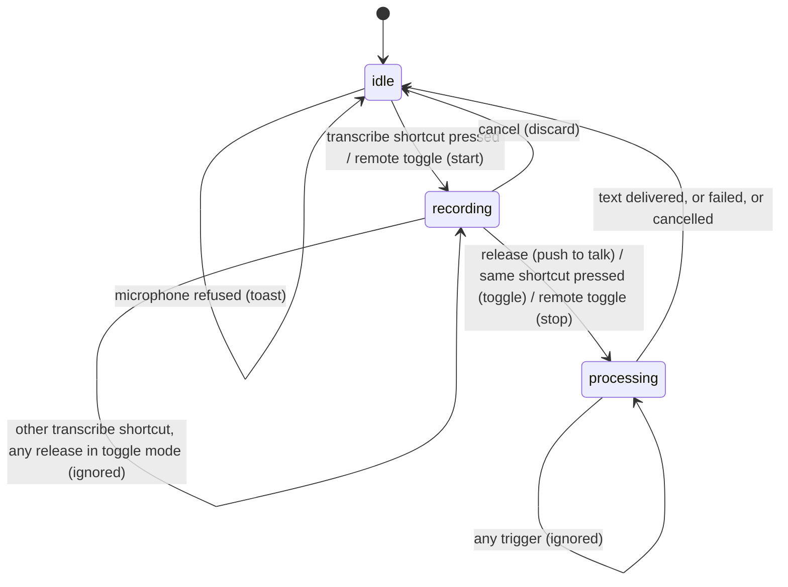

# Triggers and shortcuts

## Summary

This document is the input model for a dictation: what a trigger is, which ones exist, how push to talk and toggle mode read the keyboard, and what the dictation's three stages allow at each moment. Every other document that mentions a shortcut press, a release, a stop, or a cancel links here for the definitions and the numbers. Shortcuts are global: they work whichever application is in front, as long as Handy is running and, on macOS, has Accessibility access.

## The simple case

Handy ships with three shortcuts, called bindings: **Transcribe** (Option+Space), **Transcribe with Post-Processing** (Option+Shift+Space; it only exists while post-processing is enabled), and **Cancel** (Escape). In the default push-to-talk mode, the user holds Option+Space, speaks, and lets go. Holding is the start, letting go is the stop, and the text appears in whatever app was in front.

In toggle mode (push to talk turned off on the General page) the user taps Option+Space once to start, speaks, and taps it again to stop. Letting go of the keys does nothing. If they change their mind, Escape abandons the recording.

Two other things count as the same trigger as Option+Space: running `handy --toggle-transcription` from a shell while Handy is already running, and sending the process SIGUSR2. Both behave like a single press in toggle mode regardless of the push-to-talk setting: one starts, the next stops.

## The interaction, event by event

This document owns the states a trigger moves the dictation through; the documents under `dictation/` say what the user sees inside each state.

### Start

A dictation starts when a trigger arrives while Handy is idle. Triggers are: a press of either transcribe shortcut; `handy --toggle-transcription` (Transcribe) or `handy --toggle-post-process` (Transcribe with Post-Processing) run as a second process; the Unix signals SIGUSR2 (Transcribe) and, on macOS only, SIGUSR1 (Transcribe with Post-Processing). Which binding fired is fixed at this instant and decides whether post-processing runs at the end. Whether push to talk is on is read at this instant too, and again at every later key event.

A press is dropped without any effect if it arrives within 30 ms of the previous press of a transcribe shortcut. This is the debounce; it absorbs double-taps and key repeat in both modes.

If the microphone cannot be opened the dictation never reaches recording: the overlay and tray icon flash to recording and back, and a toast in the settings window explains why (see [Audio capture](audio-capture.md)).

### Ends at once

A dictation ends at once when its trigger is accepted but nothing comes of it: the microphone is refused, the shortcut is released before the microphone delivered any sound (push to talk), or a cancel arrives before anything was captured. In each case Handy returns to idle with no history entry and no text. The release-before-ready case still goes through the stop and a (silent) transcription of an empty capture; see [Starting and recording](../dictation/starting-and-recording.md).

### Becomes active

For the input model, recording begins the moment the microphone is accepted. From then until the stop the dictation is in the recording stage and the Cancel shortcut is live (it is registered at this moment and unregistered at the stop, so Escape is only intercepted while Handy is recording). The finer threshold inside recording — the first chunk of sound, which turns the overlay ready — belongs to [Audio capture](audio-capture.md).

### While active

What the keyboard does while recording depends on the mode, read fresh at every event:

- **Push to talk.** Releasing the transcribe shortcut stops. The release is not acted on immediately: Handy waits 50 ms, and if the same shortcut is pressed again within that window the release is forgotten and recording continues. This is what makes holding a key work under key auto-repeat, which arrives as a stream of release/press pairs. A genuine release therefore stops about 50 ms after the key comes up. Pressing the shortcut again while already recording (outside the grace window) does nothing.
- **Toggle mode.** Pressing the same transcribe shortcut again stops. Releases are ignored entirely.
- **Either mode.** Pressing the *other* transcribe shortcut is ignored: only the binding that started the dictation can stop it by key. A remote toggle (`--toggle-transcription`, `--toggle-post-process`, SIGUSR1/2) is a press in toggle mode for its own binding: it stops the recording only if it names the same binding that started it.
- **Cancel.** Escape (the Cancel binding) abandons the recording in both modes. Escape is only intercepted by Handy while recording; at any other time it reaches the frontmost application as usual.

### Finish

The stop moves the dictation to the processing stage. From here no trigger has any effect: presses and releases of any binding are dropped until Handy is idle again, and the Cancel shortcut is no longer registered. Processing ends when the text has been delivered, when the attempt fails, or when it is cancelled through the overlay's ✕, the tray's Cancel item, or `handy --cancel` (the three cancel paths that do not depend on the Escape binding). Only then can the next trigger start a new dictation.

> Technical note: all triggers, from every source, are serialized through one queue and handled in order. A press that arrives while the previous stop is still being processed is not queued for later; it is examined against the current stage and dropped.

## Modifiers

| Modifier | Set before the start | Changed while active |
| --- | --- | --- |
| Push to talk | On: hold to record, release (after the 50 ms grace) to stop. Off: tap to start, tap the same shortcut to stop; releases ignored. | Takes effect at the next key event. Turning it off mid-hold means the eventual release is ignored and the recording continues until the shortcut is pressed again. Turning it on mid-toggle means the next release (if the keys are still down) or the next press-and-release stops. |
| Binding | Transcribe or Transcribe with Post-Processing decides whether the final text is sent through post-processing. The post-processing binding is registered only while post-processing is enabled. | Fixed at the start. Pressing the other binding while recording is ignored. |
| Overlay style | No effect on triggers. | No effect. |
| Streaming model | No effect on triggers. | No effect. |
| Voice activity detection | No effect on triggers. | No effect. |
| Always-on microphone | No effect on triggers; it changes how fast recording becomes ready (see [Audio capture](audio-capture.md)). | No effect. |

## Cancel and interrupt

| Event | Before active (idle, trigger just accepted) | While active (recording) |
| --- | --- | --- |
| Cancel | Escape is not registered yet and reaches the front app. The overlay ✕ and tray Cancel item are not visible. `handy --cancel` resets Handy to idle even if the microphone is still opening. | Escape, the overlay ✕, the tray Cancel item, and `handy --cancel` all discard the recording and return to idle. See [Cancelling](../dictation/cancelling.md). |
| Another trigger | A second press within 30 ms is dropped. A second press after that is examined against the stage: if recording has begun it is a stop (same binding) or ignored (other binding). | Same binding: stop (toggle) or ignored (push to talk, already held). Other binding: ignored. Remote toggle for the same binding: stop. |
| A setting changed mid-way | Push to talk is read per event (see Modifiers). Re-recording a shortcut suspends all bindings, so no key trigger can start a dictation until the recorder closes; remote toggles still can. | Re-recording a shortcut while recording unregisters the binding that is held: in push to talk the release is then never seen and the recording continues until the recorder closes and the shortcut is pressed again. |
| Microphone lost | Refused microphone: idle, toast. | Handled by [Audio capture](audio-capture.md); the stop still works. |
| Model or processing failure | Model loading is kicked off at the trigger; a failure to load does not stop recording. | No effect on the trigger model; surfaces at the stop. |
| The active application changes | No effect; shortcuts are global. | No effect; the release or second press is seen wherever focus is. |
| Handy quits or the system sleeps | The dictation is lost. | The dictation is lost; a held key on wake does nothing until pressed again. |
| Keyboard channel changes | Under sustained Secure Input (macOS, 3 s or more), keyed shortcuts are re-registered through a fallback so they keep working; see [Secure Input](../cross-cutting/secure-input.md). Switching the keyboard implementation re-registers every binding and resets any the new implementation cannot express. | Key auto-repeat is absorbed by the 50 ms grace. Secure Input engaging mid-hold can swallow the release on the primary path; the fallback registration covers the same keys. |

## Interactions with other systems

**Permissions.** On macOS no shortcut is registered until Accessibility access has been granted and onboarding has reached the main window; before that, pressing Option+Space does nothing at all.

**History and recordings.** None directly.

**Clipboard.** None.

**Model state.** Every accepted trigger asks for the active model to be loaded if it is not already; the load runs in the background and the dictation waits for it at the stop.

**Tray and overlay.** The tray icon switches to recording at the trigger and to transcribing at the stop; the tray menu shows a Cancel item instead of the model submenu while a dictation is in progress.

**Sounds and system audio.** The start chime, when audio feedback is on, is tied to readiness rather than to the trigger; the stop chime plays at the stop and not on cancel.

**Settings persistence.** The three bindings, `push_to_talk`, and `keyboard_implementation` are the settings this document depends on. Changing a binding writes settings immediately; bindings missing from an old settings file are filled in from defaults at load.

**Platform differences.** Defaults are Ctrl+Space and Ctrl+Shift+Space on Windows and Linux. On Linux the Cancel binding is never registered and its row is hidden (dynamic registration was unstable there), so Escape never cancels; the overlay ✕, the tray item, and `--cancel` are the only cancels. Linux defaults to the tauri keyboard implementation, which requires a non-modifier key in every shortcut and does not support fn. SIGUSR1 is ignored on Linux because WebKitGTK uses it internally; `--toggle-post-process` is the replacement. Shortcuts containing fn work only with Apple keyboards.

## Edge cases

- Holding the transcribe shortcut in toggle mode: the initial press starts, auto-repeat presses are dropped by the debounce, and the release is ignored; the recording runs until the next deliberate press.
- Pressing Transcribe and Transcribe with Post-Processing at once (they share keys): both bindings fire on the same event; the first to be processed starts the dictation and the other is ignored. Which one wins is not defined.
- A remote toggle arriving during the 50 ms release grace of a push-to-talk recording is processed as a press for its binding: for the same binding it stops the recording immediately, before the deferred release.
- Modifier-only shortcuts (for example Right Option alone) are allowed by handy_keys; they fire on the modifier press and release like any key.
- Mouse buttons can be bound as shortcuts with handy_keys; they are immune to Secure Input.
- If the handy_keys implementation fails to start at launch, Handy silently switches the setting to tauri and registers the shortcuts through it; modifier-only or fn shortcuts then stop working.

## Open questions and verification

- Which binding wins when two shortcuts with identical keys fire on the same press was read from the code (first to be dequeued) but not observed.
- The exact latency between a genuine release and the stop chime (the 50 ms grace plus processing) was not measured.
- Whether handy_keys refuses to register a second binding with the same keys, or allows both, was not confirmed.
- Turning push to talk off while holding the shortcut leaves the recording running with no key released; this is consistent but surprising and may be worth a product call.

Verified against Handy commit `af48dd6`.
