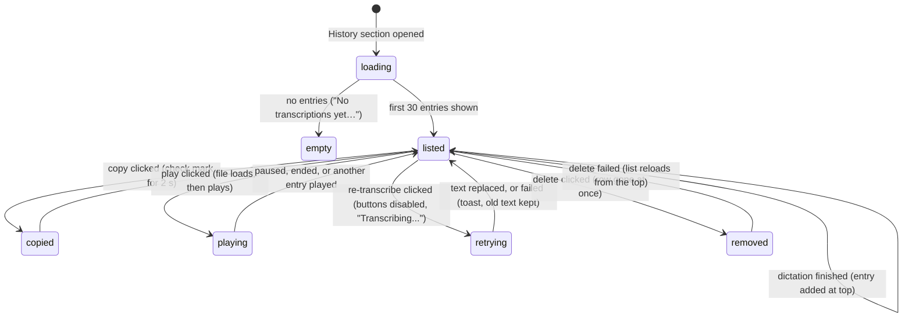

# The History page

## Summary

The History page is the settings window's record of every dictation that captured sound: one entry per recording, newest first, each with the date it was made, the text the model produced, and a player for the recording itself. From an entry the user can copy the text, star it so it is never auto-deleted, run the recording through the active model again, or delete it. The page is the History section in the sidebar (second, below General) and is always available. Entries appear on it live as dictations finish. How many unstarred entries survive, and for how long, is governed by two controls on the Advanced page, "History Limit" and "Auto-Delete Recordings", which are described here because they decide what the page shows.

## The simple case

The user dictates a sentence, then opens the settings window and clicks History. The page is headed "History" with an "Open Recordings Folder" button on the right. Below is a bordered list; the top row reads today's date and time, for example "August 24, 2026 at 02:15 PM", with four small grey icons at the right edge (copy, star, retry, trash). Under the date the transcript sits in italics, and under that a play button, "0:00", a thin slider, and "0:00". The user clicks the copy icon; it turns into a check mark for two seconds and the transcript is on the clipboard. They click play; the button dims for an instant, then the recording plays and the slider moves while the left time counts up. When it ends the play icon returns. They click the star: it fills pink, and this entry will now outlive the five-entry limit.

## The interaction, event by event

### Start

The interaction starts when the user clicks History in the sidebar. The list area shows "Loading history..." while the newest 30 entries are fetched, then either the list or, with nothing recorded yet, "No transcriptions yet. Start recording to build your history!". The "Open Recordings Folder" button is usable in every state; it opens the recordings folder in Finder and does nothing visible if that fails. Each entry shows:

- a date line, formatted in the interface language from the moment the entry was saved (the end of transcription, not the start of recording);
- four icon buttons with hover tooltips: "Copy transcription to clipboard", "Save transcription" (or "Remove from saved" once starred), "Re-transcribe", "Delete entry";
- the transcript in italics, selectable, with line breaks preserved; or, for an entry whose transcription produced no text, the dimmed line "Transcription failed. You can re-transcribe using the retry icon." with the copy icon disabled;
- the audio player: play button, elapsed time, slider, total time. Nothing is loaded until play is clicked, so the total reads "0:00" until then.

Leaving the section and coming back reloads the first page; scroll position and loaded pages are not remembered.

> Technical note: entries are ordered by their database id, not by timestamp, so an entry is never shown out of order even if the clock moved. Pages are keyed on the last entry's id, so a new entry arriving between pages does not shift or duplicate rows. The page also shows only the raw transcript: an entry's post-processed text is stored but never displayed on this page.

### Ends at once

The interaction ends without a change when the user switches to another section or closes the window without touching an entry. Nothing is written. Scrolling, reading, and playing a recording are also "no change": playback never modifies the entry.

### Becomes active

The interaction becomes active on the first click on an entry's icon or play button:

- **Copy.** The transcript (the raw text, never the post-processed text) replaces the clipboard at once. The icon becomes a check mark for 2 seconds. The clipboard is not restored afterwards, unlike a dictation's paste. Disabled when the entry has no text.
- **Star.** The star fills immediately and the entry is marked saved; a failure to write it flips the star back silently. A saved entry is exempt from every auto-delete rule and can still be deleted by hand.
- **Re-transcribe.** All four icons grey out, the retry icon spins, and the transcript is replaced by "Transcribing..." pulsing between dim and bright. Handy reads the recording from disk, loads the [active model](../foundations/models.md) if it is not loaded, transcribes with today's language, translation, and [text cleanup](../dictation/transcribing.md) settings, and — if the entry was made with the post-processing shortcut — runs [post-processing](../dictation/post-processing.md) again. No overlay, tray change, chime, or paste accompanies this.
- **Delete.** The row disappears at once; the recording file and the entry are deleted in the background. There is no confirmation and no undo, for starred entries too.
- **Play.** The play button dims while the file is located, then playback starts by itself and the slider begins to move. Starting another entry's player pauses this one; only one recording plays at a time. The slider can be dragged: while dragging the time display follows the thumb and the audio jumps when the mouse is released.

### While active

A copy's check mark simply waits out its 2 seconds; clicking again copies again. During a re-transcribe the entry's other buttons are disabled but the rest of the page works: other entries can be copied, starred, deleted, or re-transcribed in parallel, and the entry's own player still plays. A re-transcribe cannot be cancelled. A dictation can be started from the shortcut at any point; its entry appears at the top of the list when it finishes, and if a re-transcribe is running the two share the model one after the other, so the dictation's "Transcribing..." lasts longer. Playback continues when the window loses focus and when the user switches sections, until the entry is unmounted.

### Finish

- **Copy** finishes when the check mark reverts.
- **Star** finishes silently; there is no confirmation beyond the filled star. On failure it reverts with no message.
- **Re-transcribe** finishes when the new text replaces "Transcribing..." in place: the entry keeps its date, its position, its saved flag, and its post-processing flag; its transcript, post-processed text, and prompt are overwritten. If the model produced nothing or anything went wrong, a toast reads "Failed to re-transcribe. Please try again." and the entry is unchanged. The reasons are not shown to the user; the log records one of "Recording has no audio samples" (an empty file), "Recording contains no speech" (the model returned nothing), "Failed to load audio: …" (the file is missing or unreadable), or "Model is not loaded for transcription." (no model selected or the load failed). With the unload timeout at "Immediately" the model is released after the retry.
- **Delete** finishes when the background deletion returns. If it fails, the whole list reloads from the top and the row reappears; no toast is shown (see Open questions).
- **Play** finishes when the recording ends: the play icon returns and the thumb stays at the end. Play again restarts from the beginning.

## Retention

Advanced › History holds two controls that decide what the page keeps:

- **"History Limit"** — a number field (0 to 1000) followed by "entries", default 5. Every keystroke is saved as it is typed.
- **"Auto-Delete Recordings"** — a dropdown: "Never", "Keep latest 5" (the default; the number follows History Limit), "After 3 days", "After 2 weeks", "After 3 months".

Cleanup runs at exactly three moments: after each new entry is saved at the end of a dictation, when History Limit changes, and when Auto-Delete Recordings changes. It does not run at launch, on a timer, or on re-transcribe. Under "Keep latest N" the newest N unstarred entries are kept and the rest deleted with their recording files; starred entries are neither counted nor deleted. Under a time-based choice every unstarred entry older than the period goes, regardless of count, and History Limit has no effect. Under "Never" nothing is ever deleted and History Limit has no effect either. Deleting an entry also deletes its recording; a recording whose entry was never written (a cancel during processing, see [Cancelling](../dictation/cancelling.md)) is never shown here and never cleaned up.

> Technical note: every entry stores a title of the form "August 24, 2026 -  2:15PM" (local time, the hour padded with a space) alongside the timestamp. The page never shows it; it formats the timestamp itself in the interface language. The recording file is `handy-<unix seconds>.wav` in the recordings folder; see [Data on disk](../cross-cutting/data-on-disk.md).

## Modifiers

| Modifier | Set before the start | Changed while active |
| --- | --- | --- |
| Push to talk | No effect. | No effect. |
| Binding | Entries made with the Transcribe with Post-Processing shortcut carry the post-processed text (not shown on the page) and remember that post-processing was requested, so re-transcribe runs post-processing again. Entries made with Transcribe never post-process on retry. | No effect on existing entries. |
| Overlay style | No effect; re-transcribe never shows the overlay. | No effect. |
| Streaming model | No effect; re-transcribe always transcribes the file in one batch, even with a streaming model. | No effect. |
| Voice activity detection | Decides what the recording file contains: with VAD on only the speech stretches were saved, so re-transcribe works on the filtered audio and cannot recover trimmed speech. | No effect. |
| Always-on microphone | No effect. | No effect. |

## Cancel and interrupt

| Event | Before active (browsing the list) | While active (copy, star, re-transcribe, delete, or playback in flight) |
| --- | --- | --- |
| Cancel | Escape does nothing on the page; the overlay ✕, the tray's Cancel, and `handy --cancel` concern a dictation, not this page. | Same. A re-transcribe cannot be cancelled by any means; it runs to completion. |
| Another trigger | A dictation runs normally; if the settings window is frontmost, the text is pasted into it (see [Pasting](../dictation/pasting.md)). The new entry appears at the top when it finishes. | Same. A dictation stopped while a re-transcribe is running waits for the model, so its "Transcribing..." lasts longer. Playback is system audio, so "Mute While Recording" silences it during the dictation. |
| A setting changed mid-way | Switching the active model changes which model the next re-transcribe uses. Changing History Limit or Auto-Delete Recordings runs cleanup at once, but rows already on screen are not removed until the section is reopened. Changing the interface language reformats the dates. | A model switch during a re-transcribe: the retry uses whichever model holds the engine when it gets its turn. Language, custom words, and filler settings are read when the retry's cleanup runs. |
| Microphone lost | No effect. | No effect. |
| Model or processing failure | No effect until an action. | Re-transcribe with no model, a failed load, or an engine error: "Failed to re-transcribe. Please try again."; the entry is unchanged. A post-processing failure during a retry is silent: the raw transcript is saved and the post-processed text is cleared. |
| The active application changes | No effect; the window keeps its state. | Playback continues in the background. A re-transcribe continues. |
| Handy quits or the system sleeps | Nothing to lose. | Quit during a re-transcribe leaves the entry as it was (the update is a single write at the end). Sleep pauses the work; playback pauses with the system. |
| Keyboard channel changes | No effect. | No effect. |

## Interactions with other systems

**Permissions.** None. The page, playback, and re-transcribe need no Accessibility or Microphone access.

**History and recordings.** This document. The page is the only place entries are seen; the tray's "Copy Last Transcript" reads the same store (see [The tray menu](../tray/the-tray-menu.md)) but prefers the post-processed text, whereas the page's copy icon always copies the raw transcript.

**Clipboard.** The copy icon overwrites the clipboard and never restores it. It uses the window's own clipboard access, not the paste pipeline, so "Clipboard Handling" and "Append Trailing Space" do not apply.

**Model state.** Re-transcribe loads the active model if it is unloaded (the footer shows "Loading {name}..." meanwhile), counts as activity for the unload timeout, and under "Immediately" unloads the model when done. Nothing else on the page touches the model.

**Tray and overlay.** Unchanged by anything on the page. A re-transcribe shows no overlay and leaves the tray icon idle.

**Sounds and system audio.** No chimes. Playback goes through the system's default output, not the "Output Device" chosen for feedback sounds.

**Settings persistence.** The page writes nothing. `history_limit` and `recording_retention_period` are written by their Advanced controls; the star writes the entry, not a setting.

**Platform differences.** On Linux the recording is read into memory and played from there rather than streamed from disk. "Open Recordings Folder" opens the platform's file manager. Everything else is the same on Windows and Linux.

## Edge cases

- A new dictation beyond the limit adds its entry to the top of the list but the entry that cleanup just deleted stays on screen until the section is reopened. Its play button does nothing (the file is gone), its copy still works from the text on screen, and its star flips back by itself. See Open questions.
- "Keep latest 5" counts unstarred entries only: with three starred entries the page can show eight.
- History Limit 0 is accepted; with "Keep latest 0" every unstarred entry is deleted as soon as it is saved, so the page only ever shows starred entries.
- Typing a new History Limit commits each keystroke: selecting the field and typing "10" first saves 1, and cleanup deletes every unstarred entry but the newest before the 0 arrives. See Open questions.
- An entry that failed to transcribe ("Transcription failed…") is also what a successful transcription of silence looks like; see [Transcribing](../dictation/transcribing.md).
- Re-transcribing a failed entry that succeeds turns it into a normal entry in place; its date stays the original.
- Post-processing on retry depends on a provider and model being configured, not on the Post Processing toggle; with the toggle off but a provider still configured, a retry of a post-processed entry still calls the provider.
- Clicking copy twice within 2 seconds restarts nothing: the check mark disappears 2 seconds after the first click.
- Deleting an entry whose file is already gone succeeds; deleting the file is best-effort and the row is removed regardless.
- The slider thumb is nudged slightly right in the last half-percent so it visibly reaches the end.
- The date line uses the interface language's conventions (order, 12- or 24-hour clock), so switching the language under About re-renders every date.

## Open questions and verification

- Entries deleted by retention cleanup are not removed from the open page (the cleanup emits no event and the page ignores delete events by design). Suspected bug: stale rows with dead play buttons.
- The "Failed to delete entry. Please try again." toast is unreachable: deletion failures are swallowed and trigger a reload instead, so the user sees the row come back with no explanation. Suspected bug.
- History Limit saves and runs cleanup on every keystroke, so typing a two-digit value destroys entries. Suspected bug (data loss).
- The page never shows an entry's post-processed text, and the copy icon copies only the raw transcript, while the tray's Copy Last Transcript prefers the post-processed text. Suspected inconsistency.
- Re-transcribe errors reach the user only as the generic "Failed to re-transcribe. Please try again."; the specific reasons exist but are logged only. Worth treating as a copy problem.
- Whether post-processing on retry should honor the Post Processing toggle (the code checks only that a provider and model are configured) was read from the code, not tested.
- The exact date rendering ("August 24, 2026 at 02:15 PM" versus "August 24, 2026, 02:15 PM") depends on WebKit's locale data and was not checked by hand.
- Playing a recording whose file is missing: the code sends a path without checking it exists; what the player shows (nothing, or a stuck dimmed button) was not observed.
- Whether playback respects the "Output Device" setting was read as "no" from the code (a plain audio element) and not confirmed.
- Whether a re-transcribe and a concurrent dictation really serialize on the model, rather than one failing, was read from the engine lock and not reproduced.

Verified against Handy commit `af48dd6`.
