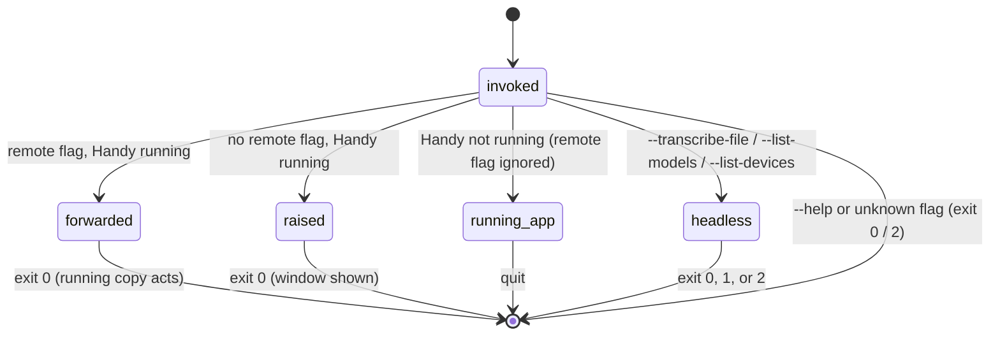

# The command line

## Summary

The `handy` binary accepts flags for three different jobs. **Remote-control flags** (`--toggle-transcription`, `--toggle-post-process`, `--cancel`) act on the copy of Handy that is already running: the new process hands the flag to the running one and exits at once, so a shell script, a window manager, or a hotkey daemon can start, stop, and abandon a dictation without Handy's own shortcuts. **Startup flags** (`--start-hidden`, `--no-tray`, `--debug`) change how one launch of Handy behaves without touching any setting. **Headless flags** (`--transcribe-file`, `--model`, `--device-index`, `--list-devices`, `--list-models`, `--repeat`, `--json`) turn the same binary into a one-shot transcription tool that runs as its own process, prints to the terminal, and exits with a code, even while the app is open. Two Unix signals, SIGUSR2 and (on macOS only) SIGUSR1, do the same as the two toggle flags. `--help` prints the flag list. On macOS the binary lives inside the app bundle at `/Applications/Handy.app/Contents/MacOS/Handy` (the file on disk is named `handy`; the path works either way because the macOS file system ignores case), so a script uses that full path rather than `handy`.

This document describes what each invocation does and how it differs from the same action taken in the app. The dictation a remote toggle starts is the ordinary dictation described under `dictation/`; the definitions of trigger, stop, and stage are in [Triggers and shortcuts](../foundations/triggers-and-shortcuts.md).

## The simple case

Handy is running in the menu bar. From a terminal the user runs:

```
/Applications/Handy.app/Contents/MacOS/Handy --toggle-transcription
```

The command returns immediately with no output. At the same moment the overlay appears at the bottom of the screen, the tray icon switches to recording, and the start chime plays once the microphone is delivering sound, exactly as if Option+Space had been pressed in toggle mode. The user speaks, then runs the same command again. Recording stops, the overlay shows "Transcribing...", and the text is pasted into whatever application is in front. If they change their mind mid-sentence, `--cancel` instead of the second toggle throws the recording away.

For a WAV file instead of a microphone:

```
/Applications/Handy.app/Contents/MacOS/Handy --transcribe-file memo.wav
```

prints two lines — a timing line and `text: …` — to the terminal and exits with code 0. No window, tray icon, or overlay appears, the microphone is not opened, nothing is pasted, and nothing is added to History.

## The interaction, event by event

For a command-line invocation the five phases are: **Start** is the invocation, **Ends at once** is the process exiting immediately, **Becomes active** is the process beginning to run as Handy, **While active** is while it runs, and **Finish** is how it finishes. Which path an invocation takes is decided by its flags and by whether Handy is already running.



| Flag | Kind | What it does |
| --- | --- | --- |
| `--toggle-transcription` | Remote control | A press of the Transcribe binding in toggle mode: starts a dictation when idle, stops one it started. |
| `--toggle-post-process` | Remote control | The same for the Transcribe with Post-Processing binding. |
| `--cancel` | Remote control | Cancels the dictation in progress; see [Cancelling](../dictation/cancelling.md). |
| `--start-hidden` | Startup | This launch does not show the settings window (unless the tray icon is hidden). |
| `--no-tray` | Startup | This launch hides the menu-bar icon; the settings window is shown and closing it keeps the Dock icon. |
| `--debug` | Startup | This launch logs at Trace level to the log file and streams log lines to the Debug section's live log. |
| `--transcribe-file <WAV>` / `-f <WAV>` | Headless | Transcribes a 16 kHz mono 16-bit WAV with the active model and prints the text. |
| `--model <id>` | Headless | Uses this model instead of the active one, for this run only. |
| `--device-index <N>` | Headless | Runs the model on the compute device with this index from `--list-devices`, for this run only. |
| `--list-devices` | Headless | Prints the compute devices with their indices. |
| `--list-models` | Headless | Prints every model Handy knows, with its id and whether it is downloaded. |
| `--repeat <N>` | Headless | Transcribes the file N times and reports the fastest. |
| `--json` | Headless | Prints the headless result (and the model list) as JSON. |
| `--help` / `-h` | — | Prints the flag list and exits. |

### Start

The interaction starts when the binary is invoked with its flags. Before anything else the flags are parsed: an unknown flag, or a flag missing its value, prints `error: unexpected argument '--x' found` (or the equivalent) and a usage line to stderr and exits with code 2; Handy does not start. `--help` prints "Handy - Speech to Text", a usage line, and the options with their one-line descriptions, and exits 0. There is no `--version` flag; asking for it is an unknown-argument error.

With the flags accepted, the process decides its path. If any of `--transcribe-file`, `--list-devices`, or `--list-models` is present it is a headless run and skips straight to [Becomes active](#becomes-active) as its own process, whether or not Handy is already open. Otherwise it tries to contact a running copy of Handy.

> Technical note: the running copy listens on a Unix socket named after the app identifier (`/tmp/com_pais_handy_si.sock`), not after the version, so a newer or older build of the binary can still control the running one. A headless run never opens or contacts that socket.

### Ends at once

The invocation ends at once when Handy is already running and the flags are not headless: the new process sends its full argument list to the running copy and exits with code 0, printing nothing, before creating any window or tray icon. What the running copy does with the arguments:

- `--toggle-transcription` present: a press of the Transcribe binding, delivered as if push to talk were off — a start when idle, a stop when recording under that same binding, ignored while recording under the other binding or while processing. The 30 ms debounce applies, so two invocations inside 30 ms count as one.
- otherwise `--toggle-post-process` present: the same for the Transcribe with Post-Processing binding.
- otherwise `--cancel` present: the cancel described in [Cancelling](../dictation/cancelling.md) — the same effect as the overlay's ✕ or the tray's Cancel item, and like them it works during processing as well as recording. While idle it does nothing visible.
- none of the three: the settings window is shown and focused (and on macOS the tray icon is recreated first if the window was hidden, as the recovery for a vanished menu-bar icon); see [Windows and the tray](../foundations/windows-and-tray.md#second-launches-and-remote-control). `--start-hidden`, `--no-tray`, and `--debug` on a second launch are ignored.

The flags are checked in that order, so `--toggle-transcription --cancel` is a toggle, and `--cancel --start-hidden` is a cancel that does not show the window. The remote toggles need no Accessibility permission and work while the shortcut recorder is open and while the keyboard shortcuts are suspended, because they never go through the keyboard.

The signals take the same route without a second process: `kill -USR2 <pid>` (or `pkill -USR2 -n handy`) is `--toggle-transcription`; on macOS `kill -USR1 <pid>` is `--toggle-post-process`. Handy installs its handlers for them during startup; a signal sent in the first moments of a launch, before that, or to a headless process (which never installs them) terminates the process instead, because that is what the system does with an unhandled SIGUSR signal.

### Becomes active

The process becomes active — begins running as Handy — when no running copy answered, or when the flags are headless.

**A normal launch.** With no running copy, the process becomes the running Handy and the launch proceeds as in [Windows and the tray](../foundations/windows-and-tray.md#launch). The remote-control flags are not consulted on this path at all: `handy --toggle-transcription` with Handy closed simply starts Handy — window shown per the Start Hidden rule, nothing recording — and `--cancel` likewise. Nothing tells the user the flag was dropped. The startup flags are read here and only here:

- `--start-hidden` hides the settings window for this launch, including the rule that a hidden tray icon forces the window to show. Unlike the Start Hidden setting it leaves the Dock icon in place, because only the saved setting switches Handy to an accessory (see [Windows and tray](../foundations/windows-and-tray.md)). It does not change the setting.
- `--no-tray` hides the menu-bar icon for this launch. Because there is then no tray, the window is shown at launch regardless of `--start-hidden`, and closing it later keeps Handy in the Dock.
- `--debug` raises the log file's level to Trace and turns on live log streaming for this launch. It does not add the Debug section to the sidebar — that still needs Cmd+Shift+D — and the Log Level control keeps showing the stored value.

**A headless run.** The process initializes only the model store and the transcription engine: no window, no tray icon, no overlay, no microphone (even with always-on microphone turned on), no shortcuts, no signal handlers. Console log lines go to stderr so that stdout holds only the result; the same lines are also appended to Handy's ordinary log file. Then, in this order: if `--list-devices`, the devices are printed; if `--list-models`, the model list is printed; if there is no `--transcribe-file`, the process exits 0 here. Otherwise the WAV file is opened and checked: it must be 16 kHz, one channel, 16-bit integer PCM — the format Handy's own recordings use — or the run stops with `error: expected 16 kHz mono 16-bit PCM WAV, got 44100 Hz / 2 ch / 16-bit Int` (with the file's actual values) and exit code 2. A file that cannot be opened or read is also exit 2. Then the model is chosen: `--model <id>` if given, else the active model; with neither (a fresh install that never finished onboarding) the run stops with `error: no model selected (pass --model or pick one in the app)`, exit 2.

### While active

While the process runs, what the user sees depends on the path.

**A normal launch** is the ordinary app; the flags have had their effect and nothing further distinguishes the run except that `--no-tray` leaves the Advanced section's Show Tray Icon switch showing the stored value (on) while the icon is absent.

**A dictation started by a remote toggle or signal** is an ordinary dictation in toggle mode, whatever the Push To Talk setting says: the overlay, chime, live panel, and text cleanup are those of [Starting and recording](../dictation/starting-and-recording.md) and the documents that follow it. It ends with the same remote toggle again, with a keyboard stop of the same binding (in toggle mode a press; in push to talk a press does nothing and the release stops), or with any cancel. A remote toggle for the *other* binding while recording is ignored. A dictation started with `--toggle-post-process` or SIGUSR1 runs [post-processing](../dictation/post-processing.md) at the end even if post-processing is turned off in settings, because the flag addresses the action directly rather than the unregistered shortcut; with no provider configured the plain transcript is pasted.

**A headless run** loads the model (a cold load; the time is reported), then transcribes the whole file in one batch pass with no voice activity detection and no live transcription. The run honors the settings the app would use for a dictation — the language intent and Translate to English, custom words, filler-word removal, the accelerator (unless `--device-index` overrides it) — and applies the same [text cleanup](../dictation/transcribing.md). With `--repeat N` the file is transcribed N times (N below 1 counts as 1); if the Unload Model setting is "Immediately" the engine is reloaded, untimed, before each repeat. Nothing is shown on screen; the terminal shows only stderr log lines until the result.

### Finish

The interaction finishes when the process exits or, for a forwarded flag, when the running copy has acted.

**A normal launch** finishes at quit. Nothing from the startup flags is persisted: the next launch without them follows the stored settings.

**A headless run** prints its result to stdout and exits with a code a script can test:

| Exit code | Meaning |
| --- | --- |
| 0 | Listed or transcribed successfully. |
| 1 | Runtime failure: the model could not be loaded (`error: load_model('<id>') failed: …`, including `Model not found` for an unknown id and `Model not downloaded` for one not on disk — the headless path never downloads), transcription failed, the model list could not be serialized, or the worker crashed (`error: headless transcription panicked: …`). |
| 2 | Bad input: an unknown flag, an unreadable or wrong-format WAV, or no model selected. |

Error messages go to stderr, prefixed `error:`. The plain result is two lines on stdout:

```
model=<id> device=settings backend=metal audio=4.20s load=812ms best=310ms rtf=13.55x
text: <the transcript>
```

`device` is `settings` or `index N`; `backend` is the engine that actually ran (for example `metal`, `cpu`, or `onnx`); `rtf` is audio seconds per second of the fastest run. With `--json` the same fields are one JSON object — `model`, `requested_device`, `bound_backend`, `audio_secs`, `load_ms`, `transcribe_ms` (an array, one entry per repeat), `best_ms`, `rtf`, `text`. `--list-devices` prints `transcribe-cpp compute devices:` followed by one `index=N kind=metal name=… vram=…MB` line per device (or `No transcribe-cpp compute devices registered.`). `--list-models` prints `Available models (✓ = installed):` followed by one line per model — a ✓ column, the id padded to a column, the display name, and `[recommended]` where it applies — in the catalog's order; with `--json` it prints the full model records instead. The loaded model is released before exit. Nothing is written to History, no recording file is made, and the clipboard is untouched.

> Technical note: the exit code comes from `process::exit` on the worker thread rather than the app's normal shutdown, so that the shell sees 1 and 2 rather than 0. Output is flushed first.

## Modifiers

| Modifier | Set before the start | Changed while active |
| --- | --- | --- |
| Push to talk | No effect on the flags themselves: a remote toggle or signal always behaves as a toggle-mode press. It changes how the keyboard can stop a remotely started recording (release in push to talk, press in toggle mode). Headless: no effect. | Read at the next key event, as in [Triggers and shortcuts](../foundations/triggers-and-shortcuts.md). |
| Binding | `--toggle-transcription` and SIGUSR2 are the Transcribe binding; `--toggle-post-process` and SIGUSR1 are Transcribe with Post-Processing. The remote form works even while the post-processing shortcut is unregistered. Headless: no effect; post-processing never runs headlessly. | Fixed at the start of the dictation. |
| Overlay style | A remotely started dictation shows the overlay per the setting. Headless: never shows an overlay. | As for any dictation: takes effect at the next show. |
| Streaming model | A remotely started dictation streams like any other. Headless: batch only, even with a streaming model; `--model` may name a streaming model and it is still run in one pass. | Fixed at the trigger. |
| Voice activity detection | Applies to a remotely started dictation as usual. Headless: ignored; every sample of the file is transcribed. | Fixed at the trigger. |
| Always-on microphone | Shortens the time to readiness for a remotely started dictation. Headless: ignored; the microphone is never opened, and a headless process never keeps it open. | No effect. |

## Cancel and interrupt

"Before active" is the moment between invoking the binary and its flags being acted on (the second process connecting, or a headless process still starting). "While active" is while the process runs or while the dictation it started is in progress.

| Event | Before active | While active |
| --- | --- | --- |
| Cancel | `handy --cancel` queued behind a toggle is handled after it, in order. Escape, the overlay ✕, and the tray Cancel are not available until a dictation exists. Headless: Ctrl+C in the terminal kills the process; the partial result is lost and the exit code is the shell's. | A remotely started dictation is cancelled by any of the four cancel paths, like any dictation. Headless: Ctrl+C, as before; there is no in-app cancel because the app does not know the headless process exists. |
| Another trigger | Two invocations within 30 ms: the second is dropped. A remote toggle and a keyboard press racing: whichever the running copy receives first wins. Headless: a second headless run is an independent process; both load their own copy of the model. | A remote toggle while a push-to-talk key is held stops the recording; the key's eventual release is then ignored. A toggle for the other binding is ignored. Any trigger during processing is ignored. Headless: triggers in the app do not affect the headless process, and vice versa. |
| A setting changed mid-way | Settings are read when the running copy acts, not when the command is typed. | A remotely started dictation reacts to settings changes like any dictation. Headless: settings are read once at load and once at each transcription; changes made in the app mid-run are picked up only at those points. |
| Microphone lost | A remote toggle with no usable microphone: the dictation ends at once with a toast in the settings window, which a script cannot see. Headless: never uses the microphone. | As for any dictation. Headless: no effect. |
| Model or processing failure | A remote toggle when no model is active still starts recording; the failure comes at the stop. Headless: exit 1 with the error on stderr. | As for any dictation: a "Transcription Failed" toast and an empty history entry. Headless: exit 1; no history entry. |
| The active application changes | No effect; the running copy acts wherever focus is. | The remotely started dictation pastes into whichever application is frontmost at delivery, which for a script run from a terminal is often the terminal itself. Headless: never pastes. |
| Handy quits or the system sleeps | With Handy not running, a remote flag starts Handy instead and is ignored. Headless: does not need Handy. | Quit abandons the remotely started dictation. Sleep during a headless run pauses it with the rest of the system. |
| Keyboard channel changes | No effect: the remote flags and signals never pass through the keyboard, so Secure Input and the keyboard implementation are irrelevant to them. | Secure Input can still swallow the keyboard stop of a remotely started recording; the remote toggle or `--cancel` always gets through. |

## Interactions with other systems

**Permissions.** The remote flags and signals need no Accessibility access; the dictation they start needs microphone access like any other. A headless run needs neither. On macOS a headless run reading a WAV from a protected folder (Desktop, Documents, Downloads) is subject to the terminal's file-access permission, not Handy's.

**History and recordings.** A remotely started dictation writes a history entry and a recording file like any dictation. A headless run writes neither, but it does append its log lines to Handy's log file, so the Debug section's Log Directory shows activity from headless runs too.

**Clipboard.** A remotely started dictation delivers through the clipboard as usual. A headless run never touches it; the text exists only on stdout.

**Model state.** A remote toggle asks the running copy to load the active model, as any trigger does. A headless run loads its model into its own process: if the app has the same model loaded, two copies are in memory until the headless process exits, and the app's copy is untouched. `--model` never changes the active model, and `--device-index` never changes the accelerator setting.

**Tray and overlay.** The second process never creates a tray icon or overlay; the running copy's icon and overlay follow the dictation it starts. `--no-tray` hides the icon for one launch. A headless process has neither.

**Sounds and system audio.** A remotely started dictation plays the chimes and honors Mute While Recording like any other. A headless run is silent.

**Settings persistence.** No flag writes a setting. `--start-hidden`, `--no-tray`, and `--debug` are runtime overrides that vanish at the next launch, and `--model` and `--device-index` are per-run. A headless run reads the settings store to find the active model, the accelerator, the language intent, Translate to English, custom words, and filler-word removal; the act of reading applies any pending settings migrations, as every launch does (see [The settings model](../foundations/the-settings-model.md)).

**Platform differences.** On macOS the binary is inside the bundle (`/Applications/Handy.app/Contents/MacOS/Handy`); launching the bundle again from Spotlight, Finder, or the Dock does not start a second process and so cannot carry flags — it shows the window. Windows and Linux package the binary as `handy` on the path, and the remote flags are the recommended way to bind Handy to a Wayland compositor's shortcuts. SIGUSR1 is ignored on Linux, where the webview engine uses that signal internally; `--toggle-post-process` replaces it. Windows has no signals. On Windows the release build has no console, so what `--help` and the headless flags print when run from a command prompt is not determined here.

## Edge cases

- A remote flag with Handy closed starts Handy and silently does nothing else; a script that runs `--toggle-transcription` at login to "start listening" instead just launches the app.
- `handy` with no flags while Handy is running is the same as clicking the Dock icon: the window is shown and, if it was hidden, the tray icon is recreated.
- Combining startup and remote flags on a second launch: the remote flag is honored and the startup flags are ignored. On a first launch the reverse.
- `--list-devices --list-models --transcribe-file x.wav` prints the devices, then the models, then transcribes; with `--json` the model list and the result are two separate JSON documents on stdout.
- `--list-models` shows legacy models (the older `.bin`/ONNX downloads) that the Models page hides unless they are on disk, because the command prints the whole registry.
- `--device-index` is honored only by models run by the transcribe.cpp engine (every catalog `.gguf`); legacy ONNX models ignore it silently. An index that is not a loadable device fails the load with exit 1.
- `--repeat 0` runs once. The plain output reports only the fastest run; the per-run times are in the JSON `transcribe_ms` array.
- The headless run performs a full cold load every time; `load=` on the timing line is that cost and is not reduced by the app having the model loaded.
- Sending SIGUSR2 to a *headless* process, where no handler is installed, terminates it with the signal's default action; `pkill -USR2 -n handy` targets the newest `handy` process, which during a headless run is the headless one.
- On macOS `open -a Handy --args --toggle-transcription` with Handy running delivers a reopen, not the flag: the window is shown and nothing toggles.
- `--debug` plus the Debug section: pressing Cmd+Shift+D in a `--debug` run turns the stored `debug_mode` on and shows the section; pressing it again turns the stored value off, and live log streaming stops even though `--debug` asked for it.
- `--start-hidden` as a flag (with the setting off) hides the window but leaves Handy as a regular app with a Dock icon; the Start Hidden *setting* makes it an accessory app with no Dock icon.
- Toggling Show Tray Icon off and on again in Advanced during a `--no-tray` run brings the icon back for the rest of the run, but closing the window in that run still keeps the Dock icon, because the close handler consults the flag.
- The Dock-click and `open -a Handy --args …` behaviors above were read from the code path that handles a reopen, not observed.

## Open questions and verification

- Whether a headless run shows a bouncing Dock icon for its duration on macOS (the process has no window but is not marked as an accessory app) was not determined from the code.
- What a Windows release build prints for `--help` and the headless flags, given it has no console, was not determined.
- Whether a remote toggle or signal arriving during onboarding (before permissions are granted or a model chosen) starts a recording and what the user then sees was read from the code (the trigger bypasses the shortcut gate) but not observed.
- `--toggle-post-process` and SIGUSR1 run post-processing even when post-processing is turned off in settings; with a provider and key configured the transcript is sent to the provider. Suspected bug.
- `--debug` does not show the Debug section, despite the README and `--help` describing it as enabling debug mode. Suspected bug, or at least a documentation mismatch.
- `--start-hidden` as a flag leaves the Dock icon visible, unlike the setting of the same name, because the accessory-app decision reads only the setting. Suspected bug.
- A remote flag with Handy not running is silently dropped and Handy launches normally; whether that is intended (rather than starting Handy and then toggling) is a product call.
- The `--list-models`, `--list-devices`, `--help`, and unknown-flag outputs quoted above were observed on the installed 0.9.5 build, not on `af48dd6`; the transcription output format and exit codes were read from the code only.
- Whether the macOS file-access prompt appears when a headless run reads a WAV from Desktop or Documents was not checked.

Verified against Handy commit `af48dd6`.
