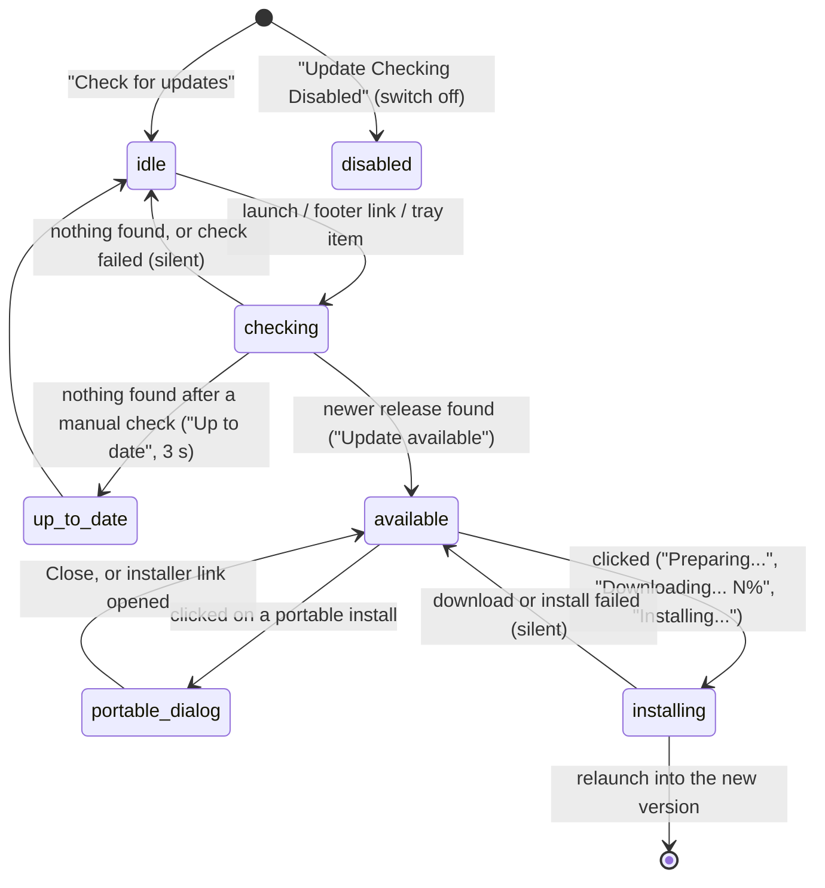

# Updates

## Summary

Handy checks for a new version once at every launch and whenever the user asks, tells the user through a short status text at the right end of the settings window's footer, and installs the update from that same text in one click: the new build is downloaded with a progress bar, put in place, and Handy relaunches into it. The check can be turned off with the "Check for Updates" switch on the Debug section; the tray's "Check for Updates..." item and the footer's "Check for updates" link trigger a check by hand. After an upgrade, the first launch of the new version may open a "What's New" modal with that release's notes, governed by the "Show What's New" switch on the About section and previewable from the Debug section. Portable installs on Windows cannot update themselves and get a dialog pointing at the installer instead.

The What's New modal and the update check are separate mechanisms that meet at the relaunch: the check knows nothing about release notes, and the modal knows nothing about how the new version arrived.

## The simple case

The user opens Handy. For a moment the footer reads "Checking for updates..." next to "• v0.9.6"; then, because a newer release exists, it changes to "Update available" in the accent color. The user clicks it. The text becomes "Preparing...", then "Downloading...  42%" with a progress bar filling beside it, then "Installing...". Handy closes and reopens by itself as the new version, with the settings window shown or hidden according to the Start Hidden rule. If the new version bundles release notes newer than the ones the user last saw, a modal titled "New in Handy v0.9.7" opens over the General section; the user reads it and closes it, and it does not come back.

With no update available, the footer settles on "Check for updates" and stays there. Clicking it runs the check again and, if nothing is found, shows "Up to date" for three seconds before returning to "Check for updates".

## The interaction, event by event

For an update the five phases are: **Start** is a check beginning, **Ends at once** is the check finishing with nothing to install, **Becomes active** is an update being found and offered, **While active** is the install running, and **Finish** is the relaunch into the new version, including the What's New modal.

The footer's status texts, in the order Handy decides between them:

| Text | When | Clickable |
| --- | --- | --- |
| "Update Checking Disabled" | The Check for Updates switch is off. Overrides everything below. | No |
| "Downloading... {{progress}}%" | An install is running and some of the download has arrived (the number is padded to three characters); a progress bar sits beside it. | No |
| "Installing..." | The download reached 100% and the files are being put in place. | No |
| "Preparing..." | An install is running but no progress has arrived yet. | No |
| "Checking for updates..." | A check is in flight. | No |
| "Up to date" | A manual check just found nothing; shown for 3 s. | No |
| "Update available" | A newer release was found. Shown in the accent color, medium weight. | Yes: installs |
| "Check for updates" | Nothing else applies. | Yes: checks |

### Start

A check starts in one of three ways. **At launch**, as soon as the settings have loaded and the main settings content (sidebar, section, footer) has mounted — which is at every launch for a returning user, including hidden starts where the window is never shown, and at the end of onboarding for a new one. **From the footer**, by clicking "Check for updates". **From the tray**, by choosing "Check for Updates...", which first shows the settings window and then runs the same check as the footer link. Turning the Check for Updates switch on also starts a check immediately. A check that starts while one is already running is dropped.

During the check the footer reads "Checking for updates..." and cannot be clicked. Nothing else in the window changes; dictation is unaffected.

> Technical note: the check fetches `https://github.com/cjpais/Handy/releases/latest/download/latest.json`, the manifest of the latest GitHub release, and compares its version with the running one; an update is offered only when the manifest's version is strictly greater. The request carries no account or device identifier. The check is not repeated on a timer, on wake, or when the window is reopened; a copy of Handy left running for weeks checks only at the next launch or manual check.

### Ends at once

The check ends at once when there is nothing to install. After the automatic launch check the text simply becomes "Check for updates" with no confirmation. After a manual check (footer link or tray item) it reads "Up to date" for 3 s, then "Check for updates". A check that fails — no network, GitHub unreachable, a manifest with no entry for this Mac's architecture — ends the same way as the automatic no-update case: "Check for updates", with no toast and no message; the only trace is a line in the log file. A manual check that fails therefore never says "Up to date" and never says why.

### Becomes active

An update becomes active when the check finds a newer release: the footer reads "Update available" in the accent color and becomes a link. Nothing else announces it — no toast, no badge on the tray icon, no version number, no release notes. If the window is hidden the user sees it the next time they open the window. The text stays until the user clicks it, turns update checks off, or quits.

Clicking "Update available" on a **portable install** (a Windows layout where Handy runs from a folder with a `portable` marker) does not download anything. A dialog titled "Manual update required" opens with one of two messages, depending on whether the manifest names an installer for this machine:

- With a matching installer: "Portable installs cannot be updated automatically. Download the installer for your system below, run it, and install to the same folder — your Data/ folder (settings, models, recordings) is kept in place." with a "Download installer" button that opens the installer's download link in the browser.
- Without one: "Portable installs cannot be updated automatically. Download the latest version for your system from GitHub Releases and install it to the same folder — your Data/ folder (settings, models, recordings) is kept in place." with an "Open GitHub Releases" button that opens the releases page.

Both variants have a "Close" button. Either button closes the dialog; Escape and clicking outside it do not. The footer still reads "Update available" afterwards.

### While active

The install is active from the click until the relaunch. Handy checks the manifest a second time, then downloads the build for this Mac. The footer reads "Preparing..." until the first bytes arrive, then "Downloading... {{progress}}%" with a progress bar beside it as the percentage climbs, then "Installing..." at 100%. None of these can be clicked, and there is no way to cancel: the text simply reports progress. The rest of the window stays usable and dictation keeps working.

When the download completes its signature is verified, the current app bundle is replaced by the new one, and Handy relaunches. If the app's folder is not writable by the user — an Applications folder owned by an administrator — macOS shows its own administrator password prompt to allow the replacement.

If anything in this stretch fails (the download is interrupted, the signature does not verify, the folder is read-only, the password prompt is cancelled) the footer goes back to "Update available" with no toast or message, and clicking it starts the whole install over. If the second manifest check finds no update after all, the text also stays "Update available".

> Technical note: the downloaded archive is verified against the public key built into Handy before anything is replaced; a build whose signature does not match is never installed. On macOS the new `.app` is extracted to a temporary folder, the old bundle is moved aside, and the new one is moved into its place. If the download's size is not announced by the server the percentage never moves, so "Preparing..." stays up for the whole download and "Installing..." is never shown.

### Finish

The interaction finishes with the relaunch: the running process exits and a new one starts as the new version. Any dictation in progress at that instant is abandoned. The new launch follows the normal launch rules — the window is shown unless Start Hidden is on, the model is not loaded until the first dictation or selection — and runs its own launch-time update check, which now finds nothing.

**The What's New modal.** On that launch, if the Show What's New switch (About section, on by default) is on, Handy compares the running version with the last version whose notes the user has seen. If a bundled release note exists that is newer than the last-seen version and not newer than the running version, the newest such note opens in a modal over the settings content: a card up to 32 rem wide, titled "New in Handy v{{version}}" with the *note's* version, a ✕ button labelled "Close" in the corner, and the note's text scrolling inside with faded top and bottom edges. Headings, paragraphs, lists, links, code, quotes, rules, and images are rendered; links open in the default browser; raw HTML in the note is dropped. Closing the modal — ✕, Escape, or a click on the dimmed backdrop — records the note's version as seen, so the modal does not return for that note on later launches or in this session. While it is open the window behind it does not scroll.

A fresh install records the installed version as already seen, so a first-time user never sees a modal. A user upgrading from a version older than the seen-version record is treated as having seen nothing, and gets the newest bundled note on their first launch.

The **"Preview"** button under "Preview What's New" on the Debug section opens the newest bundled note in the same modal regardless of what has been seen, and closing it records nothing. If the build bundles no notes at all, the button shows a toast: "No bundled release notes found".

> Technical note: release notes are Markdown files named by version under `src/content/release-notes/` (for example `0.9.0.md`), compiled into the app at build time; only versions with a file can ever be shown. At `af48dd6` the only bundled note is `0.9.0.md`, so upgrading 0.9.5 → 0.9.6 shows nothing, while upgrading from a build predating the seen-version record shows "New in Handy v0.9.0" on a 0.9.6 install.

## Modifiers

| Modifier | Set before the start | Changed while active |
| --- | --- | --- |
| Push to talk | No effect. | No effect. |
| Binding | No effect. | No effect. |
| Overlay style | No effect. | No effect. |
| Streaming model | No effect. | No effect. |
| Voice activity detection | No effect. | No effect. |
| Always-on microphone | No effect on the check or install. | No effect until the relaunch, which closes the always-open microphone stream; the new process opens it again at startup. |

## Cancel and interrupt

"Before active" covers a check in flight and the "Update available" link waiting to be clicked; "while active" covers the install and the What's New modal.

| Event | Before active | While active |
| --- | --- | --- |
| Cancel | There is no way to cancel a check; Escape, the overlay ✕, the tray's Cancel item, and `handy --cancel` act only on dictations and leave the check alone. The portable dialog closes only from its buttons. | The install cannot be cancelled once clicked; quitting Handy is the only way to stop it (see below). The What's New modal closes with Escape, ✕, or a backdrop click, and that counts as having seen it. |
| Another trigger | A dictation runs normally during a check; the check runs normally during a dictation. | A dictation runs normally during the download, but the relaunch does not wait for it: a dictation still recording or processing when the install completes is lost without a toast. The What's New modal does not block dictation; whether Escape while it is open and a recording is in progress reaches both the modal and the Cancel shortcut is not determined (see Open questions). |
| A setting changed mid-way | Turning Check for Updates off during a check: the footer reads "Update Checking Disabled" at once; the check completes silently and its result is discarded. Turning it on starts a check. | Turning Check for Updates off during an install: the footer reads "Update Checking Disabled" but the download continues and the relaunch still happens. Turning Show What's New off while the modal is open closes it without recording the version as seen, so it returns when the switch is turned back on. |
| Microphone lost | No effect. | No effect. |
| Model or processing failure | No effect. | No effect. |
| The active application changes | No effect; the check runs with the window hidden or in the background and the result waits in the footer. | No effect on the download. The relaunched app follows the Start Hidden rule rather than restoring focus. The What's New modal waits in a hidden window until it is shown. |
| Handy quits or the system sleeps | Quit during a check: nothing is remembered; the next launch checks again. "Update available" is not remembered either; the next launch re-finds it. Sleep: the request fails or completes when the network returns; a failure is silent. | Quit during a download abandons it; the next launch shows "Update available" again after its check. Sleep mid-download usually breaks the connection: the footer returns to "Update available". Quit during "Installing..." is not protected against; if the bundle has already been moved aside the next launch is whichever bundle is in place. |
| Keyboard channel changes | No effect. | No effect on the install. Secure Input does not affect the modal's Escape key, which is a window key rather than a global shortcut. |

## Interactions with other systems

**Permissions.** The check and download need only network access. Replacing the bundle needs write access to the folder Handy is installed in; macOS asks for an administrator password when the user lacks it, and cancelling that prompt fails the install silently.

**History and recordings.** None. History survives the relaunch unchanged.

**Clipboard.** None.

**Model state.** The relaunch releases the loaded model with the old process; the new version starts with nothing loaded, so the first dictation after an update waits for a load at its stop. Downloaded models are untouched by an update.

**Tray and overlay.** The tray menu's "Check for Updates..." item shows the settings window and starts a manual check. It is greyed out while Check for Updates is off, but the greying is applied the next time the tray menu is rebuilt (a dictation starting or ending, a model or language change), not the moment the switch is flipped; in between, choosing it does nothing at all — not even showing the window. The tray icon never indicates an available update, and the overlay is not involved.

**Sounds and system audio.** None.

**Settings persistence.** Three settings: `update_checks_enabled` (on by default; Debug section), `show_whats_new_on_update` (on by default; About section), and `whats_new_last_seen_version` (no control; written when a What's New modal is closed). A fresh install stamps the installed version into the last-seen record; a settings store from before the record existed has it blanked once at load so the upgrade shows the newest note. Nothing about an available or installed update is persisted, and settings are carried across the relaunch untouched.

**Platform differences.** On macOS the new `.app` bundle replaces the old one in place. On Windows the downloaded installer (NSIS or MSI, matching how Handy was installed) is run to perform the replacement; portable installs get the "Manual update required" dialog instead, with "Download installer" when the manifest has an installer for the machine's architecture and "Open GitHub Releases" otherwise. On Linux the AppImage is replaced in place, while deb and rpm installs run the system package tool and may prompt for the administrator password through the desktop's own dialog. The What's New modal behaves identically everywhere.

## Edge cases

- "Update available" never shows which version is available or what changed; clicking it starts the install immediately with no confirmation step.
- Every failure in the update path is silent in the UI: a failed check looks like "no update", and a failed install looks like the update was never attempted. Only the log file says what went wrong.
- The check runs once per process. A copy of Handy left running does not learn about new releases until it is relaunched or asked.
- The launch-time check starts before the window is visible on a hidden start, so a user who opens the window later may see "Update available" with no "Checking..." phase at all.
- During onboarding the footer is not on screen, so no check runs; the first check happens the moment onboarding hands over to the main window.
- A manual check requested while the launch check is still running is merged into it, and the in-flight check then shows "Up to date" as if it had been manual.
- The What's New title names the note's version, not the running one: after an upgrade from a pre-record build a 0.9.6 install announces "New in Handy v0.9.0".
- Closing a What's New modal records the note's version, not the running version, so if a later build bundles a note for a version in between the two, it is shown at the next upgrade.
- Turning Show What's New on (About section) while an unseen note exists opens the modal immediately, in the About section, without a relaunch.
- The Preview button opens the newest note even if it is older than the running version and even if the user has already seen it; it is the only way to re-read a note.
- Images in a release note must be bundled with Handy; the modal never loads anything from the network. Links to anything other than `http`, `https`, or `mailto` are rendered as plain text.
- The portable dialog is a plain overlay rather than Handy's standard dialog: Escape and backdrop clicks are ignored, and there is no ✕.

## Open questions and verification

- The footer texts, their order of precedence, and their clickability were read from the code; the 3 s "Up to date" timing and the look of the progress bar were not observed.
- Whether the macOS administrator password prompt appears for a user-owned `/Applications` (it should not) and what happens when Handy runs from a read-only disk image (the install should fail silently) were not tried.
- A dictation in progress at the moment the install completes is abandoned by the relaunch without warning. Suspected bug.
- Turning Check for Updates off mid-install does not stop the install or the relaunch. Suspected bug, or at least a surprising label.
- The tray's "Check for Updates..." item stays enabled until the next tray rebuild after the switch is turned off. Minor suspected bug.
- A failed check or install gives no feedback at all; whether a toast is wanted is a product call.
- The What's New title showing the note's version rather than the running version after a multi-version upgrade looks unintended. Suspected bug.
- Whether the `trigger_update_check` command, which nothing in the settings window calls, is reachable by any user action was not determined; it appears to be unused.
- Behavior on Windows (installer modes, the portable dialog's link resolution) was read from the code and its unit test and not run.
- Whether an Escape pressed while the What's New modal is open during a recording both closes the modal and cancels the recording (the Cancel shortcut is a system-wide listener and the modal listens to the window's own key events) was not determined.

Verified against Handy commit `af48dd6`.
