# Downloading a model

## Summary

Downloading a model fetches one of the catalog's speech-to-text models onto the Mac so it can be made [active](../foundations/models.md#the-models-states). The user starts it by clicking a card under "Available to Download" on the Models section (or on the onboarding model step, see [Choosing a model](../setup/choosing-a-model.md)); the card shows a progress bar, a percentage, a transfer speed, and a "Cancel" button while the transfer runs, and the footer's model selector mirrors the progress. Catalog models come from Hugging Face and fall back to a mirror; legacy models come from a direct download that is verified and, for directory models, unpacked. When the download completes the model is downloaded and, unless a dictation is recording at that moment, becomes the active model half a second later. A cancelled or failed download keeps what was transferred so the next click resumes.

## The simple case

The user opens Settings › Models, scrolls to "Available to Download", and clicks the "Whisper Medium" card. The card jumps up into the "Downloaded Models" section, a thin progress bar appears under its description reading "Downloading 0%", and a "Cancel" button sits at the bar's right end. In the footer the model selector's dot pulses pink and its text reads "Downloading 0%", with a small progress bar beside it. After half a second a speed appears next to the card's Cancel button, "12.3 MB/s", and the percentage climbs.

About a minute later the bar fills, the progress row disappears, and the card looks like any downloaded card: a drive icon next to "793 MB" and a "Delete" button. Half a second after that the footer reads "Loading Whisper Medium..." with a yellow pulsing dot, the card gains the "Active" badge and moves to the top of "Downloaded Models", and when the load finishes the footer shows "Whisper Medium" with a green dot. The next dictation uses it.

## The interaction, event by event

```mermaid
stateDiagram-v2
    [*] --> downloadable
    downloadable --> downloading : card clicked
    downloadable --> downloaded : card clicked, file already on disk
    downloading --> downloadable : Cancel (partial kept)
    downloading --> downloadable : failed (toast; partial kept or cleared)
    downloading --> verifying : transfer complete (mirror or legacy)
    downloading --> downloaded : transfer complete (Hugging Face)
    verifying --> downloadable : hash mismatch (toast; partial deleted)
    verifying --> extracting : verified, legacy directory model
    verifying --> downloaded : verified, single file
    extracting --> downloadable : archive unreadable (toast; partial deleted)
    extracting --> downloaded : unpacked
    downloaded --> active : auto-selected 500 ms later (not if recording)
```

### Start

The download starts when the user clicks anywhere on a downloadable card. The card's status changes immediately, before any network traffic: it moves from "Available to Download" into "Downloaded Models" (the page groups downloading cards with downloaded ones), its bottom row loses the size and download icon, and a progress bar appears below it with "Downloading 0%" on the left and "Cancel" on the right. The footer's model selector switches to a pink pulsing dot and "Downloading 0%", and a small bar with the word "Downloading..." appears to its right. Nothing else on the page is disabled; the user can keep browsing, start a second download, switch models, or leave the section.

Handy first checks whether the file is already on disk. For a catalog model that means the shared Hugging Face cache or Handy's models folder; for a legacy model, the models folder. If it is there, the download completes at once (see Finish). Otherwise the transfer begins. Catalog models are fetched from Hugging Face straight into the shared cache, where other tools can reuse them; legacy models are fetched from Handy's own host into the models folder as a `.partial` file.

> Technical note: a catalog download opens four parallel connections on its first attempt. Hugging Face has no built-in retry, so Handy retries itself: up to four attempts, the first with four streams and the rest with one, waiting 2 s, 4 s, and 8 s before the second, third, and fourth. Each attempt resumes from what the previous one committed. Legacy downloads and the mirror make a single attempt each, with a 15 s connection timeout.

### Ends at once

The download ends without a transfer when the file is already present: a catalog model downloaded by another tool into the Hugging Face cache, a file placed in the models folder by hand, or a legacy model whose complete file is already there. The card goes straight to downloaded and the footer's auto-selection runs as if a transfer had finished. It also ends at once, with a toast, if the model has no download source (a custom or cache model cannot be downloaded, but those are never shown as downloadable, so this needs a stale list) or if the request to the backend itself fails; in both cases the card returns to downloadable. Clicking a card that is already downloading, verifying, or extracting does nothing: those statuses are not clickable.

### Becomes active

The download becomes active when the first progress report arrives, at most a tenth of a second after the transfer begins. The card's bar starts to fill and the percentage counts up; the footer's percentage follows. The speed appears after the first half second of transfer, next to the Cancel button as "{speed} MB/s" with one decimal, and in the footer's small bar as the same number; it is smoothed, so a brief stall shows as a falling number rather than zero. A card's bar and percentage belong to that model only; two downloads running together show two bars.

### While active

The transfer runs until it completes, is cancelled, fails, or stalls. Progress is reported up to ten times a second. What happens underneath depends on the source:

- **Catalog model (Hugging Face).** If an attempt fails for a network reason, Handy waits and retries as above; the card keeps its progress row throughout. If no byte arrives for 60 seconds, a watchdog ends the attempt as stalled: a stall on the four-stream first attempt is retried with a single stream after 2 s; a stall on a single-stream attempt goes straight to the mirror. After the fourth failure, or a single-stream stall, Handy tries the mirror.
- **Mirror.** The same file is fetched from Handy's own host into the models folder, not the cache. The card's bar restarts from 0%, because this is a fresh file in a different place. The mirror transfer is resumable and has the same 60 s stall rule; if it fails, the whole download fails.
- **Legacy model.** One direct transfer into the models folder. A stall of 60 s or any server error fails the download with no retry, keeping the partial for the next click.

The user can cancel at any moment with the card's "Cancel" button. The card and footer return to their idle looks immediately; the transfer stops at its next chunk (or at once if it was still waiting for the server to answer). Everything received so far stays on disk so the next click on the card resumes rather than restarts. Closing the settings window does not stop a download; it continues with the window hidden.

> Technical note: resuming a legacy or mirror download asks the server for the remaining byte range. A server that answers with the whole file restarts from zero; one that answers from the wrong offset, advertises a different total, or sends more than the expected size is rejected and the partial is cleared, so a misbehaving server can never produce a corrupt model or fill the disk. A partial that is already the full expected size is verified without any network request, which is how a crash between the last byte and the final rename recovers.

### Finish

How a download finishes depends on the source:

- **Catalog model from Hugging Face.** The card goes straight from the progress row to a downloaded card; there is no verification step on this path.
- **Mirror or legacy model.** The card's bar becomes a pulsing full bar over "Verifying..." while Handy hashes the file and compares it with the catalog's expected value; the footer's dot turns orange and reads "Verifying {name}...". A mismatch deletes the partial and fails the download with the toast "Download verification failed for model {id}: file is corrupt. Please retry." For a legacy directory model (Parakeet V2/V3, Moonshine, SenseVoice, GigaAM, Canary, Cohere) the bar then reads "Extracting..." and the footer "Extracting {name}..." while the archive is unpacked; an unreadable archive deletes the partial and fails with "Failed to extract archive: {error}". Verification and extraction cannot be cancelled.

On success the progress row disappears, the card shows a drive icon next to its size and a "Delete" button, and the model appears in the footer's dropdown and the tray's model submenu. Half a second later, if no dictation is recording, the footer selects it: this is the same path as choosing it from the footer, described in [Switching models](switching-models.md), so the footer shows "Loading {name}..." and the card gains the "Active" badge and moves to the top of "Downloaded Models". If a dictation is recording at that half-second mark the model is simply left downloaded and not active. In onboarding the model step does the selection itself and then moves on to the main window.

A failure of any kind shows a toast with the error text in the bottom corner of the settings window, clears the progress row, and puts the card back where it was. For a network failure the toast reads "Hugging Face download failed after {n} attempt(s): {error}" or "Download failed from Hugging Face ({error}) and 1 mirror(s)"; for a legacy model it is the transfer error, for example "transfer stalled: no data for 60s" or "server returned HTTP 404". The partial is kept after network failures and deleted after verification, size, or extraction failures.

## Modifiers

| Modifier | Set before the start | Changed while active |
| --- | --- | --- |
| Push to talk | No effect. | No effect. |
| Binding | No effect. | No effect. |
| Overlay style | No effect. | No effect. |
| Streaming model | No effect on the transfer; the "Streaming" tag on the card comes from the catalog and may be corrected after the model's first load. | No effect. |
| Voice activity detection | No effect. | No effect. |
| Always-on microphone | No effect. | No effect. |

## Cancel and interrupt

| Event | Before active (waiting for the server) | While active (transferring, verifying, extracting) |
| --- | --- | --- |
| Cancel | Escape, the overlay ✕, the tray's Cancel item, and `handy --cancel` act on dictations only and leave the download alone. The card's own "Cancel" wins immediately, without waiting for the server; nothing is on disk yet. | The card's "Cancel" stops the transfer at its next chunk and keeps the partial. During "Verifying..." or "Extracting..." the Cancel button is no longer shown; a cancel request arriving then clears the card's progress but the work continues to completion and the model ends up downloaded and auto-selected anyway. |
| Another trigger | A dictation can start and run normally; the download is unaffected. | Same. If the download completes while a dictation is recording, the auto-selection is skipped and the model stays downloaded but not active. |
| A setting changed mid-way | Switching the active model, changing the microphone, or any other setting has no effect on the download. The downloading card has no Delete button. | Same. "Rescan" during a download may briefly show the card without its progress row; it comes back with the next progress report. Setting Unload Model to "Immediately" before completion means the auto-selection writes the setting but does not load the model. |
| Microphone lost | No effect. | No effect. |
| Model or processing failure | A failed load of some other model does not affect the download. | Same. The download's own failures are described under Finish. |
| The active application changes | No effect; the download continues with the settings window in the background or hidden. A failure toast shown while the window is hidden is not seen. | Same. |
| Handy quits or the system sleeps | Quitting drops the request; nothing is on disk. | Quitting aborts the transfer and keeps the partial; the card shows as downloadable at the next launch with no sign of the partial, and clicking it resumes. Sleep stalls the connection; if it does not recover within 60 s the stall rule applies (retry or mirror for catalog models, failure for legacy). An interrupted extraction leaves a temporary folder that is cleaned up at the next launch. |
| Keyboard channel changes | No effect. | No effect. |

## Interactions with other systems

**Permissions.** None. Downloads need network access, which macOS does not gate per app.

**History and recordings.** None.

**Clipboard.** None.

**Model state.** The download never touches the loaded model. Its completion starts a selection and load exactly as described in [Switching models](switching-models.md); a failed auto-selection (for example a model whose file cannot be opened) reverts the selection to the previous model with the "Failed to load model: {name}" toast.

**Tray and overlay.** The overlay is not involved. The tray's model submenu lists the new model once the tray menu is next rebuilt, which the auto-selection triggers; if the auto-selection was skipped because a dictation was recording, the rebuild at the end of that dictation picks it up.

**Sounds and system audio.** None.

**Settings persistence.** Nothing is written until the auto-selection, which writes `selected_model` and marks onboarding complete. Cancelling or failing writes nothing.

**Platform differences.** The Hugging Face cache is `~/.cache/huggingface/hub` (or `HF_HOME`) on every platform; on Windows, where symlinks may be unavailable, the cache stores the file directly. Nothing else differs.

## Edge cases

- A card moves into "Downloaded Models" the instant it is clicked, before a single byte has arrived, and moves back if the download is cancelled or fails.
- A model that another tool already downloaded into the Hugging Face cache "downloads" instantly; so does a catalog file dropped into the models folder by hand.
- Two or more downloads at once are allowed from the Models page (not from onboarding). The footer then reads "Downloading {count} models..." with one tiny bar per download; each card keeps its own bar, percentage, and speed.
- The footer's small bar says "Downloading..." until a speed is known, then "{speed}MB/s" without a space; this text is not translated and does not follow the interface language.
- A mirror fallback restarts the progress bar at 0% and leaves the file in Handy's models folder rather than the shared cache; "Delete" removes it from either place.
- The verification failure toast names the model by its id ("handy-computer/whisper-medium-gguf/whisper-medium-Q8_0.gguf"), not its display name.
- Alternate quantizations of a catalog model are never offered for download; only the default quantization has a card. See [The Models page](the-models-page.md).
- A catalog model downloaded from Hugging Face is not hash-checked; only the mirror and legacy paths are. The catalog's hash exists so that the untrusted mirror can be trusted.
- The size (and, in debug mode, the quantization label such as "Q8_0") is hidden while a card is downloading, verifying, or extracting, and returns when it is done.

## Open questions and verification

- Whether a cancel during "Verifying..." or "Extracting..." really lets the download complete and auto-select in the background, as the code reads, was not reproduced. Suspected bug.
- Whether the card's percentage restarts from 0% on a Hugging Face retry (each attempt reports from its own resumed offset) or continues from where it was; read from the code as unclear, not observed.
- The exact wording of the Hugging Face network error inside the failure toast depends on the underlying library and was not captured.
- Whether the footer's auto-selection can fire twice when the onboarding step and the footer both react to the same completion (the footer mounts after onboarding finishes, so it should not).
- How the card reads on Windows when the cache cannot use symlinks was not checked.
- The download speed's first appearance after 0.5 s and its smoothing were read from the code, not timed.

Verified against Handy commit `af48dd6`.
