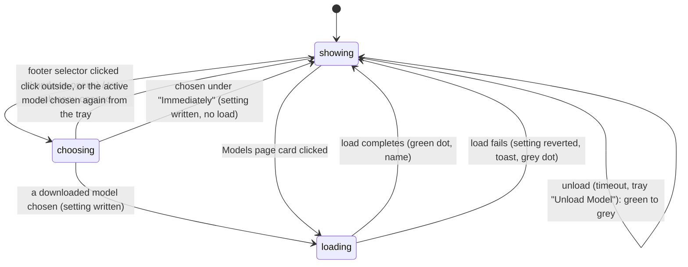

# Switching models

## Summary

Switching models makes a different downloaded model the [active model](../foundations/models.md#the-models-states): the one the next dictation uses. There are three places to do it — the model selector in the settings window's footer, the model submenu in the tray menu, and a card under "Downloaded Models" on the Models section — and all three do the same thing: write the selection, then load the new model into memory while the footer shows "Loading {name}..." with a yellow pulsing dot. A load that fails puts the previous selection back and shows a toast. The same footer and tray also show and control the loaded state: the dot's color, the tray's "Unload Model" item, and the Unload Model timeout under Settings › Advanced decide when a loaded model is released.

## The simple case

The user has Parakeet Unified EN 0.6B active and loaded; the footer shows its name with a green dot. They click the footer's model selector. A list opens upward with every downloaded model, the active one highlighted and marked "Active" on the right. They click "Whisper Medium". The list closes, the footer immediately reads "Loading Whisper Medium..." with a yellow pulsing dot, and two or three seconds later it settles on "Whisper Medium" with a green dot. The tray's model submenu now shows "Whisper Medium" as its label with a tick beside that entry, and the Models section shows the "Active" badge on the Whisper Medium card. Five minutes after the last dictation the dot turns grey: the model is still active but no longer in memory, and the next dictation loads it again.

## The interaction, event by event

### Start

The interaction starts when the user opens one of the three pickers or clicks a card:

- **Footer.** Clicking the model selector — the dot, the model name, and a chevron at the left of the footer — opens a list above it, 256 points wide and at most 60% of the window's height, listing every downloaded model by name with its description in italics beneath. Custom models carry a small "CUSTOM" tag and streaming models a "STREAMING" tag after the name; the active model's row is tinted and shows "Active" at its right. If nothing is downloaded the list says "No models available". The chevron flips while the list is open. Clicking anywhere outside closes it without a change.
- **Tray.** The tray menu's model submenu is labelled with the active model's name ("Model" if there is none) and lists downloaded models alphabetically with a tick on the active one. It exists only while Handy is idle; during a dictation the menu shows a "Cancel" item in its place.
- **Models section.** Every card under "Downloaded Models" other than the active one is clickable; the active card is deliberately not, because re-selecting it would only reload it.

### Ends at once

Choosing the model that is already active from the tray does nothing: the submenu closes and no load happens. Closing the footer list by clicking outside, or dismissing the tray menu, leaves everything as it was. A choice is also refused, before the setting is written, when a model load is already in progress (a load started by a trigger or by an earlier switch): the backend answers "Model load already in progress" and the switch is abandoned. The footer reports this as a red dot with the text "Failed to switch model"; the Models section's card just drops its "Switching..." badge; the tray only logs it. No toast appears because no load was attempted.

### Becomes active

The switch becomes active the moment a downloaded model is chosen. The selection is written to settings first, so every part of the window agrees on the new model while it loads: the footer's text changes to the new model's name at once (the list closes), the tray submenu's label and tick move, and on the Models section the chosen card shows a "Switching..." badge with a spinner while the new card is not yet "Active". Then the load starts. The previously loaded model is released from memory before the new one is built, so for the duration of the load no model is loaded at all.

> Technical note: the old model is dropped before the new one is created so that two large models are never in memory at once. A dictation stopped during this window waits for the load to finish before transcribing; see [Transcribing](../dictation/transcribing.md).

If Unload Model is set to "Immediately", the switch ends here: the setting is written, the footer shows the new name with a grey dot, and nothing is loaded until the next dictation.

### While active

While the model loads the footer shows "Loading {name}..." with a yellow pulsing dot, the Models section card keeps its "Switching..." badge, and the tray's "Unload Model" item is disabled. A load takes from under a second for a small model to several seconds for a large one on first use. Nothing can interrupt it: a second choice from any picker is refused as above, and a dictation started now records normally and waits at its stop. The settings window can be closed; the load continues.

### Finish

The load completes and the footer shows the model's name with a green dot; the Models section moves the "Active" badge to the new card and sorts it to the top of "Downloaded Models"; the tray enables "Unload Model". The model's real capabilities are read at this point, so a card's "Streaming" or "Translate" tag and the General section's language picker can change after the first load.

If the load fails, the selection is put back to the previous model and a toast reads "Failed to load model: {name}" with the error beneath it. The previous model is not reloaded: the footer shows its name with a grey dot, and the next dictation loads it again. On the Models section the "Switching..." badge disappears and the "Active" badge stays on the previous card. From the tray the failure is the same; the toast is visible only if the settings window is open.

Unloading is the other end of the same state. The loaded model is released after the Unload Model timeout (Settings › Advanced: "Never", "Immediately", "After 2 minutes", "After 5 minutes" — the default — "After 10 minutes", "After 15 minutes", "After 1 hour", and in debug mode "After 15 seconds (Debug)"), or at once from the tray's "Unload Model" item, which is enabled only while a model is loaded. Either way the footer's dot turns grey beside the unchanged model name and the tray item disables itself. The timeout counts from the last load or dictation, is checked every ten seconds, and never fires while a recording is in progress. Changing the timeout takes effect at the next ten-second check; "Never" keeps the model loaded until Handy quits.

## Modifiers

| Modifier | Set before the start | Changed while active |
| --- | --- | --- |
| Push to talk | No effect. | No effect. |
| Binding | No effect. | No effect. |
| Overlay style | No effect. | No effect. |
| Streaming model | Decides the tag shown in the footer list and on the card; after the load the tag reflects the loaded model's real capability. | No effect on the load. |
| Voice activity detection | No effect. | No effect. |
| Always-on microphone | No effect. | No effect. |

The Unload Model timeout is the setting that matters here: "Immediately" turns a switch into a setting change with no load, and every other value decides how long the loaded model survives afterwards.

## Cancel and interrupt

| Event | Before active (picker open, nothing chosen) | While active (setting written, model loading) |
| --- | --- | --- |
| Cancel | Escape does not close the footer list or the tray menu (a click outside does). The overlay ✕, the tray's Cancel item, and `handy --cancel` act on dictations only. | A load cannot be cancelled; the dictation cancels leave it running. |
| Another trigger | A dictation can start with the footer list open; the list stays open. The tray menu, if open, is replaced by the busy layout at its next opening. | A dictation started now records normally and waits for the load at its stop, then uses the new model. |
| A setting changed mid-way | Choosing a model from a different picker is the same switch. Changing the Unload Model timeout applies to the next check. | A second choice is refused ("Model load already in progress"). Deleting the loading model is possible from the Models section and yields a load failure with a toast. Changing an accelerator marks the model to reload at its next use. |
| Microphone lost | No effect. | No effect. |
| Model or processing failure | None. | A load failure reverts the selection, shows "Failed to load model: {name}", and leaves no model loaded until the next dictation. |
| The active application changes | The footer list stays open with the window in the background. | The load continues with the window hidden; a failure toast is missed. |
| Handy quits or the system sleeps | Nothing unsaved. | Quitting drops the load; the new selection is already saved and is loaded at the first trigger after relaunch. Sleep pauses the load, which resumes on wake. |
| Keyboard channel changes | No effect. | No effect. |

## Interactions with other systems

**Permissions.** None.

**History and recordings.** Re-transcribe on the History section uses whichever model is active when it is clicked and loads it if needed.

**Clipboard.** None.

**Model state.** This document. The states and their words are defined in [Models](../foundations/models.md).

**Tray and overlay.** The tray submenu and "Unload Model" item are rebuilt on every load, unload, and failure. The tray switches models on a background thread and refreshes its menu when done; it shows no progress. The overlay is not involved.

**Sounds and system audio.** None.

**Settings persistence.** A switch writes `selected_model` (and marks onboarding complete) before loading and rewrites the previous value on failure; `model_unload_timeout` is written by its dropdown. Selecting from the tray with the settings window open refreshes the window's settings so the General section's language picker follows the new model.

**Platform differences.** None in the interaction. Load times differ by accelerator (Metal on macOS, Vulkan on Windows and Linux, CPU fallback).

## Edge cases

- Choosing the already-active model from the footer list is not a no-op: the selection is rewritten and the model is reloaded (yellow dot, then green). Only the tray and the Models section guard against this.
- The footer's name is truncated to about 112 points, so long catalog names ("Parakeet TDT 0.6B primeLine (German-tuned)") are cut off with an ellipsis; the full text is in the button's tooltip.
- The footer's "Model Ready" and "Model Unloaded" texts appear only when the active model is missing from the list (for example its file disappeared and the list has not refreshed); normally the model's name is shown in both states.
- With no active model the footer reads "No Model - Download Required" with a red dot and the tray submenu is labelled "Model"; see [The Models page](the-models-page.md) for how deleting the active model gets there.
- The footer's error text after a refused switch, "Failed to switch model", is not translated and stays until the next load or unload event.
- "Unload Model" from the tray while a recording is in progress is impossible because the busy menu has no such item; the idle timeout also skips recordings.
- Under "Immediately", the footer dot is grey after every dictation and after every selection; the model is loaded only for the duration of a dictation.
- A model whose file was removed outside Handy still appears in the pickers until a rescan or relaunch; choosing it fails the switch, but because the failure happens before the load begins no "Failed to load model" toast is shown.

## Open questions and verification

- The footer's dot during a switch may briefly show grey with the new name instead of yellow "Loading {name}...": the selection change makes the footer re-check the loaded model at the same time as the loading event arrives, and the check, finding nothing loaded, can overwrite the loading state. Read from the code, timing-dependent, not observed. Suspected bug.
- Whether re-selecting the active model from the footer list really reloads it (the code does not short-circuit) was not observed. Suspected bug or at least a waste of several seconds.
- A switch refused with "Model load already in progress" leaves the footer red with "Failed to switch model" while the other load proceeds and then turns green; whether the red state is visible long enough to confuse was not checked.
- The toast after choosing a model whose file vanished is absent (the failure precedes the loading event); suspected gap.
- Whether the tray submenu's label updates before or after the load finishes when switching from the tray (the code refreshes on the loading events and again after the switch returns).
- How long "Switching..." stays on the Models section card for a large model was not timed.

Verified against Handy commit `af48dd6`.
