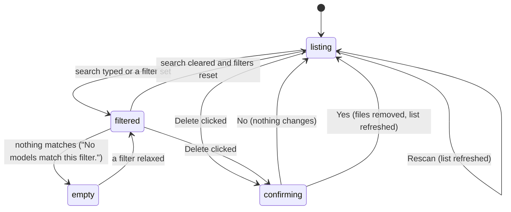

# The Models page

## Summary

The Models section of the settings window ("Models" in the sidebar, titled "Transcription Models") is where the user sees every model Handy knows about and manages the ones on disk. It has a search field, a row of filters (streaming, translation, language), a "Rescan" button, and two lists: "Downloaded Models" — the active model first, then other downloaded and custom models — and "Available to Download". Each model is a card with its name, badges, description, accuracy and speed bars, capability tags, size, and an action: clicking a downloadable card starts a [download](downloading-a-model.md), clicking a downloaded card makes it [active](switching-models.md), and a "Delete" button removes it after a confirmation. This document describes the page itself: what is listed, in what order, how the filters work, what Rescan finds, and what Delete does.

## The simple case

The user opens Settings › Models. A spinner flashes while the list loads, then the page shows "Transcription Models" with the line "Select a transcription model or download additional models. Different models offer varying levels of accuracy and speed." under it, a search field reading "Search models by name…", and the "Downloaded Models" header with a refresh icon and three filter controls on its right. Below the header sits one card, "Parakeet Unified EN 0.6B", with the "Active" badge, its description, two short bars labelled "accuracy" and "speed", the tags "English only" and "Streaming", "697 MB" with a drive icon, and a "Delete" button. Under "Available to Download" are the rest of the catalog, the five recommended models first, each with a download icon next to its size.

The user types "whisper" in the search field; the lists shrink to the Whisper models. They click the streaming filter, and the page reads "No models match this filter." They click it again, clear the search, and click "Whisper Medium" to download it.

## The interaction, event by event

### Start

The interaction starts when the user opens the Models section from the sidebar. Until the model list has been fetched the page shows a centered spinner; after that the full page appears. Search and filters are empty every time the section is opened: they are not remembered between visits or launches.

Every model Handy knows about is listed once, in a fixed order: the ten editorially ranked catalog models first (Parakeet Unified EN 0.6B, Nemotron Streaming 3.5, Canary 180M Flash, Cohere Transcribe, Whisper Medium, Voxtral Mini 4B Realtime, Parakeet TDT 0.6B v3, Parakeet TDT 0.6B v2, Qwen3-ASR 0.6B, Fun-ASR Nano Multilingual), then recommended before not, then by accuracy, speed, and name. That order is kept within each list, except that "Downloaded Models" always puts the active model first and custom models last. Legacy models — the older direct downloads (Whisper Small/Medium/Turbo/Large, Breeze ASR, Parakeet V2/V3, Moonshine Base and the Moonshine V2 streaming trio, SenseVoice, GigaAM v3, Canary 180M Flash, Canary 1B v2, Cohere) — are hidden unless already on disk, in which case they appear under "Downloaded Models" with a "Legacy" badge.

> Technical note: the list is the compiled-in catalog of 69 Hugging Face models plus the 16 legacy entries, plus whatever the startup scan found in the models folder and the shared Hugging Face cache. Catalog models use the default quantization; any other quantization found on disk becomes its own entry.

### Ends at once

Leaving the section, or opening it and doing nothing, changes nothing: the page has no state of its own worth keeping. Clicking the active card does nothing (it is not clickable). Clicking "Delete" and answering "No" in the dialog does nothing. Pressing "Rescan" while a rescan is already running is ignored.

### Becomes active

The page becomes active when the user narrows it or starts an action:

- **Search.** Typing in the field filters both lists as each character is typed, matching the text against the model's name and description (case-insensitive, anywhere in the text). The placeholder says "Search models by name…" but descriptions match too.
- **Streaming filter.** The waveform icon button (tooltip "Filter models that support live streaming transcription") toggles on with a pink tint; only models with the "Streaming" tag remain.
- **Translation filter.** The languages icon button (tooltip "Filter models that support translation to English") keeps only models with the "Translate" tag.
- **Language filter.** The globe button, labelled "All Languages" until set, opens a panel with a search field ("Search languages...") focused and a list: "All Languages" and then every language Handy names except Auto and the two Chinese script variants ("Chinese" stands for both). Typing narrows the list; Enter picks the first match; Escape closes; an empty list shows "No languages found". Picking a language keeps only models whose supported languages include it, matching on the base language so a model that lists "en-US" matches "English". The button then shows the language's name, truncated at about 120 points, with a pink tint.
- **Rescan.** The refresh icon (tooltip "Rescan for models added to the models folder or Hugging Face cache outside Handy") spins while Handy re-reads the models folder and the Hugging Face cache; new files appear in "Downloaded Models" without a restart.
- **Delete.** The "Delete" button on any downloaded card opens a native confirmation dialog.

The filters combine: a model must pass the language filter, both toggles, and the search to be shown. The "Downloaded Models" header and its controls stay visible however narrow the result, so a filter can always be relaxed; when nothing at all matches, "No models match this filter." is shown below the header, and when only the downloaded list is empty the header simply has nothing under it.

### While active

While the page is narrowed every card keeps its normal behavior: downloads can be started, models switched, cards deleted, and a download's progress row is shown on its card wherever the card sits. A downloading card counts as downloaded for the purpose of the two lists and moves to "Downloaded Models" the moment it is clicked. Clicking outside the language panel closes it and clears its search; the chosen language stays.

Each card shows, top to bottom: the name; badges — "Recommended" (only under "Available to Download"), "Active" with a tick, "Custom", "Legacy", or "Switching..." with a spinner while it is being made active; the description ("Not officially supported" for custom models, "From Hugging Face cache: {repo}" for cache models); and to the right two bars labelled "accuracy" and "speed", omitted for custom and cache models, which have no scores. Below a rule: a globe with "{n} languages" or "{language} only" (omitted when the model declares no languages), "Translate" (hover: "Can translate to English") if it can translate, "Streaming" (hover: "Shows live transcription as you speak") if it streams, and at the right the size — a download arrow for downloadable cards, a drive icon for downloaded ones, "Unknown size" when unknown, "1.6 GB" above a gigabyte, and in debug mode the quantization label ("Q8_0") — followed by "Delete" on downloaded cards. Hovering a clickable card lifts and tints it; hovering "Delete" shows "Delete {name}".

### Finish

The actions that change something finish as follows:

- **Delete.** The dialog's title is "Delete Model" with a warning icon. For a model that is not active the message is "Are you sure you want to delete {name}? You will need to download it again to use it."; for the active model it is "{name} is your active model. Deleting it will stop transcriptions until you select a new model. Are you sure?" The buttons are the system's Yes and No. On Yes, if the model was active it is unloaded and the selection is cleared: the footer reads "No Model - Download Required" with a red dot, the tray submenu is labelled "Model", and every dictation until a model is chosen fails with "Transcription Failed". Then the files go: a catalog model's whole repository folder in the Hugging Face cache (including any other quantizations of it) plus any copy and partial in the models folder; an alternate quantization's single file only; a legacy model's file or folder and partial; a custom model's file. The card returns to "Available to Download" (catalog), disappears (custom, cache, alternate quantization, legacy), and the footer list and tray submenu drop it. No model is auto-selected in its place until the next launch or Rescan.
- **Rescan.** The icon stops spinning, and any `.bin` or `.gguf` dropped into the models folder, or any compatible `.gguf` another tool put in the Hugging Face cache, appears under "Downloaded Models". Rescan also re-checks every model's presence on disk, so a file deleted outside Handy drops its card back to downloadable, and — if no model is active and onboarding is complete — it selects the first downloaded model in list order without loading it.
- **Search and filters** finish by being cleared or by leaving the section.

Downloads and switches finish as described in their own documents.

## Modifiers

| Modifier | Set before the start | Changed while active |
| --- | --- | --- |
| Push to talk | No effect. | No effect. |
| Binding | No effect. | No effect. |
| Overlay style | No effect. | No effect. |
| Streaming model | The "Streaming" tag and the streaming filter are this capability; for the active model it is corrected from the loaded model, so the tag can appear or vanish after the first load. | No effect on the page. |
| Voice activity detection | No effect. | No effect. |
| Always-on microphone | No effect. | No effect. |

## Cancel and interrupt

| Event | Before active (listing, nothing narrowed) | While active (narrowed, dialog open, rescanning) |
| --- | --- | --- |
| Cancel | Escape, the overlay ✕, the tray's Cancel item, and `handy --cancel` act on dictations only. | Escape closes the language panel (and clears its search). The delete dialog is dismissed with No or the system's close. A rescan cannot be cancelled. |
| Another trigger | A dictation can start and run; the page is unaffected. | Same. Deleting the active model while a dictation is recording unloads it mid-dictation: the stop then fails with "Transcription Failed". |
| A setting changed mid-way | Switching models from the footer or tray re-sorts "Downloaded Models" to put the new active card first. | Same; the filters stay. Changing the interface language re-renders card names only for legacy models (catalog names are not translated). |
| Microphone lost | No effect. | No effect. |
| Model or processing failure | A failed switch leaves the "Active" badge where it was and shows "Failed to load model: {name}" (see [Switching models](switching-models.md)). | Same. A failed delete ("No model files found to delete") is silent: the card stays and nothing tells the user. |
| The active application changes | No effect. | The delete dialog is a separate native window; switching apps and back returns to it. |
| Handy quits or the system sleeps | Nothing to lose. | Search and filters are lost; a delete not yet confirmed does not happen; a rescan in progress is abandoned. |
| Keyboard channel changes | No effect. | No effect. |

## Interactions with other systems

**Permissions.** None.

**History and recordings.** Deleting a model does not touch history entries made with it; re-transcribing them uses whatever model is active afterwards.

**Clipboard.** None.

**Model state.** Deleting the active model unloads it and clears the selection. Rescan may select (but not load) a model when none is active. The capability tags on the active card reflect the loaded model once it has been loaded.

**Tray and overlay.** The tray's model submenu lists the same downloaded models, alphabetically, and is rebuilt after a delete or a load event; a model found by Rescan appears in it at the next rebuild. The overlay is not involved.

**Sounds and system audio.** None.

**Settings persistence.** Only `selected_model` is written, by a delete of the active model (cleared) or by Rescan's auto-selection. Search and filter state is never saved.

**Platform differences.** The delete dialog is the native confirmation on each platform, so its button labels follow the system. The Hugging Face cache location is the same on every platform; a Windows cache without symlinks stores the file directly and is deleted the same way. Nothing else differs.

## Edge cases

- Deleting a catalog model removes its entire repository folder from the shared Hugging Face cache — every quantization, not just the one Handy downloaded — and that cache is shared with other tools on the Mac. Deleting an alternate quantization removes only its own file.
- After deleting the active model, no replacement is chosen until Rescan or the next launch; Rescan then picks the first downloaded model in list order, which may not be the one the user expects, and leaves it unloaded.
- Custom models: a `.bin` or `.gguf` in the models folder whose filename is not a known model's becomes a card named from the file's own metadata or, failing that, its filename in Title Case ("whisper_medical_v2.bin" becomes "Whisper Medical V2"). Its languages, streaming, and translation tags come from the file's header; a `.bin` has none, so the card shows no language tag at all. Hidden files, folders, and `.partial` files are ignored.
- A custom file whose name matches a catalog quantization ("whisper-medium-Q4_K_M.gguf") is shown as that catalog model with the quantization appended ("Whisper Medium (Q4_K_M)"), with full scores and description and no "Custom" badge; the default quantization's filename is shown as the catalog card itself.
- Cache models (a compatible `.gguf` another tool downloaded) have no "Custom" badge, no scores, the description "From Hugging Face cache: {repo}", and can be deleted — which deletes that repository folder from the cache.
- A `.gguf` in the models folder is listed even if Handy cannot recognize its architecture; the same file in the cache is skipped.
- Search matches the untranslated name and description, so in a non-English interface a translated legacy name may not match what is typed.
- The "Recommended" badge is shown only under "Available to Download"; once downloaded the same model has no badge other than "Active".
- The search field and the language panel's search are independent.
- The string "Rescan" exists as a label but the button shows only the refresh icon; the word appears nowhere on the page.

## Open questions and verification

- Whether the delete dialog's buttons read "Yes" / "No" on macOS (the dialog library's default for this kind) was not observed.
- A failed delete is silent; suspected bug. Whether it can happen in practice (the list would have to be stale) was not tested.
- Deleting a catalog model wipes the whole cache repository including other quantizations; stated in the code as a product decision, but a user with an alternate quantization downloaded by hand would lose it. Worth confirming as intended.
- Rescan's silent auto-selection after a delete (the model becomes active with a grey dot and no toast) was read from the code, not observed. Suspected surprise rather than bug.
- The language filter excludes "Chinese (Simplified)" and "Chinese (Traditional)" and offers "Chinese" instead; whether this matches what the General section's picker offers was not cross-checked here (see [Language and translation](../cross-cutting/language-and-translation.md)).
- How a `.bin` custom model's missing language tag reads next to a catalog card was not seen.
- Whether the page keeps its scroll position when a download moves a card between lists was not checked.

Verified against Handy commit `af48dd6`.
