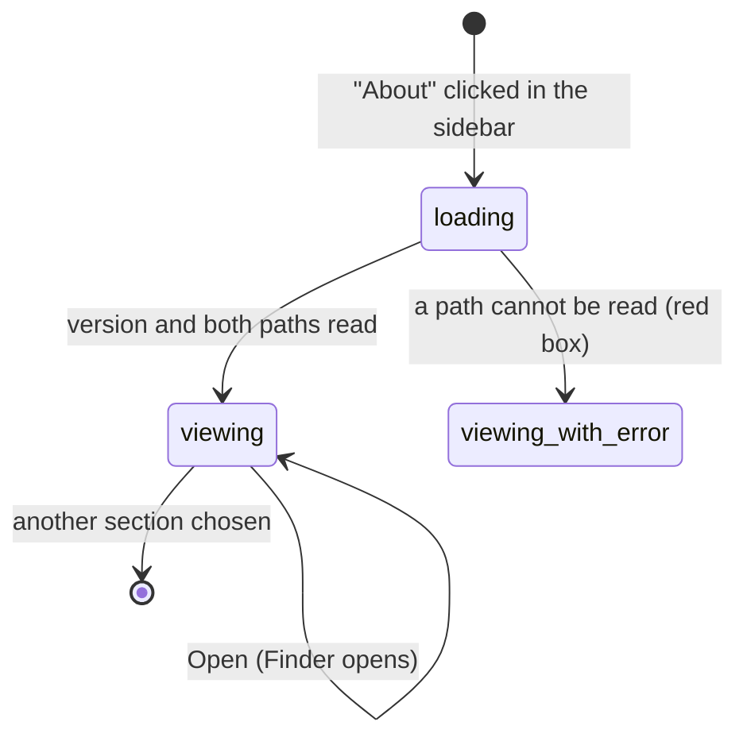

# The About page

## Summary

The About section is the settings page for things about Handy itself rather than about dictation: the interface language, the appearance, the version, whether release notes appear after an update, links to donate and to the source, and where Handy keeps its files. It is always in the sidebar as "About". The page has two groups. "About" holds, in order, the "Application Language" dropdown, the "Application Theme" dropdown, the "Version" row, the "Show What's New" toggle, "Support Development" with a "Donate" button, "Source Code" with a "View on GitHub" button, "App Data Directory" with its path and an "Open" button, and "Log Directory" with its path and an "Open" button. "Acknowledgments" holds a single "ggml" entry. The two dropdowns and the toggle save the moment they change, as in [The settings model](../foundations/the-settings-model.md); the buttons act at once and save nothing. Language and theme are the two settings in Handy whose effect is felt everywhere and immediately: the whole window re-renders in the new language and the tray menu is rebuilt, and the new palette is applied to the window, its title bar, and the overlay.

## The simple case

The user clicks "About" in the sidebar. "Application Language" reads "English (English)" and "Application Theme" reads "System"; the Version row shows "v0.9.6" in monospace; "Show What's New" is on. They open the theme dropdown and choose "Dark". The page, the sidebar, and the window's title bar turn dark at once, and the next time the overlay appears it is dark too. They open the language dropdown, scroll to "Deutsch (German)", and choose it. Every label on the page is now German, the sidebar says "Info" instead of "About", and the menu-bar menu reads "Einstellungen..." the next time they open it. Nothing had to be confirmed and nothing needs a restart. Lower down they click "Open" beside "App Data Directory" and a Finder window opens on `~/Library/Application Support/com.pais.handy`.

## The interaction, event by event

For a settings page the interaction is using the page: arriving on it, leaving it untouched, making the first change, editing further, and what is committed.

### Start

The interaction starts when the user clicks "About" in the sidebar. The page is drawn from the saved settings and three short reads: the app's version, the app data directory path, and the log directory path. While the paths load, the two directory rows show a grey placeholder bar for a fraction of a second; then each shows its path in a monospace box with an "Open" button beside it. If a path cannot be read, its row shows a red box reading "Error loading directory: {error}" instead, and for "App Data Directory" the row's title is lost as well (the error box replaces the whole row; "Log Directory" keeps its title above the box).

"Application Language" shows the saved language as "{native name} ({English name})", for example "English (English)" or "日本語 (Japanese)"; its ⓘ reads "Change the language of the Handy interface". "Application Theme" shows "System", "Light", or "Dark"; its ⓘ reads "Choose whether Handy follows your system theme or stays light or dark". "Version" shows "v" and the version, with the description "Current version of Handy". "Show What's New" has the description "Show release notes after Handy updates". "Support Development" reads "Help us continue building Handy" beside the "Donate" button; "Source Code" reads "View source code and contribute" beside "View on GitHub". The directory rows' descriptions are "Location where Handy stores its data" and "Location where log files are stored". Under "Acknowledgments", "ggml" has the ⓘ text "High-performance tensor library for on-device machine learning inference" and the paragraph "Handy's local speech-to-text is built on transcribe.cpp and ggml. Thanks to the amazing work by Georgi Gerganov and contributors."

### Ends at once

The interaction ends without a change when the user leaves the page untouched, or opens a dropdown and clicks outside it. Nothing is written. Clicking the path box selects text but changes nothing; there is no copy button, though the selected path can be copied with Cmd+C.

### Becomes active

The page becomes active on the first change or click:

- **Application Language.** Choosing a language re-renders the entire settings window in that language before the choice is saved. Arabic and Hebrew also flip the window to right-to-left: the sidebar moves to the right edge, text aligns right, and toggles slide the other way. Then the setting is saved and the tray menu is rebuilt so "Settings...", "Copy Last Transcript", "Quit", and the rest appear in the new language the next time it is opened.
- **Application Theme.** Choosing "Light" or "Dark" applies that palette to the window at once and is remembered for the next launch so the window opens in the right colors before settings have loaded; choosing "System" removes the override so the window follows macOS again. Then the setting is saved, the title bar is switched to match, and the overlay is told to switch its own palette.
- **Show What's New.** The toggle flips and is saved. Turning it off while the What's New dialog is open closes the dialog. Turning it on checks immediately whether the bundled release note for this version has been seen; if not, the dialog opens at once.
- **Donate, View on GitHub.** The default browser opens `https://handy.computer/donate` or `https://github.com/cjpais/Handy`. The settings window stays where it is.
- **Open.** Finder opens on the directory. The button is disabled if the path could not be read.

### While active

Further changes are independent of one another. The language list, in this order, offers: "English (English)", "简体中文 (Simplified Chinese)", "繁體中文 (Traditional Chinese)", "Español (Spanish)", "Français (French)", "Deutsch (German)", "日本語 (Japanese)", "한국어 (Korean)", "Tiếng Việt (Vietnamese)", "Polski (Polish)", "Italiano (Italian)", "Русский (Russian)", "Українська (Ukrainian)", "Português (Portuguese)", "Čeština (Czech)", "Türkçe (Turkish)", "العربية (Arabic)", "עברית (Hebrew)", "Svenska (Swedish)", "Български (Bulgarian)", "Nederlands (Dutch)", "नेपाली (Nepali)", "हिन्दी (Hindi)", "Dansk (Danish)". There is no "System" entry: the default is the Mac's language, read once when the settings file is first created, and after that Handy's language is whatever this dropdown says, even if the Mac's language changes.

The language dropdown relabels itself as part of the re-render, so after choosing German the row is titled "Anwendungssprache" and the theme options read "System", "Hell", "Dunkel". The theme dropdown is unaffected by language beyond its labels. Changing the theme with "System" chosen does nothing visible if the Mac is already in that appearance. Neither dropdown has a reset arrow; the way back is to choose "English (English)" or "System".

> Technical note: the language is applied by the window itself and then saved; the tray menu is rebuilt by the backend when the save lands. The overlay, a separate window, reads the saved language each time it is shown, so an overlay already on screen keeps its old language until the next dictation. The theme, by contrast, is pushed to the overlay live through an event, so an overlay on screen changes color immediately. On macOS the title bar change is made by setting the app-wide appearance, which is why the native chrome and the web content agree.

### Finish

What is committed: the language code (for example "de"), the theme ("system", "light", or "dark"), and the Show What's New flag, each as soon as it is chosen. The version, the paths, and the acknowledgment are read-only. The buttons commit nothing. A theme value the backend does not recognize is saved as "system".

## Modifiers

| Modifier | Set before the start | Changed while active |
| --- | --- | --- |
| Push to talk | No effect. | No effect. |
| Binding | No effect; there is no shortcut row on this page. | No effect. |
| Overlay style | No effect on the page. The theme applies to whichever overlay form is in use; with None there is nothing to recolor. | No effect. |
| Streaming model | No effect. | No effect. |
| Voice activity detection | No effect. | No effect. |
| Always-on microphone | No effect. | No effect. |

## Cancel and interrupt

| Event | Before active (viewing) | While active (dropdown open, change in flight) |
| --- | --- | --- |
| Cancel | Escape does nothing on this page; the overlay ✕, the tray Cancel item, and `handy --cancel` do nothing because no dictation is in progress. | A dropdown closes on a click outside, not on Escape; a language or theme change cannot be cancelled once chosen, only changed again. |
| Another trigger | A dictation starts normally; the overlay appears in the current theme and language. | Same. An overlay shown after a language change uses the new language; one already on screen does not. |
| A setting changed mid-way | Opening one dropdown closes the other. | A language change re-renders the page mid-interaction, closing any open dropdown. Changing the theme while a language change is saving, or vice versa, is fine; they are independent settings. |
| Microphone lost | No effect. | No effect. |
| Model or processing failure | No effect. A path that cannot be read shows "Error loading directory: {error}" and its "Open" is disabled. | A failed save snaps the dropdown back to the old value; the language already applied to the window is not reverted, so the window can show a language the settings file does not. A browser or Finder that fails to open is logged only. |
| The active application changes | No effect. Donate, View on GitHub, and Open deliberately move focus to the browser or Finder. | Same. |
| Handy quits or the system sleeps | Nothing unsaved exists. | Language, theme, and the toggle are written as they change. The theme is also remembered locally so the next launch paints the right palette before settings load. |
| Keyboard channel changes | No effect. | No effect. |

## Interactions with other systems

**Permissions.** None. Opening the two links and the two folders uses the system opener with no extra permission.

**History and recordings.** None. The recordings folder is inside the app data directory, so "Open" beside "App Data Directory" is one way to reach it; see [Data on disk](../cross-cutting/data-on-disk.md).

**Clipboard.** None; the path boxes are ordinary selectable text.

**Model state.** None. Models live in the app data directory but nothing here loads or unloads them.

**Tray and overlay.** A language change rebuilds the tray menu in the new language; the "Handy v0.9.6" line at the top of the menu is never translated, and on macOS the "⚠ Shortcuts blocked by Secure Input" line falls back to English in a language that lacks it. A theme change is pushed to the overlay live. The tray icon's light or dark glyph is chosen from the window's effective appearance whenever the tray next updates (a dictation, a model change, a Secure Input change), so after forcing "Dark" or "Light" the icon variant can change at that next update rather than at once; see the open questions.

**Sounds and system audio.** None.

**Settings persistence.** `app_language` (a language code; the default is the Mac's locale string such as "en-US", resolved to a supported language for display), `theme` (default System), and `show_whats_new_on_update` (default on) are saved as they change. Dismissing the What's New dialog writes the seen version; see [Updates](../integration/updates.md). The theme is additionally mirrored in the window's local storage, which only matters for the first frame after launch.

**Platform differences.** On Windows the theme switches the title bar only and the tray icon variant follows the taskbar's theme, not Handy's; the data directory is under `%APPDATA%\com.pais.handy` and the logs under `%LOCALAPPDATA%\com.pais.handy\logs`. On Linux the theme changes only the in-app palette (the window chrome is left to the desktop), the tray icon is always the colored set, and the directories are `~/.local/share/com.pais.handy` and `~/.local/share/com.pais.handy/logs`. "Open" uses the platform's file manager. The language list is the same everywhere.

## Edge cases

- The Version row shows "v0.1.2" if the version cannot be read from the bundle, which is a hardcoded fallback rather than any real release.
- A settings file whose `app_language` is not a supported code leaves the interface in English and the dropdown showing "English (English)"; choosing English again saves "en" and the odd value is gone.
- System locales are mapped before display: "zh-HK", "zh-MO", and Traditional-script tags select "繁體中文 (Traditional Chinese)"; Cantonese selects Traditional unless tagged Simplified; "pt-BR" selects "Português (Portuguese)".
- Turning "Show What's New" on when this version's release note has not been seen opens the dialog immediately from the About page, not only after an update. On a fresh install the seen version equals the installed version, so nothing opens.
- Right-to-left languages flip the settings window but the overlay's waveform and pill are symmetric; only the Live panel's text direction follows.
- The theme dropdown's "System" follows macOS live: switching the Mac between Light and Dark in System Settings recolors Handy without touching the page.
- "Log Directory" is the same row the Debug section would show; its strings live with the Debug section's, so a translation that covers About but not Debug leaves it in English.
- The donate and GitHub links are fixed; there is no way to open them in anything but the default browser.

## Open questions and verification

- On macOS the tray icon variant is derived from the window's appearance after the theme override, not from the menu bar's appearance. Forcing "Dark" while the menu bar is light should therefore pick the light-on-dark glyph at the next tray update, which may be near-invisible; and the icon is not updated at the moment the theme changes. Read from the code, not reproduced. Suspected bug.
- Whether setting the app-wide appearance on macOS also darkens the tray menu and the native file dialogs was not determined.
- Whether a language change while the What's New dialog is open re-renders the dialog's chrome (its title is translated; its content is not).
- The "v0.1.2" fallback has never been observed and its trigger (a bundle whose version cannot be read) was not reproduced.
- The loading placeholder for the two directory rows is probably too brief to see; not observed.
- Whether "Open" on a directory that does not yet exist (the log directory before any log has been written) opens Finder on the parent, shows an error, or does nothing was not determined from the code.

Verified against Handy commit `af48dd6`.
