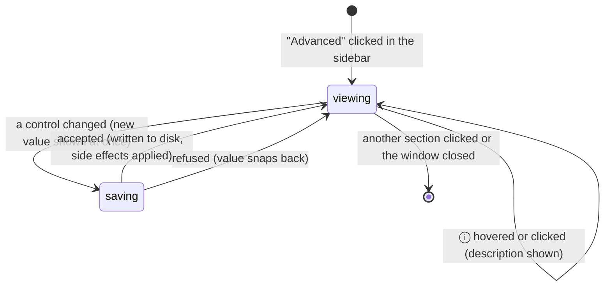

# The Advanced page

## Summary

The Advanced section of the settings window holds the settings that change how Handy behaves around a dictation rather than during the first minute of use: how the app launches and shows itself, how text is delivered, what is done to the transcript, how much history is kept, and — behind an "Experimental Features" switch — the post-processing toggle, the keyboard engine, hardware acceleration, and the microphone's idle behavior. The page is five groups of rows (App, Output, Transcription, History, and, when revealed, Experimental), each row a title, an ⓘ that shows its description on hover or click, and a control on the right: a toggle, a dropdown, a number field, or the custom-words field with its chips. There is no Save button; every control writes its setting the moment it changes, as described in [The settings model](../foundations/the-settings-model.md). Most changes take effect at the next dictation; a few apply live (the tray icon, the overlay, autostart, the post-processing shortcut, the keyboard engine, history cleanup) and a few only at the next model load (acceleration).

## The simple case

The user opens the settings window, clicks "Advanced" in the sidebar, and sees the App group at the top: "Start Hidden" off, "Launch on Startup" off, "Show Tray Icon" on, "Overlay" set to "Live", "Overlay Position" set to "Bottom", "Unload Model" set to "After 5 minutes", "Experimental Features" off. They scroll to Transcription and type "Kubernetes" into the "Add a word" field under "Custom Words", press Enter, and a chip reading "Kubernetes" appears in a row below. The setting is already saved. Their next dictation of "we deployed to cooper netties" comes out as "we deployed to Kubernetes". Nothing else on the page has changed and nothing needs confirming; clicking the chip's × removes the word just as immediately.

## The interaction, event by event

For a settings page the interaction is using the page: arriving on it, leaving it untouched, making the first change, editing further, and what each change commits. The five phases below are those five moments.

### Start

The interaction starts when the user clicks "Advanced" in the sidebar (the fourth item, below "Models"). The page renders at once from the settings already in memory; nothing is fetched and nothing is locked. Every control shows its current saved value, which on a fresh install is the default listed in [The settings model](../foundations/the-settings-model.md#defaults-and-reset). The five group headings are "App", "Output", "Transcription", "History", and, only while "Experimental Features" is on, "Experimental". The page scrolls as one column; the sidebar and footer stay fixed.

Two things on this page are computed when it opens rather than read from settings: the list of hardware accelerators (the transcribe.cpp and ONNX dropdowns in the Experimental group, fetched once per page visit) and, on Linux, the list of installed typing tools. Both are cached after first use, so the page never stalls on them after the first visit in a session.

> Technical note: GPU enumeration is pre-warmed on a background thread at startup precisely so that the first visit to Advanced with Experimental Features on does not freeze the window while the Metal or Vulkan backend probes hardware.

### Ends at once

The interaction ends with no change when the user leaves the page without touching a control: clicking another section, closing the window with its close button (which hides it), or quitting. Nothing is written, nothing is logged, and the page comes back in the same state next time. Hovering or clicking an ⓘ to read a description, opening a dropdown and clicking outside it to close it, and typing into the "Add a word" field without pressing Enter or "Add" are all still "untouched": a typed word that was never added is discarded when the page is left, and a dropdown closed without a selection changes nothing.

### Becomes active

The page becomes active at the first change to any control. The control shows the new value immediately and the change is sent to the backend. While the save is in flight the control is disabled and toggles show a small spinner over the switch; for everything on this page the round trip is a single file write and is over before the spinner is visible, except Keyboard Implementation (every shortcut is re-registered) and History Limit and Auto-Delete Recordings (a history cleanup runs before the call returns). If the backend refuses, the control snaps back to its old value with no toast; on this page a refusal only happens for an unrecognized value, which the UI cannot produce, so in practice every change sticks.

Two controls on this page do not follow the common path exactly. "Unload Model" calls its command first and updates the displayed value afterwards, so it is never disabled and never shows a spinner. "Keyboard Implementation" bypasses the optimistic update entirely: it calls its command, shows a toast if bindings were reset or the switch failed, and then re-reads every setting from the backend, because the switch can rewrite the shortcuts too.

### While active

Editing continues control by control; each change is its own save and there is no grouping, so five changes are five writes. Changes are independent: two controls can be in flight at once and each resolves on its own. Some changes reshape the page as they save — "Overlay" set to "None" removes the "Overlay Position" row, "Experimental Features" adds or removes the whole Experimental group, and on Linux "Paste Method" set to "Direct" or "External Script" adds a row or a field — so the row under the pointer can move. The Custom Words field keeps its focus between additions so several words can be entered in a row with Enter.

### Finish

Each change is committed when the backend writes the settings file; from then on it survives relaunch. What else a commit does, and when the user first notices it, depends on the control. The groups and controls below are in the order they appear on the page.

#### App

**Start Hidden.** Toggle, default off. Description: "Launch to system tray without opening the window." Takes effect at the next launch: the settings window is not shown and, on macOS, Handy is kept out of the Dock from the start (it lives in the menu bar only). The tray icon is the only way in. Ignored when "Show Tray Icon" is off, because the window would otherwise be unreachable; the window then shows at launch regardless. Also overridden, for one launch, by `handy --start-hidden` (see [Command line](../integration/command-line.md)). The window is also forced to show at launch when onboarding or a missing permission needs it; see [First launch](../setup/first-launch.md).

**Launch on Startup.** Toggle, default off. Description: "Automatically start Handy when you log in to your computer." Applied immediately: on macOS 13 and later Handy registers itself as a login item, which appears in System Settings › General › Login Items under "Open at Login" with Handy's name and icon. Turning it off unregisters it. The preference is re-applied at every launch, so a failure (an unsigned development build, or the user having switched the item off in System Settings, which apps are not allowed to override) is only logged; the toggle stays on and nothing tells the user the registration did not take. On older macOS, Windows, and Linux the system's autostart mechanism is used instead.

> Technical note: older versions wrote a launch-agent plist that System Settings attributed to the developer's certificate name rather than to Handy; that file is removed at every launch on macOS 13+ so a migrated install does not start twice.

**Show Tray Icon.** Toggle, default on. Description: "Display the Handy icon in the system tray." Applied immediately: the menu-bar icon disappears or reappears as the switch moves. With it off, the [tray menu](../tray/the-tray-menu.md) is unreachable, so quitting is Cmd+Q in the settings window; closing the settings window keeps Handy in the Dock (it is not removed as it normally would be) so the window can be brought back by clicking the Dock icon; and "Start Hidden" is ignored. `handy --no-tray` hides the icon for one launch in the same way. Relaunching Handy while it is running normally recreates the tray icon as a recovery for a macOS bug; with this setting off it does not.

**Overlay.** Dropdown with "None", "Minimal", "Live"; default "Live" on macOS and Windows, "None" on Linux. Description: "Choose the recording overlay: None hides it, Minimal shows a compact pill, Live shows transcription in real time as you speak (streaming-capable models only — look for the Streaming badge in the model picker). On Linux 'None' is recommended." Applied immediately for the next dictation: "None" shows no overlay at all, "Minimal" the pill, "Live" the panel when the active model can stream and the pill otherwise; see [The overlay](../dictation/the-overlay.md). Changing it during a dictation does not hide or show the overlay that is already up; "None" does stop the level meter at the next chunk of sound, so the waveform freezes, and the overlay is still hidden normally at the end. Changing it also nudges the overlay window to re-center for its new size.

**Overlay Position.** Dropdown with "Bottom", "Top"; default "Bottom". Description: "Where the overlay appears on screen during recording and transcription." Shown only while "Overlay" is not "None"; the row disappears with the style and reappears, with its value intact, when the style is set back. Applied immediately: the overlay window is moved even while it is hidden, and if a dictation is in progress the overlay jumps to the other edge of the screen at once.

**Unload Model.** Dropdown with "Never", "Immediately", "After 2 minutes", "After 5 minutes", "After 10 minutes", "After 15 minutes", "After 1 hour", plus "After 15 seconds (Debug)" in [debug mode](./debug.md); default "After 5 minutes". Description: "Automatically free GPU/CPU memory when the model hasn't been used for the specified time". The meaning of each option, the 10-second idle check, and the special behavior of "Immediately" are in [Models](../foundations/models.md#the-unload-timeout). Timing of the commit: the timeout is read at every check, so shortening it while the model has already been idle longer than the new limit unloads the model within 10 seconds and the footer dot turns grey. Choosing "Immediately" does not unload a loaded model on the spot; it is released after the next dictation ends. Choosing "Never" never unloads. Selecting the value already shown still writes it.

**Experimental Features.** Toggle, default off. Description: "Enable experimental features that are still in development." Applied immediately: the "Experimental" group appears at the bottom of the page (or disappears). It is only a visibility switch. Turning it off does not change Post Processing, Keyboard Implementation, the accelerators, or Keep Mic Open: whatever they were set to stays in force, the Post Process section and its shortcut stay if Post Processing was on, and the controls are simply no longer reachable until the toggle is turned back on.

#### Output

**Paste Method.** Dropdown; on macOS the options are "Clipboard (Cmd+V)" and "None", with a greyed-out "Direct" shown only if that value is somehow already saved; default "Clipboard (Cmd+V)" on macOS and Windows, "Direct" on Linux. Description: "Choose how text is inserted. Direct: simulates typing via system input. None: skips paste, only updates history/clipboard." Read at the moment of delivery, so a change made while a dictation is recording applies to that dictation. What each method does is in [Pasting](../dictation/pasting.md). On Windows the list adds "Direct", "Clipboard (Ctrl+Shift+V)", and "Clipboard (Shift+Insert)"; on Linux it adds those and "External Script", and choosing "External Script" reveals a text field below the dropdown with the placeholder "/path/to/your/script.sh" whose contents are saved on every keystroke.

**Typing Tool.** Linux only, and only while "Paste Method" is "Direct". Dropdown with "Auto (Recommended)" (default) and whichever of wtype, kwtype, dotool, ydotool, and xdotool are installed. Out of scope here beyond its existence; see [Platform differences](../cross-cutting/platform-differences.md).

**Clipboard Handling.** Dropdown with "Don't Modify Clipboard" (default) and "Copy to Clipboard". Description: "Don't Modify Clipboard preserves your current clipboard contents after transcription. Copy to Clipboard leaves the transcription result in your clipboard after pasting." Read at delivery. With "Copy to Clipboard" the transcript is placed on the clipboard after the previous contents have been restored, so it is what the next manual paste inserts; with the "None" paste method it is the only way the text leaves Handy besides history.

**Auto Submit.** Dropdown with "Off" (default), "Enter", "Ctrl+Enter", and "Cmd+Enter" (labelled "Super+Enter" on Windows and Linux). Description: "Automatically send the selected key combination after text insertion. Cmd+Enter applies on macOS, while Windows/Linux use Super+Enter." One dropdown drives two settings: choosing "Off" turns auto-submit off and keeps the last key; choosing a key saves the key and then, if auto-submit was off, turns it on, which is two writes in a row with the dropdown disabled until both land. Read at delivery: 50 ms after a successful paste the chosen key is pressed; skipped when the paste method is "None" or the paste failed. See [Pasting](../dictation/pasting.md).

#### Transcription

**Voice Activity Detection.** Toggle, default on. Description: "Filter silence from recordings. Streaming-capable models use a longer VAD tail; disabling VAD records raw audio." Read once at the trigger of each dictation, so a change during recording applies to the next one. What it keeps and drops, and the numbers, are in [Audio capture](../foundations/audio-capture.md).

**Remove Filler Words.** Toggle, default on. Description: "Removes common hesitation words from transcriptions. Turn off to keep them." Read when the transcript is cleaned up after the stop, so a change during recording applies to that dictation. The word lists and the language gate are in [Transcribing](../dictation/transcribing.md).

**Custom Words.** A compact text field with the placeholder "Add a word" and an "Add" button, followed — only once at least one word exists — by a row of chips, one per word, each a small button with the word and an ×. Description: "Help supported models recognize names and specialized terms. Fuzzy correction is currently limited to words using A–Z and numbers." Typing into the field changes nothing until Enter or "Add". What is added is the typed text with the characters `<`, `>`, `"`, and `'` removed, runs of whitespace collapsed to one space, and leading and trailing space trimmed; "Add" is disabled while that result is empty or longer than 50 characters. Adding a word already in the list shows the error toast "\"{{word}}\" already exists" (with the word filled in) and leaves the field as it was; the check is exact, so "Kubernetes" and "kubernetes" can both be added. After a successful add the field clears and keeps focus. Clicking a chip removes that word. Every add and remove saves the whole list. The words are used at the next dictation in two ways described in [Transcribing](../dictation/transcribing.md): Whisper-family models receive the list as a hint before decoding, and every other model (and Whisper when the hint was not used) gets fuzzy correction of the transcript against the list, governed by the [Word Correction Threshold](./debug.md) in the Debug section. Words containing anything outside A–Z, a–z, and 0–9 (after dropping punctuation and spaces) are never fuzzy-matched, only hinted. There is no editing in place: to change a word, remove it and add it again.

**Append Trailing Space.** Toggle, default off. Description: "Add a space after pasted transcription". Read at delivery: one space is added to the end of the pasted text (not to the history entry). See [Pasting](../dictation/pasting.md).

#### History

**History Limit.** A number field, default 5, with the word "entries" after it. Description: "Maximum number of history entries to keep". The field has a minimum of 0 and a maximum of 1000, but only its stepper arrows honor them: any non-negative number typed is saved, including one above 1000, and a negative or empty value is ignored and the field snaps back to the saved value at once (it cannot be left blank). Every keystroke that leaves a valid number saves it and runs a history cleanup immediately: when "Auto-Delete Recordings" is "Keep latest N", every unsaved entry beyond the newest N is deleted on the spot together with its recording file. That makes typing a new limit digit by digit destructive: replacing "5" with "10" by selecting the field and typing "1" then "0" passes through a limit of 1, at which point all but the newest unsaved entry are already gone. 0 deletes every unsaved entry. Starred (saved) entries are never counted or deleted. Under the other retention options the number is still shown in the "Keep latest N" label but has no effect.

**Auto-Delete Recordings.** Dropdown with "Never", "Keep latest {{count}}" (the count is the current History Limit, so it reads "Keep latest 5" by default), "After 3 days", "After 2 weeks", "After 3 months"; default "Keep latest 5". Description: "Automatically delete old recordings to save space". Despite the name it deletes whole history entries — the row and its recording file — never the file alone. The cleanup runs immediately on change and again after every new dictation: "Keep latest N" removes unsaved entries beyond the newest N; the time options remove unsaved entries older than 3 days, 14 days, or 90 days; "Never" removes nothing, so history grows without bound and the History Limit is ignored. Saved entries are exempt in every mode. Switching from "Never" to a time option can delete a large backlog at once with no confirmation. See [The history page](../history/the-history-page.md).

#### Experimental

Shown only while "Experimental Features" is on.

**Post Processing.** Toggle, default off. Description: "Enable AI-powered text refinement after transcription". Applied immediately: the "Post Process" section appears in the sidebar between "Advanced" and "Debug"/"About", and the "Transcribe with Post-Processing" shortcut (Option+Shift+Space by default) is registered; turning it off removes the section and unregisters the shortcut. The Secure Input fallback is reconciled at the same time. Configuring a provider, and what the shortcut does, are in [The Post Process page](./post-processing-page.md) and [Post-processing](../dictation/post-processing.md). If the page is left on the Post Process section when the toggle goes off, the section's content stays on screen until another section is clicked.

**Keyboard Implementation.** Dropdown with "Tauri Global Shortcut" and "Handy Keys" (these two labels are not translated); default "Handy Keys" on macOS and Windows, "Tauri Global Shortcut" on Linux. Description: "Choose the keyboard shortcut backend." Selecting the value already shown does nothing. Selecting the other: every shortcut is unregistered from the old engine, the setting is written, the new engine is started, and each transcribe shortcut is checked against the new engine's rules — a combination the new engine cannot express (a modifier-only or fn shortcut under Tauri) is reset to its platform default — and registered. If anything was reset, a warning toast reads "Keyboard shortcuts were incompatible and reset to defaults" and the General page shows the default chip. If Handy Keys cannot start at all, the setting is put back to Tauri, Tauri's shortcuts are registered, and an error toast reads "Failed to initialize HandyKeys: {error}. Reverted to Tauri." The Cancel shortcut is not checked at switch time because it is registered only during a dictation, and the post-processing shortcut is skipped while Post Processing is off. What each engine allows is in [Triggers and shortcuts](../foundations/triggers-and-shortcuts.md) and [The shortcut recorder](./shortcut-recorder.md).

**transcribe.cpp Acceleration.** Dropdown with "Auto" (default), one entry per GPU Handy can see, labelled "{name} ({size} GB)" or "({size} MB)" for its memory, and "CPU". Description: "Hardware acceleration for transcribe.cpp (Whisper-family) models. Auto uses GPU if available (Metal on macOS, Vulkan on Windows/Linux)." Choosing a GPU writes the device and then the accelerator (two writes, the dropdown disabled until both land). Takes effect at the next model load, not now: the loaded model is marked to be reloaded on next use, stays loaded and its footer dot stays green, and the next dictation (or re-transcribe from History) reloads it with the new device before transcribing, so that one dictation waits longer at the stop. A stored GPU that is no longer present shows as "Auto" in the dropdown while the setting still names it; at load time Handy falls back to automatic selection with only a log line. On a Windows-on-ARM machine running the x64 build only "CPU" is offered. Only Whisper-family (transcribe.cpp) models are affected; ONNX models ignore it.

**ONNX Acceleration.** Dropdown with "Auto", "CPU", and whichever of "CUDA", "DirectML", "ROCm" the build supports; default "Auto". Description: "Hardware acceleration for ONNX models (Parakeet, Canary, Moonshine, etc.). DirectML on Windows is experimental. Models may fail to transcribe." Shown only when there are more than two options, which means never on macOS, where the only options would be Auto and CPU. Takes effect at the next model load in the same way as the transcribe.cpp setting.

**Keep Mic Open Between Transcriptions.** Toggle, default off. Description: "Keeps the microphone stream open for 30 seconds after recording stops, reducing latency for back-to-back transcriptions. May degrade Bluetooth audio quality while active." Read at the stop of each dictation: with it on, the microphone is left open for 30 seconds after the stop (the macOS microphone indicator stays lit) and closed then unless another dictation has started; with it off the microphone is closed at the stop. With [always-on microphone](./debug.md) on it makes no difference because the stream is never closed. See [Audio capture](../foundations/audio-capture.md).

## Modifiers

| Modifier | Set before the start | Changed while active |
| --- | --- | --- |
| Push to talk | No effect on this page; the control lives on General. | No effect. |
| Binding | No row on this page. The Post Processing toggle here is what registers the Transcribe with Post-Processing binding; the Keyboard Implementation switch can reset either transcribe binding to its default. | A shortcut re-recorded on General while this page has a save in flight is independent; both land. |
| Overlay style | A control on this page. "None" hides the Overlay Position row; Minimal and Live show it. | Changing it mid-save of another control is independent. Changing it during a dictation does not hide the overlay already showing; "None" freezes its waveform. |
| Streaming model | No effect on the page. The Overlay description mentions streaming; whether "Live" shows the panel or the pill depends on the active model, not on anything here. | No effect. |
| Voice activity detection | A control on this page; read at each trigger. | Changing it during a dictation applies to the next one. |
| Always-on microphone | Set on the Debug page. With it on, "Keep Mic Open Between Transcriptions" is moot (the stream never closes); nothing on this page shows that. | No effect on the page. |

## Cancel and interrupt

| Event | Before active (page open, nothing changed) | While active (a change in flight or just saved) |
| --- | --- | --- |
| Cancel | Escape does nothing on this page: it does not close an open dropdown (a click outside does) and does not clear the custom-word field. The overlay ✕, the tray Cancel, and `handy --cancel` act on a dictation only and leave the page alone. | Same; an in-flight save cannot be cancelled and a saved change can only be changed again. |
| Another trigger | A dictation can start while the page is open (the shortcuts are live); the page is unaffected and any open dropdown stays open. Each setting here is read at its own moment in the dictation — VAD at the trigger, filler words at cleanup, paste settings at delivery. | A change that lands during a dictation applies if its read moment has not yet passed: a Paste Method change during recording affects that dictation, a VAD change does not. |
| A setting changed mid-way | Switching the model, microphone, or push to talk elsewhere does not change this page. A model switch after an accelerator change loads the new model with the new accelerator. | Two controls in flight at once resolve independently. The Overlay Position row disappears if Overlay is set to "None" while Position's save is in flight; the value is kept. |
| Microphone lost | No effect on the page. "Keep Mic Open" has nothing to keep open. | No effect. |
| Model or processing failure | No effect on the page. If a load with a newly chosen accelerator fails, the failure surfaces at the next dictation as "Failed to load model: {name}" (see [Models](../foundations/models.md)), not here. | No effect. |
| The active application changes | The page keeps its state: a typed custom word stays in the field, an open dropdown stays open, a shown ⓘ description stays until a click. | A save in flight completes in the background; the control updates when the window is next shown. |
| Handy quits or the system sleeps | Nothing unsaved exists except a custom word typed but not added, which is lost. Every committed change is on disk. | A change whose write has not finished is lost; the file is written whole per change, so it is never half-written. Launch on Startup and Show Tray Icon are re-applied from the saved value at the next launch. |
| Keyboard channel changes | Secure Input does not affect the page's controls (they are ordinary window widgets). The Keyboard Implementation dropdown is the switch; a switch under Secure Input reconciles the fallback registrations. | A switch that resets bindings shows "Keyboard shortcuts were incompatible and reset to defaults"; a failed Handy Keys start reverts to Tauri with a toast. Key auto-repeat has no meaning here. |

## Interactions with other systems

**Permissions.** Launch on Startup needs no permission but can be vetoed by the user in System Settings, which the toggle does not reflect. Nothing else on the page asks for or needs a permission; the accelerator probe reads hardware without one.

**History and recordings.** History Limit and Auto-Delete Recordings delete unsaved entries and their recording files immediately on change and after every dictation; saved entries are untouched. Custom Words, filler-word removal, and VAD shape what is written to the next entry. Re-transcribe from History reloads the model if an accelerator was changed since it was loaded.

**Clipboard.** Paste Method, Clipboard Handling, Auto Submit, and Append Trailing Space decide what the next delivery does to the clipboard and the front app; none of them touches the clipboard when changed.

**Model state.** Unload Model governs when the loaded model is released (shortening it can unload within 10 seconds). The two acceleration dropdowns mark the loaded model for reload on next use without unloading it. Custom Words are passed to Whisper-family models as a decoding hint at each dictation.

**Tray and overlay.** Show Tray Icon hides or shows the tray icon at once. Overlay and Overlay Position apply to the next overlay shown, and Position moves the overlay even mid-dictation. Start Hidden decides whether the window (and, on macOS, the Dock icon) appears at launch.

**Sounds and system audio.** None of this page's controls plays or mutes anything. Keep Mic Open keeps the microphone stream — and, for Bluetooth headsets, the degraded playback profile — alive for 30 seconds after each dictation.

**Settings persistence.** Every control writes through [The settings model](../foundations/the-settings-model.md): `start_hidden`, `autostart_enabled`, `show_tray_icon`, `overlay_style`, `overlay_position`, `model_unload_timeout`, `experimental_enabled`, `paste_method`, `external_script_path`, `typing_tool`, `clipboard_handling`, `auto_submit` and `auto_submit_key`, `vad_enabled`, `filler_word_removal_enabled`, `custom_words`, `append_trailing_space`, `history_limit`, `recording_retention_period`, `post_process_enabled`, `keyboard_implementation`, `transcribe_accelerator` and `transcribe_gpu_device`, `ort_accelerator`, `lazy_stream_close`. None of them has a reset arrow. A keyboard-implementation switch can also rewrite `bindings`. Custom Words, Append Trailing Space, History Limit, Auto-Delete Recordings, Post Processing, and Keyboard Implementation take their strings from the Debug section's namespace, a leftover from when they lived there; nothing visible follows from it.

**Platform differences.** Defaults: Overlay is "None" on Linux; Paste Method is "Direct" on Linux; Keyboard Implementation is "Tauri Global Shortcut" on Linux. Paste Method's list differs per platform as described above; Typing Tool and the External Script field exist only on Linux; "Direct" is not offered on macOS. Auto Submit's third key is "Cmd+Enter" on macOS and "Super+Enter" elsewhere. Launch on Startup uses the login-item service on macOS 13+ and the autostart plugin elsewhere. ONNX Acceleration never appears on macOS; transcribe.cpp Acceleration lists Metal devices on macOS and Vulkan devices elsewhere, and only "CPU" under x64 emulation on Windows ARM. Show Tray Icon's Dock consequences are macOS-only.

## Edge cases

- Turning "Experimental Features" off while Post Processing is on leaves the Post Process section, the second shortcut, and the provider configuration all active with no visible control to turn them off; the user must turn Experimental Features back on to find the Post Processing toggle.
- "After 15 seconds (Debug)" selected and then debug mode turned off: the option is no longer in the list, so the Unload Model dropdown shows the placeholder "Select an option..." while the setting is still 15 seconds and still unloads the model after 15 seconds idle.
- The External Script path field (Linux) and the History Limit field save on every keystroke and are disabled for the duration of each save, which can take focus away from the field between characters.
- A custom word can contain spaces ("New York"); the fuzzy matcher compares it against up to three consecutive transcript words with spaces and punctuation removed, so "new york" and "New-York" both correct to it. A word with a "&" is also matched as if the "&" were " and ".
- Custom words longer than 50 characters cannot be added, and transcript fragments longer than 50 characters are never corrected; both limits are silent (the "Add" button is simply disabled).
- The GPU label shows "0 MB" for a device whose backend does not report memory; whether Metal reports it on Apple silicon was not checked.
- Choosing a GPU, then removing it (an eGPU unplugged) leaves the dropdown showing "Auto" while the saved setting still names the GPU; choosing "Auto" explicitly is needed to clear it. The next load falls back to automatic selection either way.
- "Keep latest N" is re-labelled live as History Limit changes, so typing in the number field visibly rewrites the dropdown next to it.
- The Auto Submit key chosen before turning auto-submit "Off" is remembered: choosing any key later re-enables with that key only if the same key is picked again; picking a different key saves that one.
- Overlay set to "None" on a machine whose Overlay Position was "Top": the Position row is hidden but the value is kept, and the overlay reappears at the top when the style is set back.

## Open questions and verification

- Typing a new History Limit digit by digit runs the cleanup at each intermediate value and can delete entries the user meant to keep (for example "10" passes through 1). Suspected bug; read from the code, not reproduced.
- The History Limit field and the Linux External Script field are disabled during each per-keystroke save; whether that blurs the field and drops the next keystroke in the webview was not tested. Suspected bug.
- The History Limit maximum of 1000 is only a hint to the stepper arrows; typed values above 1000 are saved. Not tested whether anything else caps them.
- "Experimental Features" off hides the Post Processing toggle without disabling post-processing. Whether this is intended (a reveal switch) or a bug is a product decision; documented as intended above.
- The Unload Model dropdown after leaving debug mode with "After 15 seconds (Debug)" selected shows "Select an option..."; read from the code, not seen. Suspected cosmetic bug.
- Whether a Cancel shortcut that the Tauri engine cannot express (recorded under Handy Keys, then the engine switched) fails silently at the next dictation, since it is not validated at switch time. Not determined.
- Whether the post-processing shortcut is validated when Post Processing is turned on after a switch to Tauri with an incompatible binding saved, or whether its registration fails silently. Not determined.
- The Launch on Startup toggle stays on when macOS refuses the login-item registration (user-vetoed in System Settings, or an unsigned build). Not reproduced; a mismatch between the toggle and System Settings is likely visible to users.
- Whether a transcribe.cpp GPU entry on Apple silicon reads "Apple M-series (N GB)" or "(0 MB)" was not checked.
- Whether the Overlay Position change visibly moves an overlay that is showing mid-dictation, and whether the "None" style freezes the waveform without hiding the pill, were read from the code and not observed.
- The exact spinner visibility for each toggle on this page was not observed; most saves are too fast to show it.

Verified against Handy commit `af48dd6`.
