# The Debug page

## Summary

Debug mode is a hidden state of the settings window, toggled with Cmd+Shift+D (Ctrl+Shift+D on Windows and Linux), that adds a "Debug" section to the sidebar and three smaller things elsewhere: an "After 15 seconds (Debug)" option in Unload Model, a quantization label on model cards, and a live stream of Handy's log lines into the Debug page. The Debug page is one group of rows titled "Debug": the file log level, a preview of the release notes, the update-check switch, the sound theme with a preview button, the custom-word correction threshold, two paste delays, the reliable-paste switch, an extra recording buffer, the always-on microphone, the clamshell microphone (laptops only), a ten-second keyboard diagnostic (macOS only), and a Live Logs panel. Every control saves immediately as described in [The settings model](../foundations/the-settings-model.md). Debug mode itself is a saved setting, so the section stays until the shortcut is pressed again. The "Log Directory" row that helps with the same kind of troubleshooting lives on the [About page](./about.md), not here. Per the README's scope, the controls here are described at lower depth than the rest of the settings.

## The simple case

A user whose pastes sometimes insert their old clipboard instead of the transcript is asked to try a longer paste delay. With the settings window open they press Cmd+Shift+D; a "Debug" item appears in the sidebar between "Advanced" (or "Post Process") and "About". They click it. The page shows "Log Level" set to "Debug", then the rest of the rows; they drag "Paste Delay (After)" from "60ms" to "150ms". The slider saves as it moves. Their next dictation keeps the transcript on the clipboard 90 ms longer before putting the old contents back. At the bottom, the "Live Logs" box has started filling with time-stamped lines as the dictation ran — "Live · 37 lines" — which they copy with the "Copy" button and paste into a bug report. Pressing Cmd+Shift+D again removes the Debug item from the sidebar; the paste delay they set stays.

## The interaction, event by event

For a settings page the interaction is using the page: entering debug mode and arriving on the page, leaving it untouched, the first change, editing further, and what each change commits. The five phases below are those five moments; the Keyboard Diagnostic and Live Logs, which are tools rather than settings, are described inside them.

```mermaid
stateDiagram-v2
    [*] --> hidden : debug mode off (no Debug item)
    hidden --> viewing : Cmd+Shift+D, then "Debug" clicked
    viewing --> viewing : ⓘ hovered or clicked (description shown)
    viewing --> saving : a control changed (new value shown at once)
    saving --> viewing : accepted (written to disk, side effects applied)
    saving --> viewing : refused (value snaps back)
    viewing --> diagnosing : "Run 10s diagnostic" clicked
    diagnosing --> viewing : 10 s elapsed (counts and verdict shown)
    viewing --> hidden : Cmd+Shift+D (item removed; page stays until another is clicked)
    viewing --> [*] : another section clicked or the window closed
```

### Start

The interaction starts in two steps: turning debug mode on, then opening the page. Cmd+Shift+D anywhere in the settings window — whichever control has focus, and even during onboarding — flips the `debug_mode` setting and saves it; the sidebar re-renders with "Debug" (a flask icon) inserted before "About". Either Command or Control works with Shift+D on every platform. There is no toast and nothing else visibly changes until the user looks: "Unload Model" on Advanced now ends with "After 15 seconds (Debug)", model cards on the Models page show their quantization (for example "Q8_0") next to the size, and the backend starts forwarding log lines to the window. `handy --debug` turns debug mode on for one run without saving it and raises the log level to Trace for that run (see [Command line](../integration/command-line.md)).

Clicking "Debug" opens the page. Its rows render from the settings in memory, except three that are computed on arrival: "Sound Theme" checks once whether custom sound files exist (at window load, not at each visit), "Clamshell Microphone" asks whether the machine is a laptop and shows itself only if so, and "Keyboard Diagnostic" shows itself only on macOS. The Live Logs panel starts empty with "Waiting for logs… Entries appear here as the app emits them." and begins listening the moment the page is shown; lines logged before that are not shown.

> Technical note: log records reach the window through a third log target alongside the console and the file, gated on debug mode and filtered at the same level as the file. The gate is set from the saved setting at startup and flipped by the Cmd+Shift+D command, so normal runs never broadcast log lines to the window.

### Ends at once

The interaction ends with no change when the user leaves without touching a control: clicking another section, closing the window, or pressing Cmd+Shift+D again. Nothing is written except debug mode itself if it was toggled. Leaving the page discards the Live Logs buffer and any diagnostic result; both start from empty on the next visit. Pressing Cmd+Shift+D while on the Debug page removes the sidebar item but leaves the page's content on screen until another section is clicked; once the user navigates away there is no way back without the shortcut. Opening a dropdown and clicking outside, or hovering an ⓘ, changes nothing.

### Becomes active

The page becomes active at the first change. Toggles and dropdowns show the new value at once and save; a slider saves on every step as it is dragged (each step is a write); the microphone dropdowns save on selection. The control is disabled and toggles show a spinner while the save is in flight. "Always-On Microphone" is the one slow save on this page — turning it on opens the microphone stream before the call returns — and the one that can be refused: if the device cannot be opened the switch snaps back off with no toast. "Sound Theme" and its play button never disable and never show a spinner.

Two rows are not settings at all. "Run 10s diagnostic" starts a ten-second listening window (see While active). "Preview" opens the latest bundled release note in the "New in Handy v{{version}}" dialog without marking it seen; closing the dialog (its close button, Escape, or a click outside) returns to the page. If no note is bundled an info toast reads "No bundled release notes found"; if rendering fails an error toast reads "Failed to preview release notes".

### While active

Editing continues one control at a time; each change is its own save. Two of the rows keep running while the user does other things:

- **The keyboard diagnostic.** Clicking "Run 10s diagnostic" disables the button and shows a pulsing "Listening… press your shortcut a few times (e.g. Option+Space)". For ten seconds Handy counts key-down, key-up, modifier-only, and mouse events that reach it, never which keys. The registered shortcuts are not suspended, so pressing Option+Space during the test also starts a dictation as usual. When the ten seconds are up the button re-enables and three lines appear in monospace: "Secure Input: enabled — held by {{name}} (pid {{pid}})" (or "enabled — no visible holder", or "disabled"); "Key down: N · Key up: N · Modifiers: N · Mouse: N"; and a verdict in the regular face, one of "Key events are reaching Handy normally.", "Secure Input is blocking key events — keyed shortcuts cannot work until it is resolved." (Secure Input on and no key-downs), "Modifier events arrived but no key events — something is suppressing keys even though Secure Input reports disabled. Please report this on GitHub." (Secure Input off, no key-downs, some modifiers), or "No events captured — did you press any keys during the test?" (nothing at all). If the listener cannot be created the row shows "Diagnostic failed: {{error}}" in red. Secure Input counts as "enabled" if it was on at the start or at the end of the test. Running again clears the previous result first. See [Secure Input](../cross-cutting/secure-input.md).

- **Live Logs.** The panel's header shows a green pulsing dot and "Live" (or a grey dot and "Paused"), "{{count}} lines", and three small buttons: "Pause"/"Resume", "Copy", "Clear". Lines arrive in batches four times a second, each as a time "HH:MM:SS" (the moment the window received it), a colored level tag (TRACE, DEBUG, INFO, WARN, ERROR), and the message; messages wrap. The box is about 290 points tall and scrolls; it stays pinned to the newest line unless the user scrolls up more than 24 points from the bottom, after which it holds its place until they scroll back down. At most 1000 lines are kept; older ones fall off the top. "Pause" stops the display but not the collection — lines keep accumulating behind the scenes (also capped at 1000) and appear all at once on "Resume". "Copy" puts every displayed line on the system clipboard as "HH:MM:SS LEVEL message" text and reads "Copied" for 1.5 seconds; "Clear" empties the display and re-pins it. Both are disabled while the panel is empty. Only lines at or above the "Log Level" setting are shown.

### Finish

Each change is committed when the settings file is written; it survives relaunch. What else the commit does, per control, in page order:

**Log Level.** Dropdown with "Error", "Warn", "Info", "Debug", "Trace" (not translated); default "Debug". Description: "Set the verbosity of logging". Applied immediately to the log file and to Live Logs: "Trace" shows everything, "Error" only failures. The console output (for users running Handy from a terminal) is governed by the `RUST_LOG` environment variable instead and does not change. The log file is `handy.log` in the log directory, capped at 500 KB with one rotated copy kept; see [Data on disk](../cross-cutting/data-on-disk.md).

**Preview What's New.** A "Preview" button. Description: "Open the latest bundled release note without marking it as seen". Not a setting; see Becomes active. The automatic What's New dialog after an update, and the "Show What's New" switch, are on the [About page](./about.md) and in [Updates](../integration/updates.md).

**Check for Updates.** Toggle, default on. Description: "Automatically check for new versions of Handy". Applied immediately: turning it off cancels any check in progress, hides the update status from the footer, and makes the tray's "Check for Updates…" item do nothing, because the window no longer listens for it; turning it on runs a check at once. See [Updates](../integration/updates.md).

**Sound Theme.** Dropdown with "Marimba" (default), "Pop", and "Custom" — the last only when both `custom_start.wav` and `custom_stop.wav` exist in the app data directory at the time the window was opened — plus a play button. Description: "Choose a sound theme for recording start and stop feedback". Read at each chime, so the next dictation uses the new theme. The play button (its hover text: "Preview sound theme (plays start then stop)") plays the start sound and then the stop sound of the selected theme through the Output Device at the Volume set on General, whether or not "Audio Feedback" is on; each sound plays to the end before the next begins. A "Custom" selection whose files have since been deleted plays nothing and logs an error.

**Word Correction Threshold.** Slider from 0.00 to 1.00 in steps of 0.01 with a reset arrow; default 0.18. Description: "Sensitivity for custom word corrections". Read when a transcript is cleaned up. It is the most a transcript fragment may differ from a custom word and still be replaced: 0.00 never replaces anything, 1.00 replaces any fragment of similar length. Phonetic matches count as closer than they look, so a modest value already catches most mishearings. It does nothing while "Custom Words" on Advanced is empty. See [Transcribing](../dictation/transcribing.md).

**Paste Delay (Before).** Slider from 10 to 500 ms in steps of 10, shown as "60ms", with a reset arrow; default 60. Description: "Delay (in milliseconds) after copying text, before sending the paste keystroke. Increase if nothing gets pasted." Read at delivery; see [Pasting](../dictation/pasting.md).

**Paste Delay (After).** Same slider; default 60. Description: "Delay (in milliseconds) after the paste keystroke, before restoring your previous clipboard. Increase if your old clipboard content is being pasted instead of the transcription." Read at delivery. Ignored when Reliable Paste is on and succeeds.

**Reliable Paste (Beta).** Toggle, default off; shown only on macOS and Windows. Description: "Restore the clipboard only after the target app actually reads the transcription, instead of after a fixed delay. Intended to fix old clipboard content being pasted under system load. Requires a clipboard paste method; macOS and Windows only." Read at delivery, and only for the clipboard paste methods; with "None" or "Direct" it is ignored. What it changes (restore 200 ms after the last read, at most 8 s, and never over something the user copied meanwhile) is in [Pasting](../dictation/pasting.md). If it cannot start, the timed path runs silently.

**Extra Recording Buffer.** Slider from 0 to 1500 ms in steps of 50, shown as "0ms", with a reset arrow; default 0. Description: "Extra time (in milliseconds) to keep recording after you release the key, to capture trailing audio. 0 = no extra buffer." Read at the stop of each dictation: capture continues that long after the release before the microphone is drained; a cancel during the buffer aborts it. See [Audio capture](../foundations/audio-capture.md).

**Always-On Microphone.** Toggle, default off. Description: "Keep microphone active for faster response". Applied immediately: turning it on opens the microphone stream now and keeps it open between dictations, so the macOS microphone indicator stays lit permanently and the next dictation is ready almost at once; if the device cannot be opened the switch snaps back. Turning it off closes the stream now if Handy is idle, or at the end of the current dictation if one is running. See [Audio capture](../foundations/audio-capture.md).

**Clamshell Microphone.** Dropdown of the same microphones as the Microphone row on General ("Default" first; the list refreshes each time the dropdown is opened) with a reset arrow; default "Default"; shown only on a Mac with a battery. Description: "Microphone to use when laptop lid is closed". Read at each trigger: when a device other than "Default" is chosen, Handy checks whether the lid is closed at the start of every dictation and, if it is, records from that device instead of the General microphone. With "Default" the check is skipped. Meant for a MacBook used closed with an external display and microphone. Whether the chosen device is absent at the time is handled by the same fallback as the main microphone; see [Audio capture](../foundations/audio-capture.md).

**Keyboard Diagnostic.** macOS only. A title, the description "Checks whether keyboard events reach Handy. Only event counts are recorded — never which keys you press.", and a "Run 10s diagnostic" button. Not a setting; see While active.

**Live Logs.** Description: "Stream application logs in real time to diagnose issues without opening the log file. Only logs emitted while this panel is open are shown; respects the Log Level setting above." Not a setting; see While active.

**Log Directory (About page).** A stacked row with the log folder's path in a monospace box (selectable for copying) and an "Open" button that reveals the folder in Finder. Description: "Location where log files are stored". On macOS the folder is `~/Library/Logs/com.pais.handy`. If the path cannot be determined the row shows "Error loading directory: {{error}}" and no button. It is on About so that it is reachable without debug mode.

> Technical note: a "Debug Paths" row that would list the app data, models, and settings paths exists in the code but is not placed on any page; the App Data Directory row on About covers the first of those.

## Modifiers

| Modifier | Set before the start | Changed while active |
| --- | --- | --- |
| Push to talk | No effect on this page. The diagnostic's hint ("press your shortcut a few times") starts and stops dictations according to the mode. | No effect. |
| Binding | No effect on the controls. The diagnostic counts whatever keys are pressed, including the bindings, which still fire. | No effect. |
| Overlay style | No effect on the page. A dictation started during the diagnostic shows the overlay as usual. | No effect. |
| Streaming model | No effect on the page. | No effect. |
| Voice activity detection | No effect on the page. Extra Recording Buffer frames go through VAD like the rest. | No effect. |
| Always-on microphone | A control on this page; applied live. | Turning it off during a dictation takes effect at that dictation's end. |

## Cancel and interrupt

| Event | Before active (page open, nothing changed) | While active (a change in flight, a diagnostic running, logs streaming) |
| --- | --- | --- |
| Cancel | Escape closes the What's New preview dialog; otherwise it does nothing on the page. The overlay ✕, tray Cancel, and `handy --cancel` act on a dictation only. | A running diagnostic cannot be cancelled; it ends after ten seconds. An in-flight save cannot be cancelled. Cancelling a dictation during the Extra Recording Buffer aborts the buffer. |
| Another trigger | A dictation can start while the page is open; Live Logs shows its log lines as it runs. | During the diagnostic the trigger both counts as key events and starts a dictation. A Paste Delay or Reliable Paste change during recording applies to that dictation; an Extra Recording Buffer change applies if made before the stop. |
| A setting changed mid-way | Changing the microphone on General does not change the clamshell selection. Changing the Log Level changes what Live Logs shows from then on, not what it already shows. | Two controls in flight resolve independently. Turning always-on off while a microphone change is in flight: the change is refused if the device is busy (see [The settings model](../foundations/the-settings-model.md)). |
| Microphone lost | The clamshell dropdown refreshes its device list when opened; a missing device is no longer offered but stays saved. | Always-On Microphone turned on with no usable device: the switch snaps back off. A stream that dies while always-on is rebuilt at the next trigger. |
| Model or processing failure | No effect on the page; failures appear as log lines in Live Logs and as toasts. | Same. |
| The active application changes | The page keeps its state; the diagnostic keeps counting keys typed in other apps (counts only); Live Logs keeps streaming while the window is hidden. | Same; a result that arrives while the window is hidden is shown when it is next brought forward. |
| Handy quits or the system sleeps | Every committed change is on disk, including debug mode itself. The Live Logs buffer and a diagnostic result are not kept. | A save not yet written is lost. A diagnostic interrupted by sleep resumes counting on wake until its deadline and reports what it saw. With always-on microphone the stream is reopened at the next trigger after wake. |
| Keyboard channel changes | Secure Input is what the diagnostic detects: it reports "enabled" with the holder when it can name one. The page's own controls are unaffected. | Secure Input engaging mid-diagnostic is reported as enabled (it is checked at both ends). Switching the keyboard implementation on Advanced does not affect the diagnostic, which uses its own listener. |

## Interactions with other systems

**Permissions.** The keyboard diagnostic needs Accessibility access to see any key events; without it every count is zero and the verdict is "No events captured — did you press any keys during the test?". Always-On Microphone triggers the microphone permission prompt if it has never been granted.

**History and recordings.** Word Correction Threshold and Extra Recording Buffer shape what the next history entry contains. Nothing on the page reads or deletes history.

**Clipboard.** "Copy" in Live Logs writes to the system clipboard like any copy; it is not restored afterwards. The two paste delays and Reliable Paste change how long the next delivery occupies the clipboard.

**Model state.** None of these controls touches the loaded model. The "After 15 seconds (Debug)" unload option is on Advanced.

**Tray and overlay.** Check for Updates off makes the tray's "Check for Updates…" item inert. Nothing here changes the overlay.

**Sounds and system audio.** Sound Theme's play button plays both chimes regardless of the Audio Feedback switch, at the General page's volume and output device. The theme applies to the next chime.

**Settings persistence.** `debug_mode`, `log_level`, `update_checks_enabled`, `sound_theme`, `word_correction_threshold`, `paste_delay_ms`, `paste_delay_after_ms`, `reliable_paste`, `extra_recording_buffer_ms`, `always_on_microphone`, `clamshell_microphone`. The four sliders and the clamshell dropdown have reset arrows; the toggles and Log Level, Sound Theme do not. `--debug` does not write `debug_mode`.

**Platform differences.** Reliable Paste is hidden on Linux; Keyboard Diagnostic and Clamshell Microphone exist only on macOS (the diagnostic returns "The keyboard diagnostic is only supported on macOS" elsewhere, but the row is not shown there). The debug shortcut is Ctrl+Shift+D on Windows and Linux, though Cmd+Shift+D also works on macOS and Ctrl+Shift+D also works there. The log directory is the platform's standard per-app log folder, or `logs` under the portable data directory on a portable Windows install.

## Edge cases

- `handy --debug` raises logging to Trace and streams log lines, but the Debug item does not appear in the sidebar unless debug mode was also saved, because the window reads the saved setting; the Log Level dropdown likewise shows the saved level, not Trace, during such a run.
- Pressing Cmd+Shift+D while on the Debug page leaves the page showing with no sidebar item; clicking any other section makes it unreachable until the shortcut is pressed again.
- Cmd+Shift+D works in the onboarding screens too, since the listener is installed for the whole window; debug mode then starts saved before onboarding is complete.
- Sound Theme's "Custom" option depends on a check made when the window was opened; adding the two files while Handy runs needs the window to be reopened (or Handy restarted) before "Custom" appears.
- The play button plays the sounds even when "Audio Feedback" is off on General, which is the only way to hear a theme before enabling feedback.
- Live Logs shows the time the window received a line, not the time it was logged; for bursts flushed together the times can be identical.
- Paused Live Logs keeps collecting; if more than 1000 lines arrive while paused, "Resume" shows only the last 1000 and the earlier ones are gone.
- The diagnostic's "Mouse" count includes every click, so clicking around the window during the test inflates it; a non-zero mouse count with zero keys still yields the "normal" verdict.
- The diagnostic listener runs alongside the registered shortcuts, so following the hint to press Option+Space records and pastes a dictation into whatever is in front.
- Word Correction Threshold at 0.00 disables correction entirely (a fragment must score strictly below the threshold), including for exact-but-differently-cased matches, which are then left as the model wrote them.
- The clamshell check runs a short system query at every trigger once a clamshell microphone is set, adding a few milliseconds before capture starts on every dictation, lid open or closed.

## Open questions and verification

- `--debug` not revealing the Debug section (the override is applied in memory and never written, while the sidebar reads the saved value) contradicts the flag's documented purpose. Suspected bug; read from the code, not reproduced.
- Whether the Log Level dropdown under `--debug` shows "Debug" while the file logs at Trace, and whether changing it then overrides the flag for the rest of the run, was read from the code, not observed.
- Whether the always-on switch snapping back on a failed device open is visible as anything other than the switch returning to off (no toast is raised) was not checked.
- The exact look of the Keyboard Diagnostic result lines, and whether the "held by" name resolves for common Secure Input holders (Terminal with Secure Keyboard Entry, a password field), were not verified by hand.
- Whether the diagnostic listener interferes with the Handy Keys engine's own listener, or with the Secure Input fallback, during the ten seconds was not determined.
- Whether the Live Logs "Copy" button works when the window is not focused, and whether its clipboard write can collide with a dictation's clipboard swap, was not tested.
- The Sound Theme row never disables during its save and the play button never reports a failure; a missing custom file is only logged. Not verified whether the play button blocks the window for the duration of the two sounds (the command waits for each to finish).
- Whether `is_laptop` (a battery check) hides the Clamshell row on a Mac desktop with a UPS reporting as a battery was not checked.
- The unused "Debug Paths" row: whether it is intended to be placed somewhere or is dead code was not determined.

Verified against Handy commit `af48dd6`.
