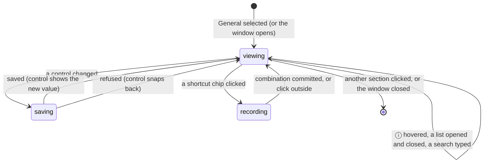

# General

## Summary

General is the first section of the settings window and the one it opens on. It holds three cards: "GENERAL" (the Transcribe Shortcut, the Push To Talk toggle, and — only in toggle mode — the Cancel Shortcut), a per-model card titled "{model} Settings" (the Language picker and the Translate to English toggle, each shown only when the active model can use it), and "SOUND" (Microphone, Input Channel for multi-channel devices, Mute While Recording, Audio Feedback, and the Output Device and Volume controls that Audio Feedback unlocks). Using the page is the interaction: arriving on it, reading it without touching anything, making a first change, editing further, and leaving with every change already saved. How saves, spinners, snap-backs, and reset arrows work in general is in [The settings model](../foundations/the-settings-model.md); how the window around the page behaves is in [The settings window](the-settings-window.md); recording a shortcut is in [The shortcut recorder](shortcut-recorder.md).

## The simple case

The user opens Settings. General is already selected. Under "GENERAL" they see "Transcribe Shortcut" with a chip reading "Option + Space" and a reset arrow, and "Push To Talk" switched on. Under "Parakeet V3 Settings" there is one row, "Language", whose button reads "Auto Detect". Under "SOUND", "Microphone" reads "Default", "Mute While Recording" and "Audio Feedback" are off, and "Output Device" and "Volume" are greyed out. They flip "Audio Feedback" on: the switch moves, and "Output Device" and "Volume" (at "100%") come alive. They drag Volume to 60%. They click "Microphone", the list re-scans and shows "Default", "MacBook Pro Microphone", "AirPods Pro"; they pick "AirPods Pro" and the list closes. Nothing asks them to save. The next dictation records from the AirPods and plays the start and stop chimes at 60%.

## The interaction, event by event

### Start

The interaction starts when the user arrives on the page: the window opens on it, or "General" is clicked in the sidebar. Everything shows its saved value immediately, except the two device lists, which are filled once after onboarding and read "Loading..." (disabled) until then. The page is at most 768 points wide and centered; the three cards are stacked with the per-model card in the middle, so when the active model changes the Sound card moves up or down. Every row is a title, an ⓘ with the description, and a control on the right.

**"GENERAL" card.**

- **"Transcribe Shortcut"** — ⓘ "The keyboard shortcut to record and transcribe your voice." A bordered chip with the current combination ("Option + Space" by default) and a reset arrow. Clicking the chip opens the recorder; see [The shortcut recorder](shortcut-recorder.md). The reset arrow writes the platform default and re-registers it in one click.
- **"Push To Talk"** — ⓘ "Hold to record, release to stop". A toggle, on by default. On is push to talk; off is toggle mode (see [Triggers and shortcuts](../foundations/triggers-and-shortcuts.md)). Its immediate effect on the page is to hide (on) or reveal (off) the Cancel Shortcut row below it. Its effect on dictation is read at every key event, so it applies to the very next press or release, including a release of a shortcut that is already held.
- **"Cancel Shortcut"** — ⓘ "The keyboard shortcut to cancel the current recording." Shown only when Push To Talk is off, and never on Linux. A chip showing the Escape key by default, and a reset arrow. Recording a new combination here only writes the setting; the Cancel shortcut is registered fresh at the start of each recording, so the change applies to the next dictation.

**"{model} Settings" card** — for example "Parakeet V3 Settings" or "Whisper Turbo Settings", using the active model's display name. The card exists only while there is an active model *and* at least one of its two rows applies; otherwise the page goes straight from "GENERAL" to "SOUND". With no model selected, or with a single-language model that cannot translate (Parakeet V2, the Moonshine models, GigaAM), there is no card.

- **"Language"** — ⓘ "Select the language for speech recognition. Auto will automatically determine the language, while selecting a specific language can improve accuracy for that language." Shown when the model supports more than one language, or exactly one language and that language is Chinese (so the script can still be chosen). A button reading the current language's name ("Auto Detect" by default) with a chevron, and a reset arrow. Clicking the button opens a list with a search field at the top, already focused, placeholder "Search languages...". The list holds "Auto Detect" first — only if the model can detect languages — and then every language the model supports, in Handy's fixed order (English, Chinese (Simplified), Chinese (Traditional), Cantonese, German, Spanish, Russian, Korean, French, Japanese, Portuguese, …). A bare "Chinese" is never offered; a model that knows Chinese gets the two script variants instead. Typing filters by name, case-insensitively, anywhere in the name; "No languages found" when nothing matches; Enter picks the first match; Escape, or a click outside, closes and clears the search. The highlighted row is the language in force. Choosing a row saves it and closes the list; a spinner covers the control while the save runs. The reset arrow writes Auto. The choice is read when a dictation is transcribed, not when it starts, so it applies to the next transcription even if a recording is already under way.

  What the button shows is the [effective language](../foundations/models.md), not the saved intent. With French saved and a model that lacks French, the button reads "Auto Detect" (or "English" if the model cannot detect languages, or its first language if it has no English); switch back to a model with French and it reads "French" again, because the saved value never changed. The same applies to reset: on a model that cannot detect languages, reset writes Auto but the button shows "English", which can look as if the click did nothing. See [Language and translation](../cross-cutting/language-and-translation.md).

- **"Translate to English"** — ⓘ "Automatically translate speech from other languages to English during transcription." A toggle, off by default, shown only when the active model can translate (the Whisper family, the Canary models). Read at transcription time like Language.

**"SOUND" card.**

- **"Microphone"** — ⓘ "Select your preferred microphone device". A dropdown and a reset arrow. The list is "Default" followed by every input device by name, re-scanned every time the list is opened. The default is "Default", meaning whatever macOS currently uses. If the saved device is not in the list (unplugged), the button reads "Select microphone..." rather than the missing name. Choosing a device saves it and then, if the microphone stream is open at that moment (always-on microphone, the 30 s keep-open window, or a recording in progress), rebuilds the stream on the new device at once; otherwise the next dictation simply opens the new device. The reset arrow writes Default. Handy itself rewrites this setting to Default when the chosen device is missing at a trigger; the dropdown updates live.

> Technical note: the new name is written to the settings file *before* the stream is rebuilt. If the rebuild fails, the backend reports an error, the dropdown snaps back to the old name, and no toast is shown — but the file now holds the new name, and the next refresh of the page (any model event) shows it. See Open questions.

- **"Input Channel"** — ⓘ "Select which input channel to record from. Use this if your audio interface has multiple inputs." Shown only when the selected microphone reports more than one input channel; the count is fetched every time the Microphone changes, and the row is absent while counting. A dropdown with "Average all channels" (the default: no channel saved) and "Channel 1" … "Channel N". No reset arrow. The change is applied to the recorder first and saved only if that succeeded; it is refused while a recording is in progress, in which case the dropdown snaps back and nothing is shown or saved. A saved channel beyond the new device's count is displayed, and used, as "Average all channels".
- **"Mute While Recording"** — ⓘ "Mute system audio during recording". A toggle, off by default. Read at the moment capture becomes ready, so turning it on applies to the next dictation; turning it off during a recording that already muted still restores the previous mute state at the stop. The mechanism and what "muted" restores to are in [Audio capture](../foundations/audio-capture.md).
- **"Audio Feedback"** — ⓘ "Play sound when recording starts and stops". A toggle, off by default. Its immediate effect on the page is to enable the two rows below it. It is read each time a chime is about to play, so switching it on during a recording makes the stop chime play. Which sound plays (Marimba by default) and the preview buttons are on the Debug page; see [Debug](debug.md).
- **"Output Device"** — ⓘ "Select your preferred audio output device for feedback sounds". A dropdown and a reset arrow, greyed out (both) until Audio Feedback is on. "Default" plus every output device, re-scanned when opened; "Loading..." while the list is empty, "Select output device..." when the saved device is absent. Saved only; read when a chime plays. Reset writes Default.
- **"Volume"** — ⓘ "Adjust the volume of audio feedback sounds". A slider from 0% to 100% in 1% steps with the value beside it ("100%" by default), greyed out until Audio Feedback is on. No reset arrow and no preview. Every movement of the slider is saved as it happens, so a drag writes the settings file many times. Read when a chime plays.

### Ends at once

The interaction ends without a change when the user leaves the page untouched: clicks another section, closes the window, or quits. Hovering or pinning ⓘ tooltips, opening the Microphone or Output Device list (which re-scans devices) and closing it, opening the Language list and typing a search then pressing Escape, and clicking a shortcut chip and then clicking outside all leave every setting as it was. Nothing on the page is a draft; there is nothing to lose.

### Becomes active

The interaction becomes active on the first change to any control. The control shows the new value at once and is disabled, with a spinner on toggles and on the Language control, until the backend has written it; for most rows this is too quick to see. Changing the microphone can take noticeably longer when a stream has to be rebuilt (Bluetooth devices especially). If the backend refuses, the control snaps back to the old value without a message; the only toasts this page produces are the shortcut recorder's. The first change also has its page effects immediately: Push To Talk off reveals the Cancel Shortcut row, Audio Feedback on un-greys Output Device and Volume, a new Microphone makes the Input Channel row disappear and, for a multi-channel device, reappear.

### While active

Editing continues with each further change saved independently of the last. Two controls can be saving at once. The page reacts to things outside it while the user edits: choosing a different model in the footer re-titles the per-model card, adds or removes its rows, or removes the card, and re-resolves the name shown in the Language button; a dictation in progress makes the Input Channel refuse changes until it ends; a device that disappears is gone from the list the next time it is opened. Changes made here to Push To Talk and Audio Feedback are felt by a dictation already in progress (the next key event; the stop chime); changes to Language and Translate to English by its transcription; changes to Microphone by its stream at once; changes to Mute While Recording, Input Channel, and the Cancel Shortcut by the next dictation.

### Finish

The interaction finishes with nothing left to commit: every control wrote its setting when it changed, and leaving the page or closing the window changes nothing further. For reference, what each control saves, its default on a fresh install, and when the saved value is read:

| Control | Setting | Default | Read |
| --- | --- | --- | --- |
| Transcribe Shortcut | `bindings.transcribe` | Option + Space | Registered on commit or reset |
| Push To Talk | `push_to_talk` | on | Every key event |
| Cancel Shortcut | `bindings.cancel` | Escape | Registered at the next recording |
| Language | `selected_language` | Auto | At transcription |
| Translate to English | `translate_to_english` | off | At transcription |
| Microphone | `selected_microphone` | Default | Stream rebuilt now if open, else next dictation |
| Input Channel | `selected_channel` | Average all channels | Applied now (idle only), saved after |
| Mute While Recording | `mute_while_recording` | off | When capture becomes ready |
| Audio Feedback | `audio_feedback` | off | Each chime |
| Output Device | `selected_output_device` | Default | Each chime |
| Volume | `audio_feedback_volume` | 100% | Each chime |

## Modifiers

| Modifier | Set before the start | Changed while active |
| --- | --- | --- |
| Push to talk | On (the default): the "Cancel Shortcut" row is hidden. Off: it is shown below "Push To Talk". | It is a control on this page; flipping it shows or hides the Cancel row at once and changes what the next press or release does, even mid-recording. |
| Binding | The "Transcribe Shortcut" row edits the Transcribe binding only; the Post-Processing Hotkey is on the Post Process page. | Re-recording the shortcut suspends every binding until committed; see [The shortcut recorder](shortcut-recorder.md). |
| Overlay style | No effect on this page. | No effect. |
| Streaming model | No effect on this page; the per-model card depends on the active model's languages and translation ability, not on streaming. | Switching models re-titles, reshapes, or removes the card. |
| Voice activity detection | No effect on this page. | No effect. |
| Always-on microphone | On: a Microphone or Input Channel change rebuilds the open stream immediately (the macOS microphone indicator blinks off and on). Off: the change waits for the next dictation unless a stream happens to be open. | Same. |

## Cancel and interrupt

| Event | Before active (viewing, nothing changed) | While active (edits made, possibly saving) |
| --- | --- | --- |
| Cancel | Escape closes an open Language list and clears its search; it does nothing to the other dropdowns (they close on a click outside). The overlay ✕ and tray Cancel are not shown; `handy --cancel` does nothing. | Same; no save can be cancelled, and a snapped-back control is the only "undo". |
| Another trigger | A dictation starts and runs with the page open; an open list stays open. | A dictation in progress makes Input Channel changes snap back; a Microphone change rebuilds the stream under the recording (whether the capture so far survives is not determined, see [Audio capture](../foundations/audio-capture.md)); Push To Talk and Audio Feedback changes are felt by that dictation; Language and Translate to English by its transcription. |
| A setting changed mid-way | Changing the active model (footer, tray, Models page) re-shapes the per-model card while the page is open. | Same; a Language list left open while the model changes still offers the old model's languages until closed and reopened. |
| Microphone lost | The saved device missing from a freshly opened list makes the button read "Select microphone..."; at the next trigger Handy falls back to Default and the button follows. | A change to a device that then fails to open snaps back silently, with the file already updated (see Open questions). |
| Model or processing failure | The card follows the active model's description, not its load state; a failed load leaves the card as it was. Deleting the active model removes the card. | Same. |
| The active application changes | No effect; open lists and pinned tooltips stay. | Same; saves finish in the background. |
| Handy quits or the system sleeps | Nothing unsaved exists. | A save not yet written is lost; the slider's last written tick is what survives. |
| Keyboard channel changes | Under sustained Secure Input the shortcut chips refuse to open with a toast; every other control works. | Switching the keyboard implementation (Advanced) can reset the two chips to their defaults with a toast; the rest of the page is untouched. |

## Interactions with other systems

**Permissions.** The device lists are enumerated without prompting; macOS asks for the microphone at the first dictation, not here. Both lists are filled only after onboarding completes, so a new user sees "Loading..." in them until then.

**History and recordings.** None. (The microphone and channel decide what the next recording file contains.)

**Clipboard.** None.

**Model state.** The per-model card follows the active model's description: its name, its supported languages, whether it can detect languages, whether it can translate. Changing Language or Translate to English does not reload the model; the values are handed to it per transcription.

**Tray and overlay.** None on this page. The tray's model submenu changes the active model and therefore the card.

**Sounds and system audio.** Audio Feedback, Output Device, and Volume are read each time a chime plays; Mute While Recording when capture becomes ready. The sound theme and its preview live on the Debug page.

**Settings persistence.** `bindings` (transcribe, cancel), `push_to_talk`, `selected_language`, `translate_to_english`, `selected_microphone` (also rewritten to Default by Handy after a fallback), `selected_channel` (saved only after the runtime change succeeded), `mute_while_recording`, `audio_feedback`, `selected_output_device`, `audio_feedback_volume`. Reset arrows exist on the two chips, Language, Microphone, and Output Device only.

**Platform differences.** The default Transcribe shortcut is Ctrl+Space on Windows and Linux. The Cancel Shortcut row never appears on Linux, whatever Push To Talk says. Mute uses a different mechanism per platform and can silently fail on Linux. On Windows, microphone access can be denied by the system consent store, which the window reports at launch rather than here. The "Default" entry is Handy's own label on every platform, not the device's name.

## Edge cases

- The Language button highlights and shows the effective language, so with a must-pick model (no detection) and Auto saved, the button reads "English" and reset appears to do nothing.
- The Language search matches anywhere in the name: "an" lists Romanian, Albanian, Afrikaans, and more; Enter with no matches does nothing.
- A Chinese-only model gets a Language row with just "Chinese (Simplified)" and "Chinese (Traditional)" (plus "Auto Detect" if it can detect), because the script choice still matters.
- Choosing the language that is already in force re-saves the same value; the spinner flashes and nothing else changes.
- The Input Channel row disappears and reappears on every Microphone change, even between two multi-channel devices, because the count is reset to one and re-fetched.
- The Input Channel row reflects the *selected* microphone's channel count, not the clamshell microphone's; with the lid closed the device actually used may differ.
- The Volume slider saves on every tick of a drag; a slow drag from 100% to 0% writes the settings file roughly a hundred times.
- The Microphone list's "Default" entry is always first even when the system default is also listed by name, so the same physical device appears twice.
- With Audio Feedback off, Output Device and Volume are greyed but still show their saved values; turning feedback on uses them as they are.
- Changing the Microphone while a Bluetooth device is the target can take a second or more; the dropdown stays disabled with the new name showing until the stream is up.
- The Cancel Shortcut's chip can be recorded to the same combination as the Transcribe shortcut; both are then registered during recording and whichever event arrives first wins.

## Open questions and verification

- A Microphone change that fails to open the new device snaps the dropdown back but has already written the new name to the settings file; the next page refresh shows the new name and the next dictation tries the new device. Suspected bug.
- A refused Input Channel change (during a recording) snaps back with no toast or message; the user has no way to know why. [The settings model](../foundations/the-settings-model.md) describes it as "refused with an error", which is only true of the log. Suspected bug.
- Whether the Input Channel row visibly flickers on every Microphone change, or the re-fetch is fast enough to hide it, was not observed.
- Whether the Language and Translate to English values are re-read for a live transcription already streaming, or only for the batch path, was not determined; both are read at transcription time for batch.
- Whether Audio Feedback switched on mid-recording makes the stop chime play (read from the chime code, which consults the setting per chime) was not tried.
- The display text of the default Cancel shortcut chip ("Esc" or "Escape": the stored value is `escape`, and the formatter maps the key event name but may not map the stored string) was not seen on screen.
- The exact Handy order of languages in the picker was read from the list in code; whether translated UI languages reorder it was not checked.
- How long a Bluetooth microphone change keeps the dropdown disabled was not measured.

Verified against Handy commit `af48dd6`.
