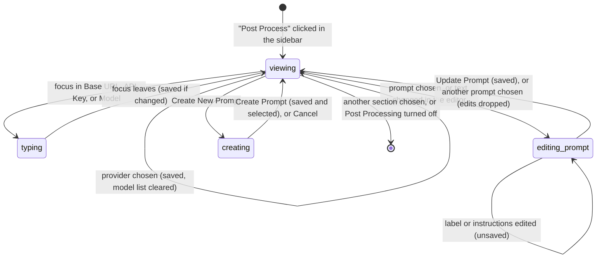

# The Post Process page

## Summary

The Post Process section is where the user configures [post-processing](../dictation/post-processing.md): which LLM provider to send transcripts to, the key and model for that provider, and the prompt that goes with them. It appears in the sidebar as "Post Process" only while Post Processing is switched on under Advanced › Experimental; the moment that toggle goes off the section disappears. The page has three groups. "Hotkey" holds the "Post-Processing Hotkey" shortcut row, which is the [shortcut recorder](shortcut-recorder.md). "API (OpenAI Compatible)" holds the "Provider" dropdown, a "Base URL" field that exists only for the Custom provider, an "API Key" field, and a "Model" combobox with a refresh button. "Prompt" holds the "Selected Prompt" dropdown, a "Create New Prompt" button, and an editor for the chosen prompt. Every control except the prompt editor saves as soon as it changes, as described in [The settings model](../foundations/the-settings-model.md); the prompt editor is the one place in Handy that holds unsaved edits until a button is pressed.

A fresh install arrives on this page with OpenAI selected, no API key, no model, one prompt ("Improve Transcriptions") in the list, and nothing selected in "Selected Prompt". Until the user picks a prompt from that dropdown, the Transcribe with Post-Processing shortcut records and pastes exactly like the plain shortcut: post-processing is skipped for lack of a prompt, silently. Choosing a prompt is therefore a required step, not a refinement, and nothing on the page says so.

## The simple case

The user turns on Experimental Features and then Post Processing under Advanced, and "Post Process" appears in the sidebar. They click it. "Provider" already reads "OpenAI". They click into "API Key", paste a key, and click elsewhere; the field keeps showing dots and the key is saved. They click the refresh arrows beside "Model"; the arrows spin for a moment and the combobox now offers the models the key can reach. They pick "gpt-4o-mini" and it is saved. Under "Prompt" they open "Selected Prompt", which reads "Select a prompt", and choose "Improve Transcriptions". The editor fills with its label and instructions. Done: the next dictation started with Option+Shift+Space is cleaned up by OpenAI before it is pasted.

## The interaction, event by event

For a settings page the interaction is using the page: arriving on it, leaving it untouched, making the first change, editing further, and what is committed.

### Start

The interaction starts when the user clicks "Post Process" in the sidebar, which is there only while Post Processing is on. The page is drawn from the saved settings: the "Post-Processing Hotkey" chip shows the current combination ("Option + Shift + Space" by default) with its reset arrow; "Provider" shows the saved provider (OpenAI on a fresh install); "API Key" shows the saved key for that provider as dots, or the placeholder "sk-..."; "Model" shows the saved model for that provider, or the placeholder "Type a model name" because no model list has been fetched yet; "Selected Prompt" shows the saved prompt's name, or "Select a prompt". Nothing is fetched from the network on arrival; the model list is empty until the user asks for it.

Each row has an ⓘ that reveals its description on hover or click: "Select an OpenAI-compatible provider.", "API key for the selected provider.", "Choose a model exposed by the selected provider." (or, for Custom, "Provide the model identifier expected by your custom endpoint."), and for the prompt row "Select a template for refining transcriptions or create a new one. Use ${output} inside the prompt text to reference the captured transcript."

### Ends at once

The interaction ends without a change when the user leaves the page untouched: clicks another section, closes the window, or turns Post Processing off on the Advanced page (which removes the section). Nothing is written. The same is true of clicking into a field and clicking out again without changing its text: the field saves only when the text it holds differs from what is saved.

### Becomes active

The page becomes active on the first change. What that means depends on the control:

- **Provider.** Choosing a provider from the dropdown saves it at once and the page re-shapes for it: the "Base URL" row appears only for "Custom"; the "API Key" and "Model" rows disappear for "Apple Intelligence". Any model list fetched for the new provider earlier in this session is discarded, and if the new provider is already configured (a key for the named providers, a non-empty base URL for Custom) Handy fetches its model list straight away. Choosing the provider that is already selected does nothing.
- **Base URL, API Key.** Typing changes only the field. The change is saved when the field loses focus, and only if the trimmed text differs from the saved value.
- **Model.** Choosing an entry from the list saves it at once. Typing a name that is not in the list offers `Use "<name>"` at the bottom of the list; choosing that saves the typed name. Clearing the combobox with its × saves an empty model.
- **Selected Prompt.** Choosing a prompt saves the selection at once and fills the editor below with its label and instructions.
- **The prompt editor.** Typing in "Prompt Label" or "Prompt Instructions" changes nothing yet; "Update Prompt" lights up once the text differs from the saved prompt.
- **Create New Prompt.** Clicking it switches the group into create mode: the dropdown and the button are disabled, the editor empties, and its buttons become "Create Prompt" and "Cancel".

### While active

Editing continues control by control; each is independent.

The provider list, in order, is: OpenAI, Z.AI, OpenRouter, Anthropic, Groq, Cerebras, Apple Intelligence (Apple-silicon Macs only), AWS Bedrock (Mantle), Custom. Each provider keeps its own API key and its own model, so switching from OpenAI to Groq and back finds the OpenAI key and model still in place. Choosing "Apple Intelligence" first asks the system whether it is available; if it is not, the provider is still selected but a red alert appears under the Provider row: "Apple Intelligence is not available on this device. Requires an Apple Silicon Mac running macOS Tahoe (26.0) or later with Apple Intelligence enabled in System Settings." The alert stays until the user next opens the dropdown and chooses anything. With Apple Intelligence selected there is no key, model, or base URL to set; the group is just the Provider row.

"Base URL" is shown only for Custom, pre-filled with "http://localhost:11434/v1" (an Ollama endpoint) and with the placeholder "https://api.openai.com/v1". When it is saved, the Custom provider's model is reset to empty and any fetched model list is discarded, because a model name from the old endpoint is unlikely to exist at the new one; the Model combobox goes back to "Type a model name". A base URL blurred empty is not saved. The other providers' base URLs cannot be edited; the backend refuses the write.

"API Key" is a password field. Blurring it with a different trimmed value saves that value for the current provider, including an empty value, which removes the key. Saving a key also discards the fetched model list for that provider, so the user should press refresh again; the combobox keeps the saved model and shows "Type a model name" until they do.

"Model" is a searchable combobox. Its list is whatever the last refresh returned for this provider, de-duplicated, plus the saved model if it is not in the list, so the saved model is always selectable. The refresh button (circular arrows, "Refresh models") spins while the fetch runs and is disabled during it. The fetch asks the provider for its model list using the saved key. If the key is empty for any provider other than Custom, the backend refuses with "API key is required for {provider}. Please add an API key to list available models." — but this message is only written to the log; on the page the spinner simply stops and the list is unchanged. The same is true of a network error, an HTTP error, or a reply in a shape Handy does not understand: nothing visible happens. A successful reply with no models leaves the list empty.

> Technical note: the fetch is `GET {base URL}/models` with the provider's auth header (Anthropic gets `x-api-key`, everyone else `Authorization: Bearer`). Handy reads `data[].id` (or `data[].name`) in the OpenAI shape, or a bare array of strings. Anything else yields an empty list. For Apple Intelligence the fetch returns the single name "Apple Intelligence" without a network call, but the Model row is hidden for that provider so the user never sees it.

"Selected Prompt" lists the prompt names. Choosing one saves it and resets the editor to that prompt, throwing away any unsaved edits to the previous one without asking. In the editor, "Update Prompt" is enabled only when both fields are non-blank and at least one differs from the saved prompt; "Delete Prompt" is enabled only when there is more than one prompt. Below the instructions a tip reads "Tip: Use ${output} to insert the transcribed text in your prompt." with `${output}` in code styling. When no prompt is selected the editor is replaced by a box reading "Select a prompt above to view and edit its details." — this is what a fresh install shows. The other empty state, "Click 'Create New Prompt' above to create your first post-processing prompt.", appears only when the prompt list is empty, which cannot be reached from the UI because the last prompt cannot be deleted; it is seen only with a hand-edited settings file.

In create mode "Create Prompt" is enabled once both fields are non-blank; "Cancel" leaves create mode and restores the editor to the selected prompt (or the empty state). While creating, the "Selected Prompt" dropdown and "Create New Prompt" are disabled.

### Finish

What is committed:

- **Provider, model, selected prompt** are written the moment they are chosen.
- **Base URL and API Key** are written when the field loses focus, if changed. The key is stored against the provider that was selected at that moment.
- **Update Prompt** writes the trimmed label and instructions over the selected prompt. If the backend cannot find the prompt the error goes to the log and the editor keeps the edits.
- **Create Prompt** adds a prompt with the trimmed label and instructions, then selects it (written as the selected prompt), then leaves create mode. The new prompt appears at the end of the list.
- **Delete Prompt** removes the selected prompt with no confirmation. If it was the selected prompt, the first prompt in the list becomes selected and the editor shows it; the backend refuses to delete when only one prompt remains, which the disabled button already prevents.
- **The hotkey** commits as described in [the shortcut recorder](shortcut-recorder.md#finish).

Leaving the page in the middle of prompt edits, or in create mode, discards them. There is no prompt to save.

## Modifiers

| Modifier | Set before the start | Changed while active |
| --- | --- | --- |
| Push to talk | No effect on the page. The Hotkey row is shown in both modes. | No effect. |
| Binding | The Hotkey row edits the Transcribe with Post-Processing binding only; the Transcribe and Cancel rows live on General. | No effect. |
| Overlay style | No effect. | No effect. |
| Streaming model | No effect. | No effect. |
| Voice activity detection | No effect. | No effect. |
| Always-on microphone | No effect. | No effect. |

The page's own settings are modifiers of a dictation, not of the page: a dictation started with the post-processing shortcut reads the provider, key, model, and prompt when its post-processing step begins, so a change saved during the recording applies to it, and a key typed but not yet blurred does not.

## Cancel and interrupt

| Event | Before active (viewing) | While active (field focused, editing or creating a prompt) |
| --- | --- | --- |
| Cancel | Escape does nothing on this page; no dictation is in progress, so the overlay ✕, the tray Cancel item, and `handy --cancel` do nothing. | Escape closes an open Model list but does not discard typed text; in the other fields it does nothing. "Cancel" in create mode discards the new prompt. There is no undo for prompt edits other than choosing the prompt again. |
| Another trigger | Option+Space or Option+Shift+Space starts a dictation normally; the page is unaffected. | Same. The dictation uses the saved values, not what is half-typed. Whether the shortcut's keys also land in the focused field was not determined. |
| A setting changed mid-way | Turning Post Processing off on the Advanced page removes the section; the user is already elsewhere. | Clicking any other control blurs the focused field first, which saves it if changed, then applies the click. Choosing a provider while a key is typed therefore saves the key to the old provider before switching. |
| Microphone lost | No effect. | No effect. |
| Model or processing failure | A failed model-list fetch: the spinner stops, the list is unchanged, nothing is shown. | A refused save (unknown provider, base URL of a non-Custom provider): logged only; the field keeps the typed text although the saved value is the old one. A failed provider switch snaps the dropdown back. |
| The active application changes | Nothing changes. | Whether the focused field blurs (and saves) when the settings window loses focus or is hidden was not determined from the code; [The settings model](../foundations/the-settings-model.md) assumes it does not. |
| Handy quits or the system sleeps | Nothing unsaved exists. | Unblurred field text and unsaved prompt edits are lost; everything else was written as it changed. |
| Keyboard channel changes | Secure Input on macOS refuses only the Hotkey chip, as in [the shortcut recorder](shortcut-recorder.md#start); typing in the fields is unaffected. | Same. |

## Interactions with other systems

**Permissions.** None for the page itself. Apple Intelligence needs an Apple-silicon Mac on macOS 26 or later with Apple Intelligence enabled in System Settings; the page checks this when the provider is chosen and [post-processing](../dictation/post-processing.md) checks again at each use. Fetching a model list needs network access.

**History and recordings.** None.

**Clipboard.** None; pasting into the fields is ordinary text entry.

**Model state.** None; the speech model is not involved.

**Tray and overlay.** None. Changing the hotkey refreshes the Secure Input fallback registrations as any binding change does.

**Sounds and system audio.** None.

**Settings persistence.** The provider list, the selected provider, one API key per provider, one model per provider, the prompt list, and the selected prompt id are all fields of the settings file. API keys are stored in plain text in that file (they are redacted only in Handy's log). Providers missing from an older file are appended on load, so the list and its order are filled in without user action. The in-session model lists are not saved; every launch starts with them empty.

**Platform differences.** "Apple Intelligence" is in the provider list only on Apple-silicon Macs. On Intel Macs, Windows, and Linux the list has eight entries and the alert can never appear. Everything else is identical.

## Edge cases

- The selected-prompt dropdown's placeholder is "Select a prompt"; it reads "No prompts available" only if the list is empty, which the UI cannot produce.
- Prompt names need not be unique; two prompts named "Default" are listed twice and are told apart only by which one is ticked.
- "Update Prompt" compares trimmed text, so adding only leading or trailing whitespace does not enable it; saving always trims.
- Clearing the Model combobox saves an empty model. Post-processing then skips silently for that provider until a model is set again.
- After a base URL change the Custom model is blanked even if the new URL is the same endpoint with a trailing slash removed; the user must pick the model again.
- Blurring "Base URL" empty is ignored, but the field keeps showing empty until the page is redrawn (leaving and returning shows the saved URL again).
- While a base URL save is in flight the field is disabled and carries the hover text "Base URL is managed by the selected provider.", an untranslated string that is otherwise never shown.
- On an install upgraded from a version without AWS Bedrock (Mantle), that provider is appended after Custom, so "Custom" is no longer last in the list.
- The Apple Intelligence alert is session state: leave the page and come back with Apple Intelligence still selected and unavailable and there is no alert.
- The refresh button looks like a reset arrow but is not one; nothing on this page except the hotkey has a reset.
- The default "Improve Transcriptions" prompt cannot be deleted while it is the only prompt, but it can be edited beyond recognition; there is no way to restore its text.

## Open questions and verification

- A fresh install has no selected prompt and the page shows only "Select a prompt above to view and edit its details."; post-processing silently does nothing until one is chosen. Suspected bug (also raised from the dictation side in [post-processing](../dictation/post-processing.md)).
- Model-list fetch failures are invisible, including the backend's own "API key is required for {provider}. Please add an API key to list available models." message, which exists but is never shown. Suspected bug.
- Choosing a provider while the API Key field is focused: the code path saves the key to the previous provider on blur, whereas [The settings model](../foundations/the-settings-model.md) says the typed key is discarded. One of the two is wrong; needs a hand check.
- Whether a focused field blurs and saves when the settings window is hidden or loses focus.
- Whether handy_keys lets the shortcut's key presses through to a focused text field.
- The Apple Intelligence alert not reappearing on a return visit. Suspected bug, minor.
- Provider order on upgraded installs putting a named provider after Custom. Suspected bug, minor.
- The Base URL field showing empty after an ignored empty blur. Suspected bug, minor.
- Deleting a prompt has no confirmation, unlike deleting a model; likely a product call.
- The untranslated "Base URL is managed by the selected provider." hover text.

Verified against Handy commit `af48dd6`.
