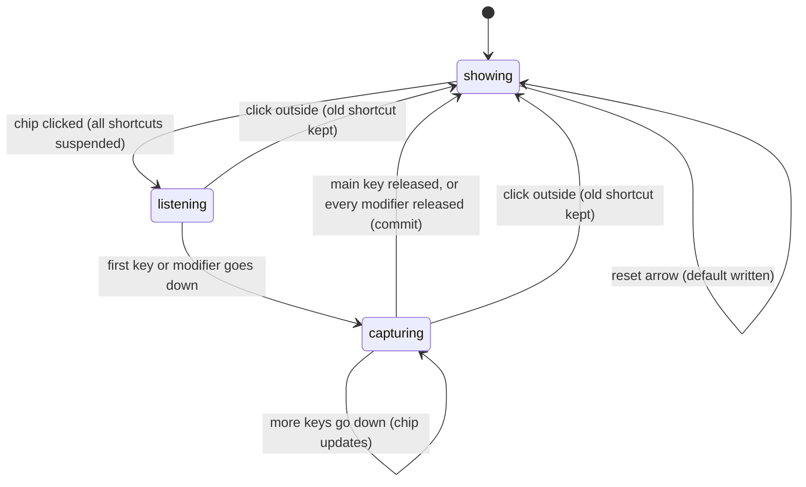

# The shortcut recorder

## Summary

The shortcut recorder lets the user replace one of Handy's keyboard shortcuts by clicking its current value and pressing a new combination. It lives on the General section as the "Transcribe Shortcut" row (and the "Cancel Shortcut" row when push to talk is off) and on the Post Process section as the "Post-Processing Hotkey" row. Each row shows the shortcut's name, an ⓘ that reveals its description, the current combination in a bordered chip (for example "Option + Space"), and a reset arrow. The recorder is active from the moment the chip is clicked until a combination is committed or the user clicks elsewhere; while it is active the chip is highlighted and reads "Press keys...". It is available whenever the settings window is open, except on macOS while [Secure Input](../cross-cutting/secure-input.md) is engaged, when the click is refused.

## The simple case

The user opens the settings window, goes to General, and clicks the chip showing "Option + Space" next to "Transcribe Shortcut". The chip turns pink-bordered and says "Press keys...". Every one of Handy's own shortcuts stops working for the duration, so the keys about to be pressed cannot start a dictation.

The user holds Control and presses Space. As each key goes down the chip updates: "Ctrl", then "Ctrl + Space". When Space is released, the combination is committed: Handy registers Control+Space as the transcribe shortcut, writes it to settings, the chip returns to its normal look showing "Ctrl + Space", and the other shortcuts come back. From this moment, holding Control+Space anywhere on the Mac starts a dictation.

The reset arrow next to the chip puts the platform default back ("Option + Space") in one click, without opening the recorder.

## The interaction, event by event

### Start

The interaction starts when the user clicks the chip. Handy remembers the current combination so it can be put back, unregisters every shortcut except Cancel (which is only ever registered during a dictation), and starts listening to the keyboard system-wide. The chip switches to its recording look: a pink border, a tinted background, and the text "Press keys...". Nothing else on the page changes, and the reset arrow stays clickable.

On macOS the click is checked against Secure Input first. If any app currently holds Secure Input, the recorder does not open: a toast says "Can't record shortcuts right now — macOS Secure Input is blocking key events. Resolve the Secure Input warning first." with a "How to fix" action that opens the troubleshooting page, and the Secure Input warning banner appears at the top of the settings content. Shortcuts are not suspended in this case.

> Technical note: the listener is a separate system-wide keyboard tap, not the settings window's own key events, so keys are captured even when the settings window is not the frontmost window (see [The active application changes](#cancel-and-interrupt)). On Linux, and whenever the "tauri" keyboard implementation is selected, the recorder instead reads key events from the settings window itself and only while that window has focus.

### Ends at once

The recorder ends without a change when the user clicks anywhere outside the chip before pressing a key. The listener stops, the other shortcuts are re-registered, the original combination is re-registered and rewritten to settings unchanged, and the chip goes back to its normal look showing the old value. Nothing is recorded in history or the log that the user would notice. A click on the reset arrow while recording counts as a click outside, so it first cancels the recording, then writes the default.

### Becomes active

The recorder becomes active on the first key-down event, whether a modifier (Control, Option, Shift, Command, fn) or any other key. From this moment the chip shows the combination currently held, formatted for display: modifiers first in the order Ctrl, Option, Shift, Command, fn, then the key, joined with " + ", with left- or right-specific modifiers spelled out ("Left Option + Space"). The original combination is still in force in settings; nothing has been committed.

### While active

Every further key-down replaces the chip's text with the full combination now held. Handy tracks two candidates separately: the last combination that included a non-modifier key, and the last combination that was modifiers only. Releasing a modifier while other keys stay down does not commit anything. There is no timeout; the recorder waits as long as keys are held.

### Finish

The recorder commits in one of two ways:

- **A keyed shortcut.** When the non-modifier key is released, the combination that included it is committed, even if a modifier was released first. "Option + Space" is committed when Space comes up, regardless of whether Option is still held.
- **A modifier-only shortcut.** If no non-modifier key was ever pressed, the combination is committed when the last held modifier is released. Holding and releasing the right Option key alone makes "Right Option" the shortcut.

Committing unregisters the old combination, validates the new one for the active keyboard implementation, registers it, and writes it to settings. The chip shows the new value and the other shortcuts are re-registered. If registration fails, a toast reads "Failed to set shortcut: {error}", the previous combination is registered and written back, and the chip shows the old value. For the Cancel shortcut only the setting is written; it is registered fresh at the next dictation.

> Technical note: with the handy_keys implementation validation only requires the string to parse, so single keys, modifier-only combinations, and the fn key are all accepted. With the tauri implementation a combination must contain at least one non-modifier key and must not include fn; otherwise the toast reads "Tauri shortcuts must include a main key (letter, number, F-key, etc.) in addition to modifiers" or "The 'fn' key is not supported by Tauri global shortcuts".

## Modifiers

| Modifier | Set before the start | Changed while active |
| --- | --- | --- |
| Push to talk | On (the default): the "Cancel Shortcut" row is hidden, so only the two transcribe shortcuts can be recorded. Off: the Cancel row appears below it. | Clicking the Push To Talk toggle is a click outside, so the recording is cancelled first and then the toggle flips. |
| Binding | Determines which shortcut the chip edits. The Post-Processing Hotkey row exists only while post-processing is enabled. | No effect; the binding is fixed at the click. |
| Overlay style | No effect. | No effect. |
| Streaming model | No effect. | No effect. |
| Voice activity detection | No effect. | No effect. |
| Always-on microphone | No effect. | No effect. |

Changing a setting while the recorder is active always goes through a click, and every click outside the chip cancels the recording before the setting changes.

## Cancel and interrupt

| Event | Before active (listening) | While active (capturing) |
| --- | --- | --- |
| Cancel | Escape is not a way out: it is a key, so pressing it makes "Esc" the candidate and releasing it commits Escape as the shortcut. The overlay ✕ and the tray Cancel item are not shown because no dictation is in progress; `handy --cancel` does nothing. | Same: Escape is captured as part of the combination. |
| Another trigger | The transcribe shortcuts are suspended, so pressing one does not start a dictation; the keys are captured as the candidate instead. `handy --toggle-transcription` or a signal bypasses the suspended shortcuts and starts a dictation normally, with the recorder still open. | Same. |
| A setting changed mid-way | Any other control is reached by clicking, which cancels the recording first. The reset arrow cancels and then writes the default. | Same. |
| Microphone lost | No effect. | No effect. |
| Model or processing failure | No effect. | No effect. |
| The active application changes | The recorder stays open and the suspended shortcuts stay suspended. On macOS keys typed in the other application are captured system-wide: the first release of a non-modifier key there commits it as the shortcut. Clicking in the other application does not count as a click outside. | Same. |
| Handy quits or the system sleeps | The old combination is untouched in settings; at the next launch it is registered normally. If the Mac sleeps, the recorder is still open on wake. | Same; a combination not yet committed is lost. |
| Keyboard channel changes | Secure Input engaging after the click: non-modifier keys stop arriving, so pressing Option+Space shows only "Option"; releasing Option commits "Option" as a modifier-only shortcut. Switching the keyboard implementation requires a click, which cancels. | Same. |

After a cancel or a commit the user is back on the settings page with the other shortcuts working again. Nothing from a cancelled recording is kept.

## Interactions with other systems

**Permissions.** The handy_keys listener needs macOS Accessibility access, which onboarding already required; without it the recorder opens but never receives a key and only a click outside closes it.

**History and recordings.** None.

**Clipboard.** None.

**Model state.** None.

**Tray and overlay.** The tray icon and menu are unaffected. On macOS, a refusal under Secure Input adds the "⚠ Shortcuts blocked by Secure Input" line to the tray menu and the warning badge to the icon until Secure Input clears.

**Sounds and system audio.** None.

**Settings persistence.** Only a commit or a reset writes the binding. A commit writes the whole settings store with the new `current_binding`; the default is kept alongside it so the reset arrow always knows what to restore. Changing the transcribe or post-processing binding also refreshes the Secure Input fallback registrations.

**Platform differences.** Windows uses handy_keys like macOS but has no Secure Input check. Linux uses the tauri implementation by default: keys are read only while the settings window has focus, the combination is committed when every key is released, the key order is normalized to modifiers-then-key, modifier-only and fn combinations are refused with a toast, and the Cancel Shortcut row is never shown.

## Edge cases

- Recording the same combination that is already set commits and re-registers it; nothing visible changes except the chip flashing back from "Press keys...".
- Recording a combination already used by the other transcribe shortcut is accepted by handy_keys; both bindings then fire on the same keys and the coordinator handles whichever event it receives first. The tauri implementation refuses with "Shortcut 'X' is already in use".
- Keys the display formatter does not know are shown in lowercase with their raw name (for example "numpad 1", "print screen").
- The chip has no maximum width; a long combination such as "Left Ctrl + Left Option + Left Shift + Left Command + F19" wraps the row's layout rather than truncating.
- Clicking the chip of a second row while the first is recording is a click outside for the first (cancel) and a click on the second (start), in that order.
- Mouse buttons are keys to handy_keys. A click outside ends the recording through the window's click handler, but the listener can see the button release first; whether a mouse button can be committed as a shortcut by clicking outside is not determined from the code.

## Open questions and verification

- Escape commits Escape as the shortcut instead of cancelling the recording. There is no keyboard way to back out; may be worth treating as a bug rather than documenting.
- With the settings window in the background, keys typed in another application are captured and committed (handy_keys). Combined with every shortcut being suspended while the recorder is open, a recorder left open by accident both hijacks the next key typed elsewhere and disables dictation until then. Suspected bug.
- Under Secure Input engaging mid-recording, a keyed combination degrades to its modifiers and is committed as modifier-only. The refusal at click time covers the common case; this residual case was read from the code, not reproduced.
- Whether a mouse-button click outside can commit "mouse_left" as a shortcut before the click-outside cancel runs (race between the global listener and the window click handler).
- The exact display strings for unusual keys (numpad, media keys) were not checked by hand.
- The toast text for a handy_keys duplicate registration, if handy_keys refuses duplicates at all, was not confirmed.

Verified against Handy commit `af48dd6`.
