# The settings window

## Summary

The settings window is Handy's one ordinary window: a 160-point sidebar of sections on the left, a scrolling content column in the middle, and a footer along the bottom. Using it is the interaction this document describes: arriving in it, looking without touching anything, making a first change, continuing to edit, and leaving. Every page inside it saves each control the moment it changes (see [The settings model](../foundations/the-settings-model.md)); the window itself has no Save, no Apply, and no confirmation. It also hosts the things that are not on any one page: two warning banners above the page, error toasts in the bottom corner, the What's New dialog after an upgrade, the hidden Cmd+Shift+D debug toggle, the interface direction and theme, and the close button that hides the window rather than quitting. Showing, hiding, focusing, and quitting are owned by [Windows and the tray](../foundations/windows-and-tray.md); the pages are owned by the other documents in `settings/`.

## The simple case

Handy launches and the window opens on General. Down the left are "General", "History", "Models", "Advanced", and "About", under the Handy wordmark. Across the bottom, the footer shows a green dot and "Parakeet V3" on the left and "Check for updates • v0.9.6" on the right; a moment later the update text reads "Checking for updates..." and then returns to "Check for updates". The user clicks "Advanced", flips a toggle, and the toggle moves; nothing else asks anything. They press Cmd+Shift+D: a "Debug" item appears in the sidebar above "About". They press it again and the item goes. They click the red close button. The window disappears, Handy leaves the Dock, and the menu-bar icon stays; Handy keeps dictating. Choosing "Settings…" from the menu-bar icon later brings the window back on the section they left.

## The interaction, event by event

```mermaid
stateDiagram-v2
    [*] --> hidden
    hidden --> shown : launch (not start hidden), tray Settings…, relaunch
    shown --> whats_new : a release note is pending on arrival
    whats_new --> shown : Close, Escape, or click on the backdrop
    shown --> shown : section clicked, Cmd+Shift+D, banner dismissed
    shown --> saving : a control changed
    saving --> shown : saved (control shows the new value)
    saving --> shown : refused (control snaps back; some refusals toast)
    shown --> hidden : close button (window hides, Dock icon goes)
    shown --> [*] : Cmd+Q, or Quit in the tray menu
```

### Start

The interaction starts when the window is shown and the user arrives on a page: at launch (unless start hidden), from the tray's "Settings…", or by relaunching Handy. On a fresh install the window shows onboarding first (see [First launch](../setup/first-launch.md)); from the second launch on it opens on General. When the window is merely hidden and shown again it comes back on whatever section was open, because nothing inside it is torn down while hidden.

What is on screen, top to bottom and left to right:

- **The sidebar.** A 160-point column with the Handy wordmark at the top, a divider, then one row per section: an icon and a label, "General", "History", "Models", "Advanced", "Post Process", "Debug", "About", in that fixed order. "Post Process" is present only while post-processing is enabled (Advanced › Experimental › Post Processing); "Debug" only while debug mode is on. The open section is filled pink; the others grey on hover. A click switches pages at once, with no animation and no confirmation, and never discards anything because nothing is ever pending.
- **The content column.** Scrolls independently of the sidebar and footer. At its top, before the page, come two banners that are usually absent:
  - The accessibility banner (macOS only), shown when the window's main view appears without Accessibility access: "Handy needs accessibility permissions to type transcribed text." with an "Open System Settings" button. The first click asks macOS for the permission (the system prompt appears) and the second click re-checks; the banner disappears only when a click finds the permission granted. It does not re-check on its own. In practice it is rare, because a returning user without Accessibility access is sent to the permissions step instead (see [Permissions](../setup/permissions.md)).
  - The Secure Input banner (macOS only), an amber strip with a warning triangle: "{name} may be blocking 1 shortcut", "{name} may be blocking {count} shortcuts", "macOS is temporarily blocking 1 shortcut", "macOS is temporarily blocking {count} shortcuts", "{name} may be blocking shortcut changes", or "macOS is temporarily blocking shortcut changes", a "How to fix" link that opens the troubleshooting page in the browser, and an ✕ that dismisses it for the current episode only. It appears only when Secure Input has been held for 3 s or more *and* a shortcut is degraded or uncovered, or when the shortcut recorder was refused; see [Secure Input](../cross-cutting/secure-input.md).
  - Then the page itself, centered, at most 768 points wide. Each page is a stack of groups: a small uppercase caption ("GENERAL", "SOUND") over a bordered card whose rows are separated by hairlines. A row is a title, an ⓘ that shows the setting's description in a 200-point tooltip on hover (or on click, which pins it until a click elsewhere), and the control on the right. Text in the window cannot be selected with the mouse and the pointer stays an arrow, except inside text fields.
- **The footer.** A hairline, then on the left the model selector (a status dot, the active model's name truncated to about 110 points, and a chevron; the list opens *upward* from it) and, while a download is in progress, its progress bar; on the right the update status, a "•", and "v{version}". The status reads "Check for updates" (clickable), "Checking for updates...", "Up to date" (for 3 s after a manual check), "Update available" (pink, clickable: installs and relaunches), "Preparing...", "Downloading... {progress}%" with a progress bar, "Installing...", or "Update Checking Disabled" when update checks are off. A check runs automatically every time the window's page loads with checks enabled. The dot is green when the active model is loaded, grey when it is unloaded, yellow and pulsing while loading, pink and pulsing while downloading, orange and pulsing while verifying or extracting, red on error or when no model is selected (then the text is "No Model - Download Required"). See [Switching models](../models/switching-models.md) and [Updates](../integration/updates.md).
- **The What's New dialog.** If the settings store remembers a version older than the newest bundled release note (or no version at all, which is how a pre-0.9 install looks), a centered dialog titled "New in Handy v{version}" opens over everything on arrival, with the note's text, links that open in the browser, and an ✕ labelled "Close". Escape, the ✕, or a click on the dimmed backdrop closes it and records that version as seen, so it does not return. A fresh install never sees it, because its store is created already marked with the installed version. "Show What's New" on the About page turns the dialog off entirely; the About page can also open the latest note on demand (see [About](about.md)).

> Technical note: the only bundled release note at this commit is for 0.9.0, and the dialog shows the newest note whose version is at or below the running version and above the last-seen version. A user upgrading from 0.8.x to 0.9.6 is therefore shown "New in Handy v0.9.0", not v0.9.6, and a user upgrading from 0.9.1 to 0.9.6 sees nothing.

The window is drawn in the light or dark palette chosen by the theme setting (System, Light, or Dark, on the About page). System follows macOS; Light and Dark force a palette and also recolor the native title bar. The last-used palette is remembered inside the window so the right colors are painted before settings have loaded. When the interface language is Arabic or Hebrew the whole window is mirrored: the sidebar is on the right, toggles flip, text is right-aligned, and the footer's model selector and version swap sides.

### Ends at once

The interaction ends without a change when the user leaves the window untouched: closes it, hides it behind other windows, or quits. Closing (the red button, or Cmd+W) hides the window and, on macOS with the tray icon shown, removes Handy from the Dock; nothing is written, and the section stays selected for next time. Clicking between sections, hovering ⓘ tooltips, opening and closing dropdowns, dismissing the Secure Input banner, and closing What's New without reading it are all "untouched" in the sense that no setting changes — except What's New, whose dismissal writes the seen version. Cmd+Q or the tray's "Quit" ends Handy; a hidden window is not shown first.

### Becomes active

The interaction becomes active on the first change: a toggle flipped, a dropdown chosen, a slider moved, a field blurred, a chip recorded, or Cmd+Shift+D pressed. The control shows the new value at once and is disabled, most with a small spinner, until the backend has written it (see [The settings model](../foundations/the-settings-model.md#how-a-change-is-saved)). If the backend refuses, the control snaps back; only some refusals produce a toast (a failed shortcut registration does; a refused microphone or channel change does not, see [General](general.md)).

Cmd+Shift+D (Ctrl+Shift+D also works, on every platform) is the one change made from the keyboard rather than a control. It is heard anywhere in the window, including while a text field has focus and during onboarding, and it flips debug mode: "Debug" appears in the sidebar above "About", a "15 seconds" option joins the Unload Model dropdown, model cards gain a quantization label, and log lines start streaming to the Debug page. Debug mode is a saved setting, so it survives relaunch; the second press turns it off. See [Debug](debug.md).

> Technical note: the `--debug` flag raises the log level and streams logs for one run but does not change the saved setting the sidebar reads, so it does not reveal the Debug section. See Open questions.

### While active

Editing continues as long as the window is open: every further change is saved on its own, independently of any other, and switching sections does not wait for saves in flight. Several controls can be saving at once. The footer and banners update live while the user edits: the model selector follows the active model and its load state, the download progress bar appears during a download started from any page, the update status changes as checks run, and the Secure Input banner appears and disappears with the system state. Enabling Post Processing on Advanced adds "Post Process" to the sidebar in place; disabling it removes the item.

Toasts appear in the bottom-right corner of the content area, stacked, and go away on their own after about four seconds; there is no close button on them. They are the window's only channel for errors that happen outside it, so a user whose window is hidden never sees them. The messages that can appear while using the window are:

| Toast | When |
| --- | --- |
| "Microphone Access Denied" / "Grant microphone access in System Settings → Privacy & Security → Microphone." | A dictation was triggered and macOS refused the microphone. |
| "No Microphone Found" / "No audio input device was detected. Please connect a microphone or headset and try again." | A dictation was triggered with no input device present. |
| "Failed to start recording: {error}" | The microphone could not be opened for another reason. |
| "Transcription Failed" / the backend's message | The model failed during transcription. |
| "Failed to Paste Text" / "Text could not be pasted into the active application." | Delivery failed; the text is still in History. |
| "Failed to load model: {model}" / the error | A model load failed (the name falls back to "unknown model"). |
| The raw error text | A model download failed. |
| "Failed to set shortcut: {error}", "Failed to restore original shortcut", "Failed to reset shortcut to original value", "Can't record shortcuts right now — macOS Secure Input is blocking key events. Resolve the Secure Input warning first." | The shortcut recorder; see [The shortcut recorder](shortcut-recorder.md). |
| Others | History delete and re-transcribe failures ([The history page](../history/the-history-page.md)), keyboard implementation changes ([Advanced](advanced.md)), custom words ([Advanced](advanced.md)), onboarding ([First launch](../setup/first-launch.md)). |

### Finish

The interaction finishes with everything already committed: there is no final step. Closing the window after a session of edits changes nothing on disk that was not already changed, and the window remembers its section until Handy quits. Quitting or relaunching brings the window back on General (or hidden, per Start Hidden), never on the last section. The only thing the window itself persists is the seen What's New version; everything else belongs to the page that changed it.

## Modifiers

| Modifier | Set before the start | Changed while active |
| --- | --- | --- |
| Push to talk | No effect on the window; it changes which rows the General page shows (see [General](general.md)). | No effect on the window. |
| Binding | No effect on the window. The "Post Process" section (and its shortcut row) exist only while post-processing is enabled. | Recording a shortcut suspends every shortcut while the recorder is open; see [The shortcut recorder](shortcut-recorder.md). |
| Overlay style | No effect on the window. | No effect; the overlay is a separate window. |
| Streaming model | Decides the footer's "Streaming" tag on the active model in the model list. | The footer updates when the active model changes. |
| Voice activity detection | No effect on the window. | No effect. |
| Always-on microphone | No effect on the window. | No effect. |

## Cancel and interrupt

| Event | Before active (arrived, nothing changed) | While active (edits made, possibly saving) |
| --- | --- | --- |
| Cancel | Escape closes an open What's New dialog or language picker and does nothing else; the overlay ✕ and the tray Cancel item are not shown because no dictation is in progress; `handy --cancel` does nothing. | Same. No edit can be cancelled; the previous value must be set again by hand. |
| Another trigger | A dictation starts and runs normally with the window open; the overlay appears on the monitor with the pointer, the footer dot turns yellow if the model has to load, and toasts for any failure appear in the window. If the window is frontmost the pasted text goes into it (usually nowhere visible). | Same. Changes that need the microphone idle are refused while it records (see [General](general.md)). |
| A setting changed mid-way | This *is* the interaction. | Two controls saving at once resolve independently. Turning off debug mode while on the Debug page, or post-processing from a page other than Advanced, leaves the page on screen with no sidebar item highlighted (see Edge cases). |
| Microphone lost | Device dropdowns re-enumerate each time they are opened; nothing else in the window notices. | Same. A microphone that disappears and falls back to Default rewrites the Microphone dropdown live. |
| Model or processing failure | A load failure turns the footer dot red with the error in place of the name, plus a toast. | Same; a selection that fails reverts in the footer. |
| The active application changes | The window stays as it is; open dropdowns stay open; pinned tooltips stay pinned. | Same. Saves in flight finish in the background. |
| Handy quits or the system sleeps | Nothing is lost. The next launch opens on General or hidden. | A save not yet written is lost; everything written is kept. After sleep the window is as it was. |
| Keyboard channel changes | Secure Input engaging while the window is shown adds the banner (when a shortcut is affected); clearing it removes the banner. | Same. Switching the keyboard implementation (Advanced) re-registers every shortcut and may reset some with a toast. |

## Interactions with other systems

**Permissions.** The accessibility banner is the window's only permission prompt after onboarding; the microphone is requested by the first dictation, not by the window. The Microphone and Output Device lists are enumerated only after onboarding completes, so the window never triggers the macOS microphone prompt by itself.

**History and recordings.** None beyond the History page.

**Clipboard.** None.

**Model state.** The footer is the window's view of the active and loaded model; it reflects every load, unload, failure, download, verification, and extraction live, whichever page is open.

**Tray and overlay.** Closing the window with the tray icon shown removes Handy from the Dock; the tray's "Settings…" and "Check for Updates…" items show it again (the latter also starts a check whose result appears in the footer). Show Tray Icon off with the window hidden leaves no way back except relaunching (see [Windows and the tray](../foundations/windows-and-tray.md)).

**Sounds and system audio.** None from the window itself; the Sound group on General is described in [General](general.md).

**Settings persistence.** `debug_mode` (Cmd+Shift+D), `whats_new_last_seen_version` (dismissing What's New), `theme` and `app_language` (About), `post_process_enabled` (Advanced) are the settings that change the window's own chrome. Every other setting belongs to its page.

**Platform differences.** The accessibility and Secure Input banners exist only on macOS. The theme recolors the title bar on macOS and Windows only; on Linux only the page palette changes. Cmd+Shift+D is Ctrl+Shift+D on Windows and Linux (and Ctrl also works on macOS). On Windows the window is forced visible at launch when microphone access is denied in the registry. Close-to-tray is identical on all three; the Dock switch is macOS only.

## Edge cases

- Turning debug mode off with Cmd+Shift+D while the Debug page is open leaves the Debug page on screen with no sidebar item highlighted; it stays until another section is clicked. The same happens to the Post Process page if post-processing is turned off while it is showing (possible via the hidden page's own toggle if one is added; today the toggle is on Advanced). Suspected bug.
- The sidebar rows are not reachable with the Tab key; sections can only be switched with the mouse. The ⓘ icons, toggles, dropdowns, and buttons are.
- Tooltips pinned by a click stay open while scrolling and are repositioned to follow their ⓘ; they close on the next click anywhere else, including on another ⓘ.
- The What's New dialog locks scrolling and traps Tab inside itself while open; Escape closes it only if it has focus, which it takes on open.
- Toasts are bound to the window: a dictation that fails while the window is hidden leaves no visible trace except the overlay vanishing and the tray icon returning to idle; the message is in the log.
- The footer's model name is truncated to about 110 points, so long names ("Moonshine V2 Medium") are cut with an ellipsis; the full name is in the dropdown and in the button's hover title.
- Resizing the window narrower than 680 points is refused by the window manager; the content column never scrolls horizontally at that width, but the Secure Input banner's message can wrap to two lines.
- A release note newer than the running version is never shown, so a settings store shared between a newer and an older Handy does not pop a note the older build cannot explain.

## Open questions and verification

- `--debug` does not reveal the Debug section: it overrides the log level and log streaming on a private copy of the settings, but the sidebar reads the saved `debug_mode`, which stays false. [The settings model](../foundations/the-settings-model.md) states that the flag turns debug mode on for one run; that claim should be re-verified. Suspected bug.
- The accessibility banner checks the permission once when the main view appears and again only when its button is clicked, so a permission granted in System Settings while the window is open does not clear the banner until the button is clicked. Suspected bug.
- Turning debug mode off while on the Debug page leaves the page showing with no section selected. Suspected bug.
- The toast duration (read as sonner's 4 s default) and whether toasts honor the window's RTL direction were not observed.
- Whether Cmd+W closes (hides) the window like the red button was read from the close-request handler and not tried; Tauri routes both through the same event.
- Whether the macOS app-wide appearance set by Light/Dark also affects the tray menu's appearance was not checked.
- Whether the "Up to date" text appears after the automatic check at launch (the code shows it only after a manual check) was not observed.
- The exact color of the sidebar's active row and the tooltip's arrow placement were read from class names, not measured.

Verified against Handy commit `af48dd6`.
