# Choosing a model

## Summary

The model step is the last screen of onboarding: the user picks the speech-to-text model Handy will use, Handy downloads it, makes it the active model, loads it, and opens the main window. The screen is headed "To get started, choose a transcription model" and lists models as cards in two groups, "Compatible Models" (already on disk, shown only when there are any) and "Available to Download" (two featured picks, three more recommended models, and a "Show all 69 models" button that reveals the rest). Clicking a card is the whole interaction: a downloadable card starts its download and shows progress, speed, and a Cancel button; a compatible card is selected straight away. The step ends the moment a selection succeeds; it cannot be skipped. The model vocabulary and states are in [Models](../foundations/models.md); downloading outside onboarding is in [Downloading a model](../models/downloading-a-model.md).

## The simple case

After "All set!" the window shows the Handy logo, "To get started, choose a transcription model", and under "Available to Download" two accented cards: Parakeet Unified EN 0.6B ("Fast, accurate live English transcription", "English only", "Streaming", 697 MB) and Nemotron Streaming 3.5 ("Live multilingual transcription across 28 languages", "28 languages", "Streaming", 716 MB). Below them, plainer cards for Canary 180M Flash (208 MB), Cohere Transcribe (1.6 GB), and Whisper Medium (793 MB), then a "Show all 69 models" button. Each card shows "accuracy" and "speed" bars on the right.

The user clicks Parakeet Unified EN 0.6B. Every card dims and stops responding; the clicked card loses its size line and gains a progress bar with "Downloading 0%" on the left and a "Cancel" button on the right. The percentage climbs, a speed such as "12.4 MB/s" appears beside Cancel, and at 100% the card disappears from "Available to Download" and reappears at the top under "Compatible Models" with a spinner badge, "Switching...". A few seconds later the window becomes the main settings window: General section, footer reading Parakeet Unified EN 0.6B with a green dot. The next launch opens straight on General.

## The interaction, event by event

```mermaid
stateDiagram-v2
    [*] --> listing : step appears
    listing --> selecting : "Compatible Models" card clicked ("Switching...")
    listing --> downloading : "Available to Download" card clicked (all cards disabled)
    downloading --> listing : Cancel clicked (partial kept), or download failed (toast)
    downloading --> verifying : mirror fallback finished transferring
    verifying --> listing : verification failed (toast, file deleted)
    downloading --> selecting : download complete (card moves to Compatible Models, "Switching...")
    verifying --> selecting : verified
    selecting --> listing : load failed (toasts, selection reverted)
    selecting --> [*] : model loaded; main window
```

### Start

The step starts when the permissions step hands over (or, on Linux, as soon as the page loads). The model list is already loaded in the background; the screen shows it in two groups.

**Compatible Models** appears only when at least one model is downloaded: a catalog model already in the shared Hugging Face cache (from another tool or an earlier install), a legacy model file (badged "Legacy"), a custom `.bin` or `.gguf` the user put in the models folder (badged "Custom", described "Not officially supported", no bars), or a cache model. These cards show a drive icon with their size and are clickable.

**Available to Download** lists every catalog model not on disk, with a download icon and size. The first two recommended models in catalog order are featured with a tinted border: Parakeet Unified EN 0.6B and Nemotron Streaming 3.5. The other three recommended models follow: Canary 180M Flash ("Tiny and instant, runs well on any hardware", "4 languages", "Translate"), Cohere Transcribe ("Highest accuracy, 14 languages, slower", "14 languages"), Whisper Medium ("Broadest language, but may run a bit slow", "99 languages", "Translate"). Then the "Show all 69 models" button with a chevron; clicking it appends the remaining 64 cards in catalog order and changes to "Show fewer models". The "Recommended" badge is not shown on this screen. Legacy models are never offered for download here.

Every card shows the name, a one-line description, the "accuracy" and "speed" bars (absent for custom models), and a capability row: a globe with "English only" or "N languages" (hovering shows "Supports this language only" or "Supports multiple input languages"), "Translate" if the model can translate to English ("Can translate to English"), "Streaming" if it can transcribe live ("Shows live transcription as you speak"), and the size. In debug mode the quantization label (for example "Q8_0") is shown after the size. Sizes are whole megabytes below 1 GB and one decimal above ("1.6 GB").

> Technical note: the order is the catalog's editorial rank (1–10), then recommended models, then accuracy, speed, and name; the page trusts that order rather than sorting again, which is why the two featured picks are simply the first two recommended models. The count in "Show all N models" is the number of downloadable models, including the five already visible.

### Ends at once

The step ends without a download when the user clicks a card under "Compatible Models": the card gains a "Switching..." badge with a spinner, every other card dims, and Handy writes the selection, marks onboarding complete, and loads the model. When the load finishes the window becomes the main window. The same instant path happens for a downloadable card whose file turns out to already be present (in the Hugging Face cache under a different revision, or dropped into the models folder by hand): the download completes immediately and selection follows.

### Becomes active

The step becomes active when a card under "Available to Download" is clicked (or focused with Tab and activated with Enter). All cards dim to half opacity and stop responding; only one download can be started from this screen. The clicked card's size line is replaced by a progress bar, "Downloading 0%", and a "Cancel" button. The transfer starts from Hugging Face into the shared Hugging Face cache.

### While active

The progress bar and "Downloading N%" update up to ten times a second; once half a second of data has arrived a smoothed speed, "{speed} MB/s", appears beside Cancel. Retries are invisible except as pauses: a transfer that fails or makes no progress for 60 seconds is retried up to four times (the first attempt uses four parallel connections, the rest one), with growing pauses of 2, 4, and 8 seconds, and each retry resumes from what was already fetched. If Hugging Face fails outright, the file is fetched instead from Handy's mirror into Handy's own models folder; at the end of a mirror transfer the bar pulses with "Verifying..." while the file's checksum is compared with the one compiled into Handy. A Hugging Face transfer shows no verifying state. "Extracting..." is a state the card can show for archive-based legacy models, but no model offered on this screen uses it.

Clicking "Cancel" stops the transfer within moments: the card returns to its downloadable look with its size, the other cards come back, and the partial file is kept (in the Hugging Face cache, or as a `.partial` beside the models folder for a mirror transfer) so clicking the same card again resumes rather than restarts.

### Finish

When the transfer completes (and, for a mirror, verifies) the model becomes downloaded: it leaves "Available to Download" and appears under "Compatible Models", and the step immediately selects it. Selection writes the model as the active model and `onboarding_completed` together, then loads the model; the card shows "Switching..." for the duration, which for a 700 MB model is a few seconds on a fast Mac. On success the window becomes the main window with the model named in the footer and a green dot, and onboarding is over for good. If the load fails, the selection and the onboarding flag are both reverted, a toast reads "Failed to load model: {name}" with the error and another reads "Failed to select model", the cards come back, and the model remains under "Compatible Models" to be clicked again.

> Technical note: selection goes through the same command as the Models page and the tray, so the "Model load already in progress" refusal and the unload-timeout rule apply: under "Immediately" (not possible on a fresh store) the model is selected without being loaded and the window moves on at once. The step watches for the model to be downloaded and not downloading, verifying, or extracting before selecting, so a download completing while the window is hidden still selects and transitions.

## Modifiers

| Modifier | Set before the start | Changed while active |
| --- | --- | --- |
| Push to talk | No effect. | No effect. |
| Binding | No effect. | No effect. |
| Overlay style | No effect on this screen. | No effect. |
| Streaming model | Shown as the "Streaming" tag on cards; both featured picks are streaming models, so the default Live overlay will use its panel after onboarding (see [Live transcription](../dictation/live-transcription.md)). | No effect. |
| Voice activity detection | No effect. | No effect. |
| Always-on microphone | No effect. | No effect. |

## Cancel and interrupt

| Event | Before active (listing, nothing chosen) | While active (downloading or switching) |
| --- | --- | --- |
| Cancel | Escape does nothing; `handy --cancel` and the tray's Cancel act on dictations, not downloads. | The card's "Cancel" button cancels the download and keeps the partial. Nothing cancels a load in progress ("Switching..."); it completes or fails. |
| Another trigger | On macOS shortcuts are live since Accessibility was granted: a dictation records under the onboarding window and fails at the stop with a "Transcription Failed" toast because no model is selected. | Same while downloading. While switching, a dictation waits for the load at the stop and succeeds. |
| A setting changed mid-way | No controls are visible. Choosing a downloaded model from the tray's submenu selects it and marks onboarding complete while the window stays on this step (see [First launch](first-launch.md#edge-cases)). Cmd+Shift+D reveals quantization labels. | Same; a tray selection during a download does not stop the download. |
| Microphone lost | No effect. | No effect. |
| Model or processing failure | An empty model list (the backend failed to produce one) leaves only the logo and subtitle with no cards and no message. | A failed download shows a toast with the raw reason (for example "Download failed from Hugging Face (…) and 1 mirror(s)") and returns the card to downloadable. A mirror file that fails verification is deleted and the toast reads "Download verification failed for model {id}: file is corrupt. Please retry.". A failed load shows the two toasts above and re-enables the cards. |
| The active application changes | Nothing changes. | The download continues in the background and while the window is hidden; completion, selection, and the transition to the main window happen unseen, and toasts are missed while hidden. |
| Handy quits or the system sleeps | Nothing is saved; the next launch returns here after the permissions step. | Quit cuts the transfer; the partial is kept and the next attempt resumes. The selection is not written until the download completes, so the next launch returns to this step. Sleep stalls the transfer; after 60 seconds without data it is retried or moved to the mirror, and on wake it carries on. |
| Keyboard channel changes | No effect. | No effect. |

## Interactions with other systems

**Permissions.** Accessibility is already granted on macOS when this screen appears, so shortcuts work during it. The download needs network access only.

**History and recordings.** None.

**Clipboard.** None.

**Model state.** The chosen model goes downloadable → downloading → downloaded → active → loaded in one interaction. This screen is the only place a fresh install makes a model active, and the only place `onboarding_completed` first becomes true; until then Handy refuses to auto-select a model even if compatible files are on disk. A Hugging Face download lands in the shared cache (`~/.cache/huggingface/hub`) where other tools can reuse it; a mirror download lands in Handy's models folder. See [Models](../foundations/models.md#where-models-live).

**Tray and overlay.** The tray's model submenu lists the model once it is downloaded and ticks it once selected; "Unload Model" becomes enabled once it is loaded. No overlay.

**Sounds and system audio.** None.

**Settings persistence.** `selected_model` and `onboarding_completed` are written together at selection and both reverted if the load fails. Nothing is written while downloading.

**Platform differences.** The screen is the same on every platform; Linux users reach it first because there is no permissions step. On Windows ARM under emulation the load runs on the CPU. Sizes are shown in the user's locale's number format.

## Edge cases

- Two cards are named "Cohere Transcribe": the recommended 14-language one and, in the full list, a 2-language Arabic/English one described "2-language speech-to-text.". Only the description tells them apart.
- "Show all 69 models" counts every downloadable model, including the five already on screen; the click reveals 64.
- The whole card is the button; there is no separate Download button on this screen. Pressing Enter on a focused card activates it.
- Once a download starts, every other card is disabled, so only one download runs from onboarding; the Models page allows several at once.
- With no network, the first click sits at "Downloading 0%" while the attempts and the mirror fail, which can take minutes when connections stall rather than refuse, then shows the failure toast.
- An empty model list shows nothing and says nothing; the error is recorded in the page's state but not displayed here. Suspected gap.
- The speed is hidden until it is known and positive, so a fast small download can finish without ever showing one.
- A model already downloaded by another tool into the Hugging Face cache appears under "Compatible Models" at first launch and can be selected without any download.
- The quantization label shows only in debug mode; the catalog's default file for every model is used, so two cards never differ only by quant on this screen.

## Open questions and verification

- Whether the expanded 69-card list scrolls inside the window (the list container has no scroll region of its own) or overflows was not determined from the code.
- The text of a Hugging Face failure toast (the error chain is formatted verbosely for diagnosis) was read from the code; what it looks like in the toast was not seen.
- Whether "Verifying..." is visible long enough to read on a mirror transfer of a 700 MB file was not timed.
- The duration of "Switching..." for the featured picks on Apple silicon was not measured.
- Whether a download that completes while the window is hidden reliably selects and transitions (the watcher runs in the hidden page) was read from the code, not observed.
- The missing message for an empty model list was not reproduced; it requires the model registry to fail at startup.

Verified against Handy commit `af48dd6`.
