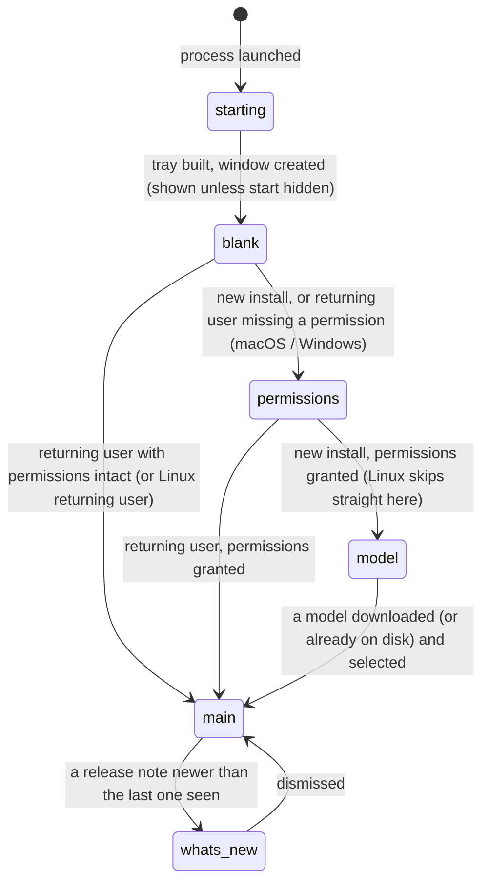

# First launch

## Summary

First launch is everything between starting the Handy process and arriving at the settings window's General section with a model ready to use. It covers what appears (a menu-bar icon, then the settings window unless it was asked to start hidden), how Handy decides whether this is a new install or a returning user, the onboarding flow a new install walks through (permissions, then a model), the shorter path a returning user takes when a permission has gone missing, the "What's New" dialog shown once after an upgrade, and the rule that picks a model automatically when the chosen one is gone. The permissions step and the model step are described in their own documents ([Permissions](permissions.md), [Choosing a model](choosing-a-model.md)); this document owns the sequence and the decisions between them. The window and tray mechanics are in [Windows and the tray](../foundations/windows-and-tray.md).

## The simple case

The user opens Handy for the first time. A Handy icon appears in the menu bar and, a moment later, the settings window opens at 680×570 points, titled "Handy", with the Handy logo and a short spinner. It turns into the permissions step: "Permissions Required" with a card for Microphone Access and a card for Accessibility Access. The user grants both, sees "All set!" for a third of a second, and the window becomes the model step: "To get started, choose a transcription model" above two featured cards, Parakeet Unified EN 0.6B and Nemotron Streaming 3.5, three more recommended cards, and a "Show all 69 models" button. They click Parakeet Unified EN 0.6B; the card shows a progress bar, "Downloading 37%", a speed, and a Cancel button. When the download finishes the card briefly reads "Switching..." and the window becomes the ordinary settings window: a sidebar on General, the footer naming the model with a green dot. Option+Space now dictates. The next time Handy starts, none of this happens: the window opens straight on General.

## The interaction, event by event

### Start

The launch starts when the process is created: a double-click on Handy.app, a login item, `open -a Handy`, or the binary from a shell. Before anything is drawn Handy reads its settings file (a fresh install writes the defaults), creates the settings window hidden, builds the menu-bar icon in its idle state with the tooltip "Handy v0.9.6", creates the overlay window hidden, and registers or unregisters the login item to match Launch on Startup. It then shows the settings window unless Start Hidden is on or `--start-hidden` was passed (and, even then, shows it if the tray icon is hidden, because there would otherwise be no way back in). On macOS Handy is a regular app with a Dock icon at this point, except under a hidden start with the tray shown, when it is an accessory with no Dock icon. On Windows the window is also forced visible when at least one model is downloaded but microphone access is denied.

The window's page then loads: the theme is applied, the model list and the settings are fetched, and the page decides what to show from one saved flag, `onboarding_completed`:

- **Not completed** — a new install, or a store from before the flag existed in which no model had ever been selected. The page goes to the permissions step (on macOS and Windows) or, on Linux, straight to the model step. Nothing is initialized for keyboard shortcuts or text injection yet.
- **Completed** — a returning user. On macOS the page checks Accessibility and Microphone access; if either is missing it brings the window to the front (overriding a hidden start) and shows the permissions step with only the missing one outstanding. On Windows it reads the microphone consent from the registry and does the same if it is denied. If both checks pass, or the check itself fails, the page goes straight to the main window.

Until the decision is made the window is blank. This is normally too quick to notice.

> Technical note: the flag is set to true in exactly one place: a successful model selection (the onboarding card, the Models page, the footer, or the tray). A settings file that predates the flag is migrated on first read: `onboarding_completed` becomes true if `selected_model` is non-empty, false otherwise, so a user who merely has compatible files on disk still sees onboarding. Shortcuts and text injection are initialized by the page, not at process start — on macOS as soon as Accessibility is confirmed (during the permissions step), otherwise when the main window appears — so a hidden start still gets working shortcuts as soon as the hidden page loads.

### Ends at once

The launch ends without onboarding when the page decides it is a returning user with nothing missing: the main window appears directly (General section, sidebar, footer), shortcuts are registered, text injection is initialized, and the microphone and output device lists are refreshed. Under a hidden start nothing appears at all except the menu-bar icon; the page does all of the above hidden, and the window waits for "Settings…" in the tray menu. A second launch while Handy is already running is not a launch: the running copy raises its window (and on macOS recreates a vanished tray icon) and the new process exits; see [Windows and the tray](../foundations/windows-and-tray.md#second-launches-and-remote-control).

### Becomes active

Onboarding becomes active when the permissions step appears. For a new install on macOS that is the two-card "Permissions Required" screen; on Windows a one-card screen for the microphone; on Linux the step is skipped and the model step is the first thing seen. For a returning user it is the same screen with the already-granted card showing "Granted". During onboarding the window has no sidebar, no footer, no banners, and no settings controls; the menu-bar icon and its menu are fully present, including "Settings…", "Check for Updates…", and "Quit". Toasts do appear during onboarding, in the window's bottom corner.

### While active

The user moves through the steps in order; there is no back, no skip, and no progress indicator. Each step advances itself: the permissions step advances 300 ms after both permissions are confirmed, showing "All set!" meanwhile; the model step advances as soon as a model has been downloaded and selected (or an already-downloaded "Compatible Models" card is clicked). Closing the window during onboarding hides it without resetting anything; reopening it from the tray shows the same step in the same state. On macOS, because shortcuts are registered the moment Accessibility is confirmed, Option+Space already starts a dictation while the model step is still on screen; with no model selected the dictation records normally and fails at the stop with a "Transcription Failed" toast (see [Choosing a model](choosing-a-model.md#cancel-and-interrupt)).

### Finish

Onboarding finishes when the model step's selection succeeds: the chosen model is active and loaded, `onboarding_completed` is saved, and the window becomes the main window on the General section with the footer naming the model and a green dot. At this moment Handy registers shortcuts and initializes text injection (both are no-ops if the permissions step already did so), refreshes the microphone and output device lists, starts the automatic update check if Check for Updates is on (see [Updates](../integration/updates.md)), and evaluates the What's New gate.

The What's New gate shows a dialog titled "New in Handy v{version}" when Show What's New is on and a release note is bundled whose version is newer than the last version the user dismissed and not newer than the running app. Its body is the release note rendered as headings, paragraphs, lists, links (which open in the browser), quotes, code, and images. It is dismissed by the ✕ button (labelled "Close"), Escape, or a click on the dimmed backdrop; dismissing saves that note's version as the last seen, so it is not shown again. A fresh install never sees it: the last-seen version is stamped with the installed version when the defaults are written. An upgrade from a version that had no such marker sees it once.

> Technical note: the only bundled note at this commit is for 0.9.0, so an upgrade from a pre-marker store to 0.9.6 shows "New in Handy v0.9.0", and dismissing records 0.9.0 (the note's version), not 0.9.6. The next launch is quiet because no note is newer than 0.9.0. The dialog is wrapped in an error boundary: if the note fails to render, the rest of the window is unaffected.

## Modifiers

| Modifier | Set before the start | Changed while active |
| --- | --- | --- |
| Push to talk | No effect on the launch sequence; it is read per key event once shortcuts exist. | No effect; there is no control for it during onboarding. |
| Binding | The Transcribe with Post-Processing shortcut is registered at shortcut initialization only if post-processing is enabled, which a fresh store never is. | No effect. |
| Overlay style | The overlay window is created hidden regardless. None means it is never shown afterwards. | No effect. |
| Streaming model | No effect on the launch. The picks offered first in the model step are both streaming models. | No effect. |
| Voice activity detection | No effect. | No effect. |
| Always-on microphone | On (only possible for a returning user; it lives in the Debug section): the microphone stream is opened as the process starts, before any window is shown, so on macOS the system microphone prompt can appear before onboarding does. | No effect. |

## Cancel and interrupt

| Event | Before active (deciding, or main window directly) | While active (onboarding on screen) |
| --- | --- | --- |
| Cancel | Escape does nothing; the overlay ✕ and tray Cancel are not shown; `handy --cancel` does nothing. Closing the window hides it. | Same. Onboarding cannot be cancelled or skipped; only Quit from the tray leaves it, and the next launch starts it over. Escape dismisses the What's New dialog once the main window is up. |
| Another trigger | Before shortcuts are registered, Option+Space does nothing. A remote toggle (`--toggle-transcription`, SIGUSR2) is accepted as soon as the process is up, with or without a model. | After Accessibility is confirmed, a shortcut starts a dictation under the onboarding window; without a model it fails at the stop with "Transcription Failed". The onboarding step is unaffected. |
| A setting changed mid-way | No controls are visible. | No controls are visible. Picking a downloaded model from the tray's model submenu marks onboarding complete in settings while the window stays on the onboarding step (see Edge cases). Cmd+Shift+D toggles debug mode even during onboarding. |
| Microphone lost | No effect; the launch does not open the microphone unless always-on is set. | No effect. The permissions step checks authorization, not whether a device is present. |
| Model or processing failure | A model list that fails to load leaves the model step empty (see [Choosing a model](choosing-a-model.md)). | A failed download or load shows a toast and leaves the user on the model step. |
| The active application changes | The launch continues in the background; a hidden or backgrounded window still reaches the main window. | Steps advance while Handy is in the background; the user returns to find the next step already showing. The window is not brought forward on its own. |
| Handy quits or the system sleeps | Quitting before the page loads leaves a fresh store with nothing onboarding-related saved. | Quitting mid-onboarding saves nothing; the next launch starts from the permissions step (which passes instantly if permissions were granted) and the model step again. A download in progress is cut off and its partial file kept. Sleep pauses nothing visible. |
| Keyboard channel changes | Secure Input held at launch is detected once shortcuts are initialized; the tray badge appears, and the banner appears in the main window. | Same, but no banner during onboarding: it is only rendered in the main window. |

## Interactions with other systems

**Permissions.** The permissions step and its every-launch re-check are in [Permissions](permissions.md). Nothing about the launch asks for a permission by itself on macOS, except the always-on microphone case above.

**History and recordings.** None. The history store is opened at launch and nothing is written.

**Clipboard.** None.

**Model state.** Nothing is loaded at launch, whatever the active model; the first trigger or the first selection loads it. At launch (and at every rescan) Handy tidies the selection: an active model that is no longer in the model list at all (a custom file that was removed, an alternate quant whose file vanished) is cleared; then, only if onboarding is complete and nothing is selected, the first downloaded model in catalog order (editorial rank, then recommended, then accuracy, speed, name) is made active without being loaded. While onboarding is pending no model is auto-selected even if compatible files are on disk, so that the model step presents the choice. A catalog model that stays in the list but whose file was deleted by hand outside Handy is not cleared by this rule (see Open questions).

**Tray and overlay.** The menu-bar icon exists from the start of the launch, before the window, and through all of onboarding; its model submenu lists whatever is downloaded and "Unload Model" is disabled. The overlay is created hidden and never shown by the launch.

**Sounds and system audio.** None.

**Settings persistence.** Read at launch: `start_hidden`, `show_tray_icon`, `autostart_enabled`, `theme`, `debug_mode`, `log_level`, `onboarding_completed`, `selected_model`, `show_whats_new_on_update`, `whats_new_last_seen_version`, `update_checks_enabled`, `always_on_microphone`. Written by the launch: a fresh store's defaults; any migration (the onboarding flag, a blank What's New marker, the overlay style, the GPU device); a cleared or auto-selected `selected_model`. Written by onboarding: `selected_model` and `onboarding_completed` together at the model step. Written by the gate: `whats_new_last_seen_version` on dismiss. `--debug` and `--start-hidden` change the run, not the file. See [The settings model](../foundations/the-settings-model.md).

**Platform differences.** The Dock/accessory switch and the Accessibility check are macOS-only. Windows checks microphone consent in the registry, forces the window visible when models exist but the microphone is denied, and opens the settings window on a left click of the tray icon. Linux has no permissions step and starts hidden-capable only when the tray is available; its overlay defaults to None. Portable mode on Windows keeps the settings and web cache beside the executable and is otherwise the same flow.

## Edge cases

- The window is blank for the instant between the page loading and the onboarding decision; with a slow disk or a large model list it can be long enough to see.
- A fresh install given `--start-hidden` runs onboarding in a hidden window: the permissions step waits unseen until the user opens "Settings…" from the tray. Only a returning user missing a permission gets the window forced visible.
- Picking a model from the tray's model submenu during onboarding (possible if a compatible file is already on disk) writes `onboarding_completed` and loads the model, but the window stays on whatever onboarding step it was showing; clicking any card under "Compatible Models" then completes normally, and a relaunch goes straight to the main window. Suspected gap.
- "Check for Updates…" in the tray during onboarding shows the window and asks for a check, but the update checker lives in the footer, which is not mounted during onboarding, so nothing happens. Suspected gap.
- Deleting the last downloaded model later does not bring onboarding back; the footer reads "No Model - Download Required" and the Models page is the way to get one.
- `--debug` turns debug mode on for the run without saving it; Cmd+Shift+D saves it. Both are read by the model cards (the quantization label) during onboarding.
- The What's New dialog can appear over a forced-visible permissions step only after that step completes; it is evaluated only in the main window.
- A settings file that cannot be parsed at all resets everything, including `onboarding_completed`, so a damaged store looks like a fresh install even though models are still on disk; they then appear under "Compatible Models".

## Open questions and verification

- The model-tidying rule clears the selection only when the model is absent from the list. A catalog model whose file was removed outside Handy stays listed (the catalog is always seeded), so the selection is kept and the first dictation fails with a load error rather than auto-selecting another downloaded model. This contradicts the wording in [Models](../foundations/models.md#the-models-states) ("deleted, file removed"); one of the two needs correcting. Read from the code, not reproduced.
- The "New in Handy v0.9.0" title on an upgrade to 0.9.6 was read from the bundled notes and the gate logic, not observed. Whether users read the version as the running one is a product question.
- Whether the blank window before the onboarding decision is visible on a typical Mac was not measured.
- Whether the tray-selection-during-onboarding path leaves the model step's cards in a consistent state (the selected model now appears under "Compatible Models" with no badge) was not tried.
- Whether "Check for Updates…" from the tray during onboarding is silently dropped (the listener is in the footer) or queued was read from the code only.
- The forced-visible window for a returning user on macOS is requested from the page after it loads; whether there is a visible delay between the tray icon appearing and the window was not measured.

Verified against Handy commit `af48dd6`.
