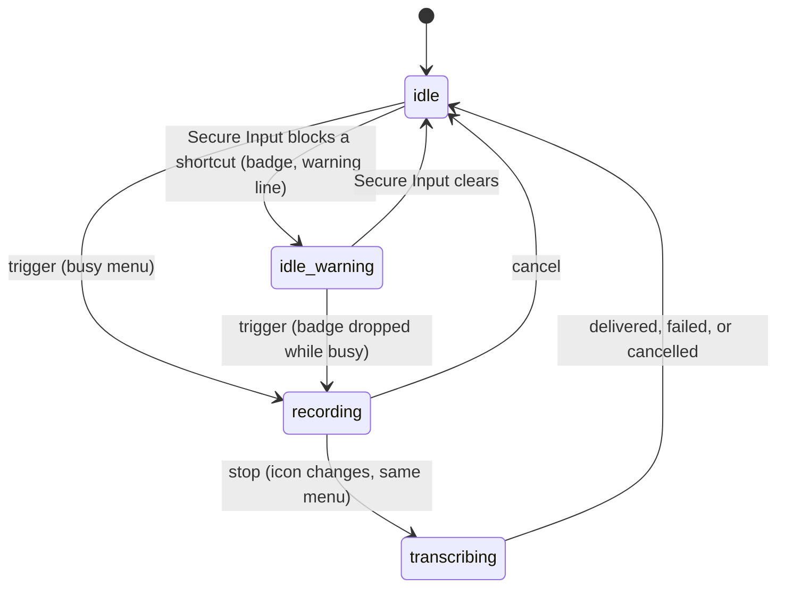

# The tray menu

## Summary

The tray menu is the menu under Handy's menu-bar icon: the place to reopen the settings window, copy the last transcript, switch or unload the model, cancel a dictation in progress, check for updates, and quit. The icon itself is a status light with three states — idle, recording, transcribing — and, on macOS, a warning badge while [Secure Input](../cross-cutting/secure-input.md) is blocking a shortcut. The menu has two layouts: an idle layout with a model submenu and "Unload Model", and a busy layout in which a single "Cancel" item takes their place from the trigger until the dictation ends. Strings follow the interface language. The window rules the icon lives under (show, hide, Dock, relaunch, Show Tray Icon) are in [Windows and the tray](../foundations/windows-and-tray.md); this document is the icon's looks and the menu's items.

## The simple case

Handy is idle. The user clicks the menu-bar icon and a menu drops down: "Handy v0.9.6" greyed out at the top, then "Copy Last Transcript", then a submenu named after the active model, say "Parakeet Unified EN 0.6B", with "Unload Model" under it, then "Settings…" with Cmd+, shown at the right, "Check for Updates…", and "Quit" with Cmd+Q. They open the submenu: every downloaded model is listed by name and the active one has a check mark. They pick another; the menu closes, the footer in the settings window turns yellow with "Loading {name}…" and then green, and the next time they open the menu the submenu is named after the new model and the check has moved. Later, while dictating, they open the menu again: the model submenu and "Unload Model" are gone and "Cancel" sits in their place; choosing it abandons the dictation.

## The interaction, event by event

### Start

The interaction starts when the user clicks the icon. On macOS a left click (or a right click) opens the menu under the icon; the icon has a hover tooltip "Handy v0.9.6" ("Handy v0.9.6 (Dev)" in development builds, and with the Secure Input warning "Handy v0.9.6 — ⚠ Shortcuts blocked by Secure Input"). The menu is the last one Handy built, laid out as follows.

Idle:

1. "Handy v0.9.6" — disabled
2. *(when Secure Input is blocking a shortcut)* "⚠ Shortcuts blocked by Secure Input"
3. "Copy Last Transcript"
4. *{active model name}* ▸ — a submenu listing every downloaded model by name, alphabetically, with a check mark on the active one; titled "Model" when no downloaded model is active
5. "Unload Model" — enabled only while the active model is loaded
6. "Settings…" — Cmd+, shown
7. "Check for Updates…" — disabled when "Check for Updates" (Debug section) is off
8. "Quit" — Cmd+Q shown

Busy (from the trigger until the dictation ends):

1. "Handy v0.9.6" — disabled
2. *(Secure Input line as above)*
3. "Cancel"
4. "Copy Last Transcript"
5. "Settings…", "Check for Updates…"
6. "Quit"

Separators sit between the groups. The icon is one of three template images — idle, recording (a dot), transcribing — in a light or dark variant chosen to match the menu bar, and on macOS the idle image gains a warning badge while the Secure Input line is present; the recording and transcribing images never carry the badge, so activity in progress is always recognizable.

> Technical note: the menu is rebuilt only when one of its inputs changes — busy or idle, the warning, whether the model is loaded, the active model, the list of downloaded models, the interface language, and whether update checks are enabled — and the rebuild happens on the main thread from a snapshot taken when the change was reported. Bursts of changes (a dictation flips the tray several times in a second) are coalesced into one native update, and recording → transcribing changes only the icon, never the menu. This is the mechanism behind the vanishing-icon fix (#1948).

### Ends at once

The interaction ends without effect when the menu is dismissed: a click anywhere else, Escape, or switching to another application. Nothing was read or written. The same goes for opening and closing the model submenu without choosing.

### Becomes active

The interaction becomes active when an item is chosen. The menu closes and the item's action starts:

- **"⚠ Shortcuts blocked by Secure Input"** shows the settings window, where the banner at the top explains which app is holding Secure Input and what to do.
- **"Copy Last Transcript"** puts the most recent history entry that has text onto the clipboard — the post-processed text when the entry has one, otherwise the transcript. Entries whose transcription failed (empty text) are skipped in favor of the one before. There is no confirmation, sound, or toast; if history is empty nothing happens at all. The clipboard is not restored afterwards.
- **A model in the submenu** makes it the [active model](../foundations/models.md): the setting is written first, then the model loads in the background (not under an "Immediately" unload timeout, where it waits for the next dictation). Choosing the model that is already checked does nothing, not even a reload. The footer in the settings window follows. If the load fails the selection reverts and, if the settings window is visible, a toast reads "Failed to load model: {name}".
- **"Unload Model"** releases the loaded model. The footer dot turns grey and the item greys out the next time the menu opens; the next dictation loads the model again at the trigger.
- **"Cancel"** abandons the dictation in progress exactly as the overlay's ✕ does; see [Cancelling](../dictation/cancelling.md).
- **"Settings…"** shows the settings window: restores it if minimized, brings it to front, focuses it, and on macOS puts Handy back in the Dock.
- **"Check for Updates…"** shows the settings window and starts a manual update check; the footer shows "Checking for updates...", then "Up to date" for three seconds or "Update available". See [Updates](../integration/updates.md).
- **"Quit"** exits Handy. The loaded model is released first. A dictation in progress is abandoned with nothing written.

### While active

Most actions are instantaneous. The two that take time are a model switch and an update check. During a model switch the menu keeps showing the previous model until the load finishes (the check mark moves when the submenu is next opened after the switch completes); choosing another model meanwhile is refused silently, with "Model load already in progress" written only to the log. During an update check the footer in the settings window shows progress; the menu item stays enabled and can be chosen again, which starts another check once the first returns.

### Finish

The action completes and the menu reflects it at the next open: a new submenu title and check mark after a switch, "Unload Model" greyed out after an unload, "Cancel" replaced by the model items once a cancelled or finished dictation is idle. Copy and the window actions have no visible finish in the menu.

## The Secure Input line

On macOS, when an app has held Secure Input for 3 seconds or more and at least one of Handy's shortcuts cannot be covered by the fallback — or the user has just been refused by the [shortcut recorder](../settings/shortcut-recorder.md) for that reason — the idle icon gains its warning badge, the tooltip grows the "— ⚠ Shortcuts blocked by Secure Input" suffix, and the line "⚠ Shortcuts blocked by Secure Input" is inserted directly under the version, with its own separator, in both layouts. Clicking it opens the settings window. The line, badge, and suffix go away on their own when Secure Input clears. See [Secure Input](../cross-cutting/secure-input.md).

## Modifiers

| Modifier | Set before the start | Changed while active |
| --- | --- | --- |
| Push to talk | No effect. | No effect. |
| Binding | No effect; the menu cannot start a dictation and does not distinguish which shortcut started one. | No effect. |
| Overlay style | No effect on the menu. With the overlay set to None the tray's "Cancel" is the only on-screen way to cancel a dictation. | No effect. |
| Streaming model | No effect; the model submenu does not mark streaming models. | No effect. |
| Voice activity detection | No effect. | No effect. |
| Always-on microphone | No effect. | No effect. |

## Cancel and interrupt

| Event | Before active (menu open, nothing chosen) | While active (an item's action running) |
| --- | --- | --- |
| Cancel | Escape closes the menu; nothing happens. The "Cancel" item itself is one of the four cancel paths for a dictation. | A model switch, an update check, or a copy cannot be cancelled. |
| Another trigger | A dictation started from the shortcut while the menu is open runs; the open menu shows the idle layout it was opened with (see Open questions for whether it updates in place). | A dictation started during a model switch uses whichever model is loaded at the stop. During an update check: no effect. |
| A setting changed mid-way | Changing the interface language rebuilds the menu in the new language. Selecting a model in the footer or on the Models page moves the check mark. Turning Show Tray Icon off hides the icon and closes the menu. Turning "Check for Updates" off greys the item at the next rebuild (not immediately; see Open questions). | Same. Switching models in the footer while a tray switch is loading is refused ("Model load already in progress"). |
| Microphone lost | No effect. | No effect. |
| Model or processing failure | The submenu still lists a model whose file was removed outside Handy until the list is re-read (Rescan, relaunch). | A failed load reverts the selection and shows the "Failed to load model: {name}" toast in the settings window; the menu shows the previous model. A failed copy is logged only. |
| The active application changes | macOS closes the menu when another app activates. | "Settings…" and "Check for Updates…" bring Handy's window to front regardless of what was active. |
| Handy quits or the system sleeps | Quit removes the icon. After sleep the menu is closed; the icon persists. If the icon has vanished (#1948), relaunching Handy from Spotlight, Finder, the Dock, or a shell recreates it while the window is hidden. | Same. A model switch interrupted by quit leaves the new selection written; it loads at the next launch's first trigger. |
| Keyboard channel changes | Secure Input engaging adds the badge, the warning line, and the tooltip suffix. Switching the keyboard implementation does not touch the menu. | Same. |

## Interactions with other systems

**Permissions.** None. The icon, the menu, and every item work without Accessibility or Microphone access; the warning line exists precisely for when key events are blocked.

**History and recordings.** "Copy Last Transcript" reads the newest entry with non-empty text, starred or not. It prefers the post-processed text; note that text is also present when only the Chinese script conversion changed the transcript. It never creates, changes, or deletes an entry. See [The History page](../history/the-history-page.md), whose copy icon copies the raw transcript instead.

**Clipboard.** Copy overwrites the clipboard and does not restore it, unlike a dictation's paste, which puts the previous contents back.

**Model state.** The submenu and "Unload Model" are the tray's view of [Models](../foundations/models.md): the submenu title and check follow the active model; "Unload Model" follows loaded/unloaded, including unloads by the idle timeout and after a crash. Selecting from the tray is the same operation as selecting in the footer or on the Models page, with the same "Immediately" exception.

**Tray and overlay.** This document. The tray's "Cancel" and the overlay's ✕ are interchangeable; the overlay is described in [The overlay](../dictation/the-overlay.md).

**Sounds and system audio.** None. Nothing in the menu plays a chime.

**Settings persistence.** A model chosen in the submenu writes `selected_model` (and sets `onboarding_completed`, already true after onboarding). The menu reads `app_language`, `update_checks_enabled`, and `show_tray_icon`; it writes none of them.

**Platform differences.** Windows: a left click or double click on the icon opens the settings window and a right click opens the menu; the accelerators read Ctrl+, and Ctrl+Q; the icon's light/dark variant follows the taskbar's theme from the registry, not the app theme. Linux: the icons are Handy's colored pink images instead of template images, the Secure Input line never appears, and a left click opens the menu. The vanished-icon recreation on relaunch is macOS-only.

## Edge cases

- The submenu sorts models by display name, so its order differs from the catalog order used by the footer dropdown and the Models page.
- With no downloaded models the submenu is titled "Model" and is empty; with downloads but no selection (the active model was deleted) it is titled "Model" with nothing checked.
- Two quants of the same model appear as two checkable items, for example "Whisper Medium" and "Whisper Medium (Q4_K_M)".
- A model downloaded or deleted on the Models page does not appear in or leave the submenu until something else rebuilds the menu (a dictation, a model selection, a theme or language change, Secure Input changing). See Open questions.
- The "Check for Updates…" item is chosen-time checked: even when it looks enabled, it does nothing if update checks were turned off since the menu was last built.
- Choosing "Quit" during transcription discards the transcript; a recording file already written stays (see [Cancelling](../dictation/cancelling.md)).
- The menu's strings follow the interface language; a language whose translation lacks the warning line shows it in English.
- The version line is a disabled item, not a header: it cannot be chosen or copied.
- In development builds the version reads "Handy v0.9.6 (Dev)" in both the tooltip and the menu.
- The icon's light/dark choice on macOS follows the settings window's theme, but because the images are template images the menu bar tints them correctly either way.

## Open questions and verification

- Whether Cmd+, and Cmd+Q shown beside "Settings…" and "Quit" actually work as system-wide shortcuts, or are only displayed: the menu items carry accelerators, but Handy registers no app menu of its own; Cmd+Q with the settings window focused quits through macOS's default application menu, and Cmd+, from another app is not expected to open Handy. Not verified.
- Whether an open menu updates in place when the tray is rebuilt underneath it (a dictation starting while the menu is open), or keeps the stale layout until reopened. Not observed.
- Downloading or deleting a model does not rebuild the menu, so the submenu can list a deleted model or omit a fresh download until the next rebuild. Suspected bug.
- Turning "Check for Updates" off or on does not rebuild the menu, so the item's enabled look can be stale; choosing it while stale does nothing. Suspected bug (minor).
- "Copy Last Transcript" with nothing to copy gives no feedback at all, and neither does a successful copy. Worth treating as a copy problem.
- Choosing a model while another tray-initiated switch is loading is refused with no visible message. Suspected gap.
- Whether a right click on macOS opens the same menu as a left click was read from the default behavior of menu-bar items and not confirmed.
- Whether the tooltip is shown at all on macOS menu-bar items (it is set; display depends on the system) was not confirmed.

Verified against Handy commit `af48dd6`.
